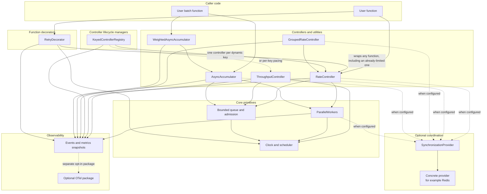
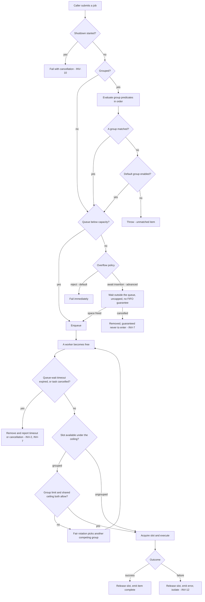
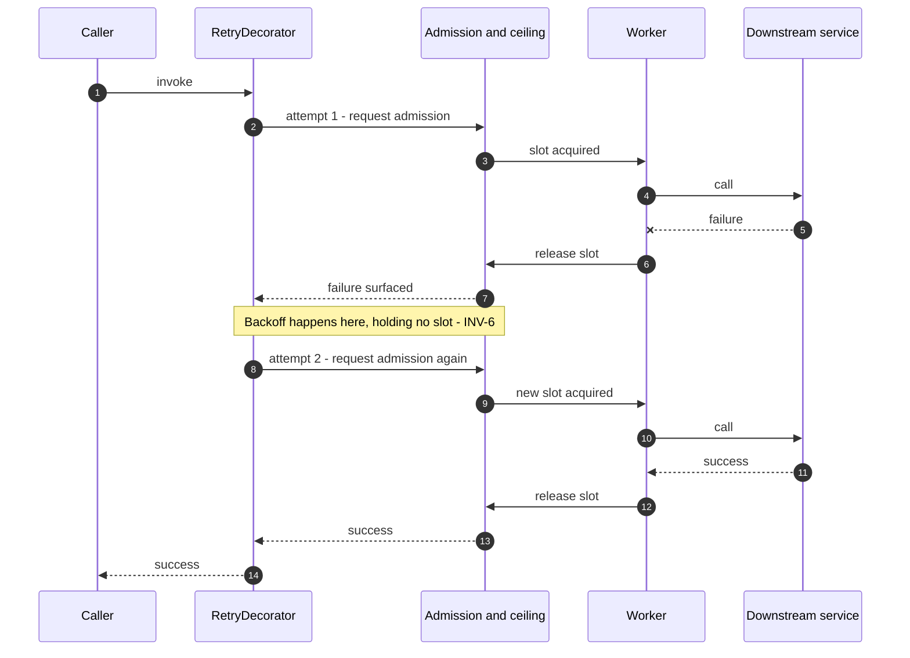
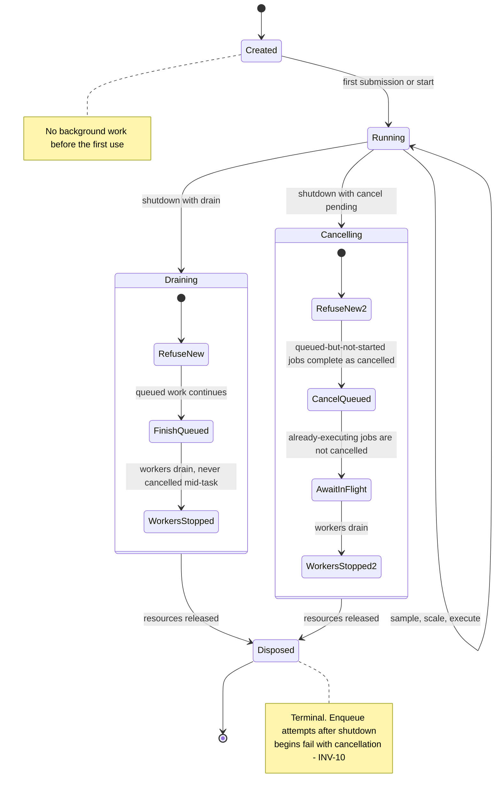
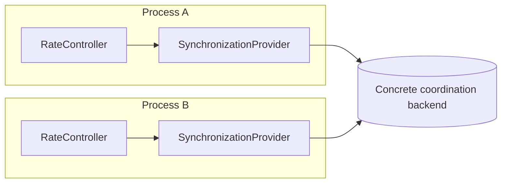

# Architecture

Limitful is a set of small load-leveling utilities that compose. Each utility owns
one concern, exposes raw events and metrics, and accepts user functions for every
policy decision. There is no central scheduler, no god object, and no shared
mutable registry.

- [Layering](#layering)
- [Component boundaries](#component-boundaries)
- [Invariants](#invariants)
- [Admission and concurrency flow](#admission-and-concurrency-flow)
- [Composition guidance](#composition-guidance)
- [Lifecycle and disposal](#lifecycle-and-disposal)
- [Distributed mode](#distributed-mode)
- [Observability seams](#observability-seams)
- [Implementation strategy](#implementation-strategy)
- [Open items](#open-items)

## Layering

Two primitives sit at the bottom — a bounded queue with an admission policy, and
a worker pool whose size is sampled from a user function. Every other utility is
built from them. `RetryDecorator` is the exception: it is a pure function wrapper
that composes *around* the others and depends on none of them.



Dotted edges are optional and absent by default: in-process, in-memory, zero
dependencies
([D-163](./decisions.md#d-163-synchronizationprovider-is-the-backend-neutral-public-contract)).

### Why `WeightedAsyncAccumulator` sits on `AsyncAccumulator`

It is the same utility with one extra admission rule: a stored per-item weight
instead of an item count governs when a batch closes. Everything else — timeout
stages, outcome correlation, batching-worker lifecycle — is inherited unchanged.
See [weighted-async-accumulator.md](./utilities/weighted-async-accumulator.md).

### Why `RateController` sits on `ParallelWorkers`

`RateController` needs "run up to N things at once, pulling from a queue as slots
free". That is exactly a worker pool whose size can change. `RateController`
contributes the hard ceiling and the queue; `ParallelWorkers` contributes the
worker loop, the sampling-driven resize, and graceful worker drain.

The worker count never raises the ceiling. It only **divides a fixed budget**
([INV-4](#invariants), [D-002](./decisions.md#d-002-n-is-the-hard-global-in-flight-ceiling)).

## Component boundaries

| Component | Owns | Explicitly does not own |
| --- | --- | --- |
| [Bounded queue and admission](./subsystems/queue-and-admission.md) | Capacity bound, overflow policy, admission waiting, pre-admission and queue-wait timeouts, cancellation-before-start | Execution, retries, batching |
| [ParallelWorkers](./utilities/parallel-workers.md) | Worker lifecycle, sampled worker count, scaling delta, graceful drain, worker events | Queue capacity, global ceilings, what the work is |
| [RateController](./utilities/rate-controller.md) | The hard in-flight ceiling `N`, queueing of submitted jobs, failure isolation, rate metrics | Retries ([D-004](./decisions.md#d-004-ratecontroller-never-retries)), time-window limiting ([D-001](./decisions.md#d-001-ratecontroller-limits-by-concurrency-not-by-time-window)), batching |
| [ThroughputController](./utilities/throughput-controller.md) | Time-based permission to start, pacing, optional quota and credit cost | A concurrency ceiling — compose with `RateController`; retries; batching |
| [GroupedRateController](./utilities/grouped-rate-controller.md) | Static group definitions, group matching, per-group limits, shared-ceiling arbitration | Dynamic group creation ([D-060](./decisions.md#d-060-groups-are-static)), per-group retry policy |
| [KeyedControllerRegistry](./utilities/keyed-controller-registry-draft.md) | Key resolution, per-key controller creation, idle expiry, max active keys, eviction safety | Admission itself — it owns no queue, no slot, and no timeout stage ([D-120](./decisions.md#d-120-keyedcontrollerregistry-creates-one-controller-per-dynamic-key)) |
| [AsyncAccumulator](./utilities/async-accumulator.md) | Batch accumulation, batching-worker loop, outcome correlation, the three timeout stages | Rate limiting ([D-041](./decisions.md#d-041-asyncaccumulator-does-not-integrate-with-ratecontroller)), retrying a failed batch |
| [WeightedAsyncAccumulator](./utilities/weighted-async-accumulator.md) | Weight computation at insertion, weight-budget admission, strict/flexible over-max policy | Anything already owned by `AsyncAccumulator` |
| [RetryDecorator](./utilities/retry-decorator.md) | Attempt budget, backoff, retry predicate, attempt hooks, aggregated error, deferred retry queue | Concurrency, queueing, batching — it holds no slot while waiting ([INV-6](#invariants)) |
| [Shared controller contract](./subsystems/controller-contract.md) | Submission, `JobOptions`, advisory admission queries, deadline-aware admission | Capacity semantics — each controller defines what a slot or credit means ([D-110](./decisions.md#d-110-a-shared-controller-contract-owns-submission-job-options-and-admission-queries)) |
| [AdaptiveCapacityPolicy](./utilities/adaptive-capacity-policy.md) | Opt-in capacity adaptation, outcome classification, overclock safeguards | Raising a hard ceiling; being enabled implicitly ([D-142](./decisions.md#d-142-adaptive-presets-are-opt-in-and-the-congestion-preset-comes-later)) |
| [SynchronizationProvider](./utilities/synchronization-provider.md) | Cross-instance permission and shared state, capability declaration | Executable work, payload transport, or naming a backend in a controller API ([D-150](./decisions.md#d-150-providers-declare-capabilities-and-insufficient-providers-fail-configuration)) |
| [RedisSynchronizationProvider](./subsystems/redis-coordination.md) | Redis sets/claims, liveness, degraded divided-allocation fallback, keys/scripts, cluster slotting | The generic coordination contract or controller API; those belong to `SynchronizationProvider` ([D-164](./decisions.md#d-164-redis-coordination-is-a-concrete-provider-under-the-neutral-contract)) |
| [Observability](./subsystems/observability.md) | Raw events, metrics snapshots, sampling event | Opinionated telemetry — OTel lives in a separate opt-in package ([D-091](./decisions.md#d-091-otel-is-a-separate-opt-in-package-per-language)) |

### Dependency rules

1. A utility may depend on a primitive. A primitive never depends on a utility.
2. Core packages never depend on OpenTelemetry, a Redis client, or any logger.
3. `RetryDecorator` depends on no other utility. Any apparent coupling (a retry
   re-entering admission) happens because the *caller* composed the two, not
   because the types know about each other.
4. Cross-utility behavior is the caller's composition, never implicit wiring.
5. `KeyedControllerRegistry` depends only on the
   [shared controller contract](./subsystems/controller-contract.md), never on a
   concrete controller type — that is why one registry serves concurrency limits,
   pacing, or a composition of both
   ([D-120](./decisions.md#d-120-keyedcontrollerregistry-creates-one-controller-per-dynamic-key)).
6. A policy utility — [AdaptiveCapacityPolicy](./utilities/adaptive-capacity-policy.md),
   [Probe](./utilities/probe.md) — is read-only with respect to the controller. It
   proposes; the controller validates, clamps, and decides.

## Invariants

These hold in every language. A change to any of them is a specification change
([docs/README.md § How to change a documented behavior](./README.md#how-to-change-a-documented-behavior)).

| ID | Invariant |
| --- | --- |
| **INV-1** | A queued job is never dropped unannounced, and never by dropping the oldest. |
| **INV-2** | The only ways a queued job leaves without executing are announced to the caller: cancel-pending shutdown, an expired queue-wait timeout, or cancellation of the job's own task. |
| **INV-3** | Every internal queue is bounded, with a configurable capacity, timeout set, and overflow strategy. |
| **INV-4** | During healthy coordinated operation, the configured `N` is the hard global in-flight ceiling. A sampled worker count only divides that budget and is clamped to `N`. A provider-specific degraded mode may weaken that guarantee only within its documented bound and must report the degradation ([D-164](./decisions.md#d-164-redis-coordination-is-a-concrete-provider-under-the-neutral-contract)). |
| **INV-5** | Cancellation is terminal. It is never retried and never overridden by a user predicate. |
| **INV-6** | A retrying job holds no concurrency slot while waiting between attempts. |
| **INV-7** | An item that has timed out while queued, or whose task was cancelled, never executes later — it is removed, not merely abandoned by its caller. |
| **INV-8** | A worker marked dead is never revived. Capacity returns by starting a fresh worker. |
| **INV-9** | A batch never exceeds its maximum weight. The single exception is one over-max item admitted in flexible mode, which runs alone. |
| **INV-10** | Once shutdown begins, new enqueues fail immediately with cancellation. |
| **INV-11** | Distributed counting is set-based and idempotent: entities add and remove their own ID, and the count is set cardinality. Increment/decrement is never used. |
| **INV-12** | A failing task is isolated to itself. Queue, workers, and sibling tasks continue. |
| **INV-13** | Observable behavior is identical across languages. Only the API surface differs. |
| **INV-14** | No job state survives process exit. Durable queues are out of scope; the reliability guarantee is process-lifetime only. |

## Admission and concurrency flow

The path a submitted job takes, with the group layer shown where it applies. The
same shape serves `RateController` (one implicit group) and
`GroupedRateController` (many).



Slot accounting is the only place the ceiling is enforced, and it is enforced on
acquisition, never by trusting the worker count
([D-002](./decisions.md#d-002-n-is-the-hard-global-in-flight-ceiling)).

## Composition guidance

Limitful composes by wrapping functions, not by registering components with each
other. The caller decides the order, and the order is meaningful.

> Illustrative pseudocode. No public API signature is committed yet.

### Retry outside the limiter — the common case

```text
limited = rateController.wrap(callApi)
resilient = retry.wrap(limited, { attempts: 3 })
```

Each attempt re-enters admission and acquires its own slot; the backoff happens
outside the limiter, holding nothing
([INV-6](#invariants), [D-015](./decisions.md#d-015-awaited-retries-re-enter-normal-admission)).
This is the recommended order: a saturated downstream service sees at most `N`
concurrent calls including retries.



### Retry inside the limiter — rarely what you want

```text
resilient = retry.wrap(callApi)
limited = rateController.wrap(resilient)
```

One logical job occupies one slot across every attempt *and* every backoff,
because the limiter cannot see inside the wrapped function. This starves the
queue. Use it only when a slot must represent a whole logical operation.

### Batching plus limiting

`AsyncAccumulator` deliberately does not know about `RateController`
([D-041](./decisions.md#d-041-asyncaccumulator-does-not-integrate-with-ratecontroller)).
The caller picks the composition:

```text
# Limit how many batches run concurrently
limitedBatchFn = rateController.wrap(myBatchFn)
accumulator    = asyncAccumulator(limitedBatchFn, { maxBatchSize: 50 })

# Or limit submissions into the accumulator
limitedSubmit = rateController.wrap(item => accumulator.submit(item))
```

### Grouping plus batching

A `GroupedRateController` in front of per-group accumulators gives per-tenant
batching under one global ceiling. Keep the group predicate pure and cheap: it
runs on every submission.

### Compositions to avoid

| Anti-composition | Why |
| --- | --- |
| Expecting `RateController` to retry | It never does ([D-004](./decisions.md#d-004-ratecontroller-never-retries)). Wrap with `RetryDecorator`. |
| Nesting a limiter inside its own job function | The inner acquisition can only wait on slots the outer call is holding. |
| Unbounded `await insertion` with no upstream control | Limitful does not cap admission waiters; that memory is the caller's problem ([D-032](./decisions.md#d-032-admission-waiters-are-uncapped-and-the-callers-responsibility)). |
| A heavy weight function or group predicate | Both run on the submission path. Weight is computed once at insertion ([D-052](./decisions.md#d-052-item-weight-is-computed-once-at-insertion)); predicates have no such cache. |

## Lifecycle and disposal

Every utility follows the same four-state lifecycle. Disposal is explicit and
always completes the chosen shutdown mode before tearing down
([D-070](./decisions.md#d-070-shutdown-is-either-drain-or-cancel-pending)).



Rules that hold in both shutdown modes:

1. **New enqueues stop immediately** and fail with cancellation
   ([INV-10](#invariants)).
2. **Workers are never cancelled mid-task.** A stopping worker stops reading from
   the queue, finishes its current item, and disappears
   ([D-022](./decisions.md#d-022-workers-drain-gracefully-and-are-never-revived)).
3. **Already-executing jobs are not cancelled** by cancel-pending mode. They may
   finish under their normal behavior.
4. **Cancel-pending is the announced exception to [INV-1](#invariants).** Queued
   jobs that never started complete as cancelled, visibly to their callers.
5. **Disposal is ordered:** refuse new work → settle queued work per mode → drain
   workers → stop the heartbeat and distributed membership (graceful removal, see
   synchronization provider membership/claims (with concrete mechanics such as
   [Redis](./subsystems/redis-coordination.md)) → release
   resources.
6. **Nothing survives the process** ([INV-14](#invariants)). Durable queues are
   out of scope; a caller who needs them layers their own store in front.

**Open item.** What happens to callers already *awaiting insertion* when shutdown
begins is not specified ([D-070](./decisions.md#d-070-shutdown-is-either-drain-or-cancel-pending)).

## Distributed mode

By default Limitful is in-process and in-memory. A compatible utility opts into
cross-instance coordination by receiving a backend-neutral
[`SynchronizationProvider`](./utilities/synchronization-provider.md). The utility
declares required capabilities and fails configuration when the provider cannot
satisfy them. Coordination is per configured utility, not silently process-wide
([D-150](./decisions.md#d-150-providers-declare-capabilities-and-insufficient-providers-fail-configuration),
[D-163](./decisions.md#d-163-synchronizationprovider-is-the-backend-neutral-public-contract)).



The neutral semantic operations, capabilities, idempotency, and degradation
signals live in
[synchronization-provider.md](./utilities/synchronization-provider.md). Redis
sets, scripts, liveness, divided-allocation fail-open behavior, and cluster key
slotting live in the concrete
[RedisSynchronizationProvider](./subsystems/redis-coordination.md) deep dive
([D-164](./decisions.md#d-164-redis-coordination-is-a-concrete-provider-under-the-neutral-contract)).

## Observability seams

Each utility emits raw events and exposes a metrics snapshot; nothing is
aggregated or formatted for the user
([D-090](./decisions.md#d-090-observability-is-event-driven-and-exposes-raw-data)).
The seams are fixed so the optional OTel package can wrap them without the core
knowing it exists:

- **Events** — worker start/stop/complete, worker-count change, item complete,
  error, batch exceeded, max batch, and a periodic sample event.
- **Snapshots** — immutable, point-in-time reads of queue depth, in-flight count,
  worker count, and rate statistics.
- **Spans** — the optional package injects a few library-stage spans (admission
  wait, batch size, which batch) so slowness can be attributed to Limitful rather
  than to user code, while the user's own spans still dominate the trace.

See [observability.md](./subsystems/observability.md).

## Implementation strategy

**Full native reimplementation per language.** Targets share the design and the
business test spec, never code. There is no shared Rust core with thin bindings
([D-100](./decisions.md#d-100-native-reimplementation-per-language-no-shared-core)).

Rationale:

1. **No FFI marshalling.** A shared core forces a boundary crossing per
   operation; for operations this cheap, the crossing can cost more than the work.
2. **User functions are first-class.** The entire API accepts user callbacks;
   passing functions across an FFI boundary is painful and is avoided.
3. **The shared-core benefit is correctness, not speed** — writing the tricky
   logic once. Here that is outweighed by nativeness and flexibility, and is
   recovered instead through the shared business test spec
   ([testing.md](./testing.md)).

Consequences each binding must accept:

- The shared Markdown test spec is the parity mechanism. A binding is complete
  when it satisfies the test matrix, not when its code resembles another binding.
- Surfaces are idiomatic per language — `async`/`await` in C# and TypeScript,
  idiomatic futures in Rust, channels and contexts in Go, idiomatic Python
  ([D-101](./decisions.md#d-101-api-surfaces-are-idiomatic-per-language)).
- Degree of parallelism is language-constrained (a single-threaded runtime cannot
  truly parallelize CPU work). **Semantics stay identical**; only achievable
  concurrency differs. This is a technical-test concern, not a business-test one
  ([testing.md § Technical tests](./testing.md#technical-tests)).
- C# and Rust bindings use functional constructs and current language features:
  records, immutable data, discriminated-union-style results, exhaustive matching.

## Open items

Architecture-level questions that remain open. The full list, including
utility-level items, is in [decisions.md § Unresolved](./decisions.md#unresolved-items).

| Item | Owner document |
| --- | --- |
| Disposition of callers awaiting insertion when shutdown begins | [queue-and-admission.md](./subsystems/queue-and-admission.md) |
| Which utilities inherit reject-by-default, uncapped waiters, and waiter ordering | [queue-and-admission.md](./subsystems/queue-and-admission.md) |
| Whether `GroupedRateController` is one shared admission layer or one `RateController` per group plus an arbitrator | [grouped-rate-controller.md](./utilities/grouped-rate-controller.md) |
| Shared-capacity normalization and integer-remainder algorithm | [grouped-rate-controller.md](./utilities/grouped-rate-controller.md) |
| Non-frozen membership policy during a Redis outage | [redis-coordination.md](./subsystems/redis-coordination.md) |
| Whether the membership set and last-seen key share a hash tag | [redis-coordination.md](./subsystems/redis-coordination.md) |
| Build order for the accepted-but-unbuilt features | [D-160](./decisions.md#d-160-roadmap-order-keyed-registry-then-shared-job-options-then-supervision-then-outcome-classification) |
