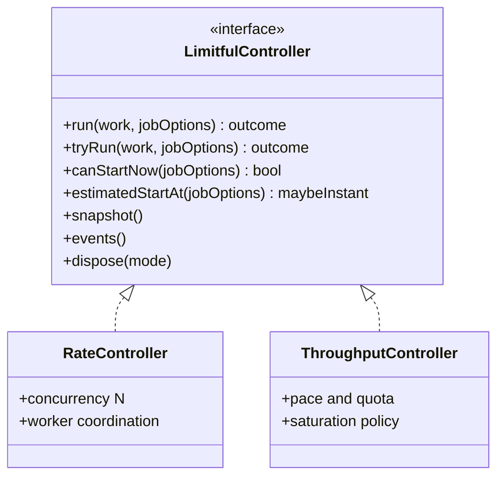
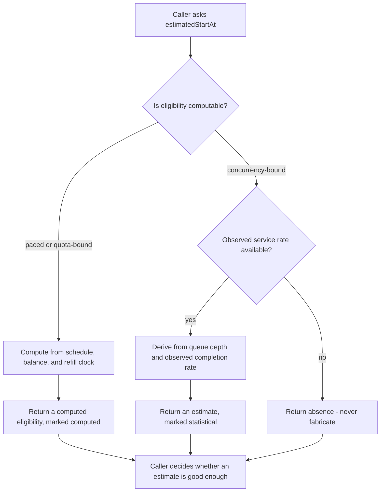

# Shared Controller Contract

> **Status: draft.** The shared surface across every Limitful controller:
> submission, job options, advisory admission queries, and deadline-aware
> admission. Resolved decisions carry their `D-nnn`; the rest is in
> [Open items](#open-items).

[`RateController`](../utilities/rate-controller.md) and
[`ThroughputController`](../utilities/throughput-controller.md) are **peer**
implementations of one neutral abstraction — `ILimitfulController` in C# and an
idiomatic equivalent elsewhere. Neither is secondary
([D-110](../decisions.md#d-110-a-shared-controller-contract-owns-submission-job-options-and-admission-queries)).

- [What is shared and what is not](#what-is-shared-and-what-is-not)
- [JobOptions](#joboptions)
- [Cost means different things](#cost-means-different-things)
- [Priority](#priority)
- [Deduplication](#deduplication)
- [Advisory admission queries](#advisory-admission-queries)
- [Saturation snapshots](#saturation-snapshots)
- [Deadline-aware enqueueing](#deadline-aware-enqueueing)
- [Error contract](#error-contract)
- [Defaults](#defaults)
- [Invariants](#invariants)
- [Test coverage](#test-coverage)
- [Open items](#open-items)

## What is shared and what is not



| Shared | Owned per controller |
| --- | --- |
| Submission, and one awaitable terminal outcome per submission | What a slot or credit *is* |
| `JobOptions`: identity, priority, cost, cancellation, start deadline | How `cost` is accounted ([below](#cost-means-different-things)) |
| Bounded admission, overflow policy, the three timeout stages | Capacity semantics: in-flight ceiling vs pace and quota |
| Cancellation and the exactly-once terminal-outcome rule | Worker coordination, pacing, quota, adaptive policy |
| Advisory `canStartNow` / `estimatedStartAt` | Whether eligibility is *computable* ([below](#advisory-admission-queries)) |
| Drain and cancel-pending disposal, immutable snapshots, raw events | Snapshot and event field sets |

**A shared interface must not imply that different controls have the same
semantics.** This document exists to name the places where the surface is common
but the meaning is not.

## JobOptions

One shared, immutable submission envelope. **Every field is optional, and
function-only submission remains the simple path**
([D-111](../decisions.md#d-111-joboptions-is-one-shared-envelope-with-per-controller-cost-semantics)).

> Illustrative pseudocode. No public API signature is committed yet.

```text
# The simple path is unchanged and stays the common case
result = await controller.run(() => callApi())

# Advanced: any subset of the shared options
result = await controller.run(() => generateReport(), {
  id:       "report-8831",          # opaque caller correlation ID
  priority: 5,                      # or priority: item => item.tier
  cost:     10,                     # per-controller meaning, see below
  deadline: startBefore(seconds(2)),
  cancellation: ct,
})
```

| Field | Meaning | Default |
| --- | --- | --- |
| `id` | Opaque caller correlation ID, surfaced in events and snapshots. **Not** a deduplication or idempotency key | Generated internally |
| `priority` | Selection order among queued work only. A value, or a pure function over the item | Neutral; FIFO within a band |
| `cost` | Positive integral weight. **Accounting differs per controller** | `1` |
| `cancellation` | The language's cooperative cancellation primitive | None |
| `deadline` | Latest acceptable *start*, as a duration or instant | None |

Rules that hold for all controllers:

1. **Evaluated once, at submission**, and stored in the immutable queued
   envelope — never recomputed inside a scheduling lock. This matches how item
   weight is handled in the accumulators
   ([D-052](../decisions.md#d-052-item-weight-is-computed-once-at-insertion)).
2. **Invalid options fail at submission**: zero, negative, non-finite, or
   out-of-range cost, or a cost that can never be satisfiable.
3. **Options never override a hard gate.** Priority, cost, and deadline change
   *order* and *admission*, never the ceiling, the quota, or cancellation
   terminality ([INV-4](../architecture.md#invariants),
   [INV-5](../architecture.md#invariants)).
4. **The numeric range, overflow behavior, and rounding rule for `cost` and
   `priority` are identical in all five languages**
   ([INV-13](../architecture.md#invariants)).
5. **Caller cancellation is a caller-outcome rule.** While queued it removes the
   job. After execution starts, physical work completes, cancellation wins the
   caller's eventual outcome, and the eventual work result is discarded
   ([D-182](../decisions.md#d-182-queued-cancellation-wins-the-caller-outcome-without-stopping-running-work)).

## Cost means different things

This is the sharpest edge in the shared envelope, and collapsing it into "one
cost field" would be wrong
([D-111](../decisions.md#d-111-joboptions-is-one-shared-envelope-with-per-controller-cost-semantics)):

| | `ThroughputController` | `RateController` |
| --- | --- | --- |
| What cost buys | Credits, spent at launch | Concurrency slots, held while running |
| Returned on completion | **Never** — a time credit is spent | **Always** — slots release |
| A cost-10 job | Consumes 10 credits of the period's allowance | Occupies 10 of `N` slots for its duration |
| Head-of-line risk | Already resolved: queue order is preserved by default | **Unresolved** — see below |

`ThroughputController` cost is specified today. **Weighted concurrency cost for
`RateController` is deferred**, because it introduces a head-of-line problem with
no decided answer
([D-116](../decisions.md#d-116-weighted-concurrency-cost-for-ratecontroller-is-deferred)):

- A cost-10 job with `N = 10` can only start when the controller is completely
  idle, so under steady cost-1 traffic it may never start.
- Letting cheaper jobs pass it is work-conserving but starves it.
- Making it wait blocks the queue head behind a job that cannot run.
- `ThroughputController` solved the same problem by preserving order and waiting
  for the next window — but a concurrency controller has **no window**; it waits
  on user-code completion, which may never arrive.

Until a bounded-starvation rule is decided, `cost` on `RateController` is
accepted in the envelope and **rejected at submission with a clear error** rather
than silently ignored. Shipping it as "ignored for now" would let callers build
on a limit that is not being enforced.

## Priority

Priority is an **advanced per-job option, neutral and FIFO by default**
([D-112](../decisions.md#d-112-priority-is-optional-banded-and-protected-by-aging)).
The caller supplies the value or a pure function, because only the application
knows what matters.

- It maps to **one documented, bounded set of priority bands**, with stable FIFO
  order inside each band — not an arbitrary comparator, which would be
  allocation-heavy and unportable.
- When priority is enabled, selection defaults to **aging or weighted-fair
  service**, so ordinary work keeps a guaranteed turn. Strict priority is an
  expert mode that must warn that a sustained high-priority stream starves
  everything below it.
- Priority changes **selection order only**. It cannot bypass the ceiling,
  pacing, quota, cancellation, or deadlines.
- Admission order among callers waiting *outside* a full queue remains
  implementation-dependent ([D-033](../decisions.md#d-033-no-fifo-guarantee-for-admission-waiters)).

**Overlap to resolve:** [`RetryDecorator`](../utilities/retry-decorator.md) already
defines three retry-scheduling priority modes
([D-016](../decisions.md#d-016-retry-scheduling-priority-is-configurable)). Those
are the same concept arriving by a different route. Expressing retry priority as
a `JobOptions.priority` value would remove a parallel mechanism, but probabilistic
prioritization has no `JobOptions` equivalent today. Unresolved — see
[open items](#open-items).

## Deduplication

Queued-job deduplication is optional
([D-184](../decisions.md#d-184-optional-queued-job-deduplication-rejects-duplicates)).
The caller supplies a hash/key function evaluated at submission. If that key is
already present in queued work, the new submission fails with the semantic
`AlreadyQueued` error.

The duplicate never attaches to the original submission's awaitable.
Deduplication identity is separate from `JobOptions.id`, which remains an opaque
correlation ID. No in-flight deduplication behavior is specified.

## Advisory admission queries

Two queries, both **advisory and non-reserving**
([D-113](../decisions.md#d-113-admission-estimation-is-advisory-and-never-reserves-capacity)):

| Query | Returns | Honest for |
| --- | --- | --- |
| `canStartNow(options)` | Whether a job of this cost appears **immediately** eligible | Both controllers |
| `estimatedStartAt(options)` | When it is expected to become eligible, **or absence** | Reliable only where eligibility is computable |

**Neither reserves anything.** A result may be stale the moment it returns, and
two callers may both be told "yes". They exist so a caller can shed load early —
for example, rejecting an HTTP request with `Retry-After` when it cannot begin
before the client's own timeout — not to coordinate admission.

### `estimatedStartAt` is not equally honest on both controllers

This is the pushback worth internalizing
([D-114](../decisions.md#d-114-estimatedstartat-is-best-effort-and-may-be-absent)):

- **`ThroughputController` can compute it.** Next eligibility is a deterministic
  function of the pacing schedule, the quota balance, and the refill clock. The
  controller already computes "next known eligibility" for its own timer.
- **`RateController` cannot.** A slot frees when a user function finishes, and the
  library has no idea when that is. Any estimate is a statistical guess derived
  from observed completion rates and current queue depth — which is wrong exactly
  when it matters most: during a latency spike, when durations stop resembling
  their history.

Therefore:

1. `estimatedStartAt` returns the language's **absence type** when the controller
   cannot compute an estimate. It never fabricates a number.
2. Where it is a statistical estimate, that is **explicit in the return value**,
   not a documentation footnote — a caller must be able to tell a computed
   eligibility from a guess.
3. A caller-supplied duration estimator may improve the estimate, but the library
   ships no implicit predictor of user-code duration.



## Saturation snapshots

Both controllers expose an immutable point-in-time saturation snapshot with queue
depth, in-flight work, callers waiting outside the queue, and the applicable cost
or weight. The snapshot is advisory and racy: it helps a caller decide whether to
submit, skip, or cancel upstream work, but never reserves capacity or guarantees
the next admission result
([D-113](../decisions.md#d-113-admission-estimation-is-advisory-and-never-reserves-capacity)).

## Deadline-aware enqueueing

"Accept only if this can begin before `X`; otherwise reject immediately"
([D-115](../decisions.md#d-115-deadline-aware-admission-rejects-at-submission-with-controller-bounded-accuracy)).

The point is to stop a 500 ms request from sitting in a 30-second queue. The
mechanism is the `deadline` field in [`JobOptions`](#joboptions), evaluated at two
moments:

1. **At submission.** If the controller can **prove** the earliest possible start
   is after the deadline, it rejects immediately rather than queueing work that is
   already doomed and arming a useless timer.
2. **At launch.** The deadline is re-checked before the start commits, which is
   the existing queue-wait-deadline guarantee
   ([D-036](../decisions.md#d-036-a-queue-wait-timeout-removes-the-item-permanently)).

Step 2 is always correct. **Step 1 is only as good as the estimate**, which is why
it is specified as *prove*, not *estimate*:

| Controller | Submission-time rejection |
| --- | --- |
| `ThroughputController` | **Sound.** Next eligibility is computable, so "cannot start before `X`" is a proof, not a prediction |
| `RateController` | **Conservative only.** Rejects when the queue is provably too deep to clear — for example `maxQueued` work ahead at a known ceiling — and otherwise accepts and relies on step 2 |

A `RateController` must **never reject at submission on a statistical estimate
alone.** A false rejection is an availability bug invented by the library;
accepting and letting the deadline expire in the queue is the announced,
already-specified behavior ([INV-2](../architecture.md#invariants)). Deadline
rejection is therefore a sound optimization where eligibility is computable, and a
best-effort nicety where it is not.

## Error contract

Expected outcomes use semantic Limitful error categories in every binding
([D-185](../decisions.md#d-185-expected-outcomes-use-semantic-library-errors-and-result-values)).
Operations return an idiomatic `Result` or value-or-error form by default.
Throwing, raising, or unwrapping is explicit opt-in behavior.

At minimum, the model distinguishes queue full, waiting-room full, timeout,
cancellation, `AlreadyQueued`, invalid cost/weight, contract violation, and task
failure. When user code fails, Limitful returns a known task-failed error whose
cause exposes the original failure. TypeScript's `neverthrow` is a candidate, not
a selected dependency.

## Defaults

| Option | Default | Notes |
| --- | --- | --- |
| `JobOptions` | Entirely absent | Function-only submission is the simple path |
| `id` | Generated | Caller IDs are optional and not idempotency keys |
| `priority` | Neutral, FIFO | Banded and aging-protected when enabled ([D-112](../decisions.md#d-112-priority-is-optional-banded-and-protected-by-aging)) |
| `cost` | `1` | Rejected at submission on `RateController` until weighted concurrency is decided ([D-116](../decisions.md#d-116-weighted-concurrency-cost-for-ratecontroller-is-deferred)) |
| `deadline` | None | Opt-in |
| Queued-job deduplication | Off | Caller enables it and supplies the hash/key function |
| `canStartNow` | Always available | Advisory |
| `estimatedStartAt` | Available; may return absence | Never fabricated ([D-114](../decisions.md#d-114-estimatedstartat-is-best-effort-and-may-be-absent)) |
| Completed-job retention | Off | Bounded if ever enabled; unbounded history is out of scope ([D-161](../decisions.md#d-161-explicitly-out-of-scope)) |

## Invariants

- Every submission returns exactly one awaitable terminal outcome — value,
  failure, cancellation, or announced admission failure
  ([INV-2](../architecture.md#invariants)).
- `JobOptions` fields are evaluated once, at submission, and are immutable
  thereafter.
- No `JobOptions` field can raise a hard limit or make cancellation non-terminal
  ([INV-4](../architecture.md#invariants), [INV-5](../architecture.md#invariants)).
- Advisory queries never reserve, never mutate state, and never block
  ([D-113](../decisions.md#d-113-admission-estimation-is-advisory-and-never-reserves-capacity)).
- `estimatedStartAt` either returns a value marked as computed or statistical, or
  returns absence. It never fabricates.
- Deadline rejection at submission happens only when the controller can prove
  infeasibility.
- Fire-and-forget is the same scheduling path as awaited submission — the caller
  simply does not retain the handle.
- Expected failures use semantic library errors in the default result form.

## Test coverage

Case IDs `JO-xxx` in
[testing.md § Shared controller contract](../testing.md#shared-controller-contract-jo).
Every case runs against **both** controllers; divergence in a shared case is a
contract bug, not a per-controller detail.

## Open items

| Item | Status |
| --- | --- |
| Whether `RetryDecorator`'s three priority modes collapse into `JobOptions.priority`, and where probabilistic prioritization then lives | **Not decided.** Two mechanisms for one concept is a simplification opportunity ([D-016](../decisions.md#d-016-retry-scheduling-priority-is-configurable)) |
| The bounded-starvation rule that would unblock weighted concurrency cost | Not decided ([D-116](../decisions.md#d-116-weighted-concurrency-cost-for-ratecontroller-is-deferred)) |
| How many priority bands, and whether aging or weighted-fair is the advanced default | Not decided |
| Whether `estimatedStartAt` accepts a caller-supplied duration estimator, and its shape | Not decided |
| Whether a composite controller can answer `canStartNow` across a chain without consuming capacity | Not decided ([throughput-controller.md](../utilities/throughput-controller.md#unresolved-design-questions)) |
| Whether the shared contract is a language interface or only a documented shape in non-OO bindings | Not decided — it must not force OO structure onto Go or Rust ([D-104](../decisions.md#d-104-prefer-functions-and-events-over-object-orientation)) |
| Whether `canStartNow` is exposed on `KeyedControllerRegistry`, and at what cost per key | Not decided ([keyed-controller-registry-draft.md](../utilities/keyed-controller-registry-draft.md#open-items)) |
