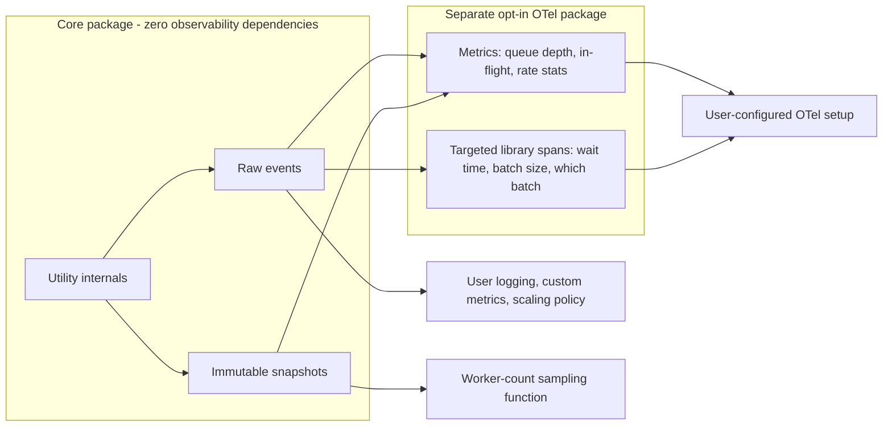

# Observability

Limitee is built around an **event-driven architecture with a rich set of niche
events**, exposing data **raw** so each developer wires it into their own
observability as they see fit
([D-090](../decisions.md#d-090-observability-is-event-driven-and-exposes-raw-data)).

The core carries **zero observability dependencies**: no OpenTelemetry, no logger,
no metrics library.

- [Three surfaces](#three-surfaces)
- [Events](#events)
- [Metrics snapshots](#metrics-snapshots)
- [The optional OTel package](#the-optional-otel-package)
- [Defaults](#defaults)
- [Invariants](#invariants)
- [Test coverage](#test-coverage)
- [Open items](#open-items)

## Three surfaces

| Surface | Shape | Who consumes it |
| --- | --- | --- |
| **Events** | Push. Raw payload values delivered to subscribed handlers | Anyone — logging, custom metrics, scaling decisions |
| **Snapshots** | Pull. An immutable point-in-time read of state and statistics | Dashboards, health checks, the worker-count sampler |
| **Spans** | Push, and only from the optional package | Tracing backends |

Events and snapshots are **not alternatives**: the sampling function that drives
`ParallelWorkers` reads a snapshot, while an operator dashboard typically consumes
events. Both are first-class.

## Events

Desired events, non-exhaustive — each binding exposes them idiomatically
(C# events, Node emitters, Go channels, Rust callbacks or streams, Python
callbacks):

| Event | Fires when | Carries |
| --- | --- | --- |
| On worker start | A fresh worker begins its loop | Worker identity |
| On worker stop | A worker reaches `Dead` after draining | Worker identity, reason |
| On worker complete | A worker finishes a unit of work | Worker identity, duration |
| On worker increment | A worker is added | New count |
| On worker amount change | The worker count changes for any reason | Previous and new count, desired count |
| On item complete | A submitted item reaches a terminal outcome | Item identity, outcome |
| On sample | The sampling interval elapses | Queued-item counts and metrics at that instant |
| On error | A task, batch, or worker fails | The error, the affected item or batch |
| On batch exceeded | An item does not fit the current batch | Batch size or weight, the carried-over item |
| On max batch | A batch closes because it hit its bound | Batch size, and weight where applicable |

Rules:

- **Raw, not interpreted.** No formatting, no aggregation, no sampling decisions
  made for the user.
- **Immutable payloads.** A handler cannot mutate library state by editing what it
  was handed ([design-principles.md § Immutability](../design-principles.md#immutability-where-it-belongs)).
- **Handler failure is isolated.** A throwing event handler never breaks the
  utility that emitted the event
  ([INV-12](../architecture.md#invariants)).
- **Events never replace a caller's result.** An item's outcome always reaches its
  caller as well — except on the deferred retry path, where the event *is* the
  reporting channel by design
  ([retry-decorator.md](../utilities/retry-decorator.md#two-retry-api-styles)).
- **Every announced non-execution is observable**: timeout, cancellation, and
  shutdown cancellation surface both to the caller and through events
  ([INV-2](../architecture.md#invariants)).

## Metrics snapshots

Every utility lets users read current state and statistics — the number of items
in the queue, the number being processed, and the relevant rate-limiting or
batch-processing metrics. This is important for metrics and is part of the public
API, not a debug aid.

| Snapshot field | Exposed by |
| --- | --- |
| Queue depth, and queued weight where applicable | Every queue owner |
| In-flight count | `RateController`, `GroupedRateController` |
| Current and desired worker count | `ParallelWorkers` and everything built on it |
| Per-group in-flight and allocation | `GroupedRateController` |
| Current batch size and in-flight batch count | The accumulators |
| Attempt counts and delayed-queue depth | `RetryDecorator` |
| Coordinated member count, and whether the tracker is degraded | The Redis tracker |

A snapshot is a **value**, with no live link to its source, so a caller can hold
one without tearing or locking.

## The optional OTel package

On top of the raw data there is an **optional OpenTelemetry wrapper: a separate
opt-in package per language, living in the same monorepo**, so the core carries
zero OTel dependency
([D-091](../decisions.md#d-091-otel-is-a-separate-opt-in-package-per-language)).

The user brings and configures their own OTel setup. Overriding directive:
**always give the user a way to customize it.**

The package emits both metrics and traces:

1. **Metrics** — exposed as expected: queue depth, in-flight counts,
   rate-limiting statistics, and so on.
2. **Traces** — the user's own function traces pass through **cleanly**, without
   the library's boundaries or overhead polluting them. The user's code dominates
   the span tree: their spans, their trace
   ([D-092](../decisions.md#d-092-user-traces-pass-through-cleanly-library-spans-are-targeted)).
3. **Custom library spans** — a few targeted spans around the library's own
   stages, so a user can diagnose when slowness comes from Limitee rather than
   from their own code:

| Span | Answers |
| --- | --- |
| Admission wait | "Was the delay queueing, or my function?" |
| Batch size and which batch | "Is batching adding latency, and did my item land in a big batch?" |
| Backoff wait | "How much of this latency was retry delay?" |

The test for whether this is right: **removing the OTel package must change
nothing but telemetry.** No behavior, no timing contract, no event.

## Defaults

| Option | Default | Notes |
| --- | --- | --- |
| Event handlers | None subscribed | Zero cost when unused |
| Sample event interval | `Undecided` | Shares the sampling interval ([parallel-workers.md](../utilities/parallel-workers.md#defaults)) |
| Snapshots | Always available | Public API |
| OTel | Not installed | Separate package ([D-091](../decisions.md#d-091-otel-is-a-separate-opt-in-package-per-language)) |
| Logging | None, ever | The library never logs on the user's behalf |

## Invariants

- The core package has no observability dependency.
- A throwing event handler cannot break the emitting utility.
- Event payloads are immutable and never expose live internal collections.
- Snapshots are consistent point-in-time values.
- Removing the OTel package changes telemetry only.

## Test coverage

Case IDs `OB-xxx` in [testing.md § Observability](../testing.md#observability-ob).

## Open items

| Item | Status |
| --- | --- |
| The exact event payload shape per event | Not decided. Surfaced during consolidation |
| Whether event delivery is synchronous or queued, and whether ordering is guaranteed | Not decided. Surfaced during consolidation |
| Whether `on sample` shares the `ParallelWorkers` sampling interval or has its own | Not decided. Surfaced during consolidation |
| The OTel package's metric and span naming conventions | Not decided. Surfaced during consolidation |
