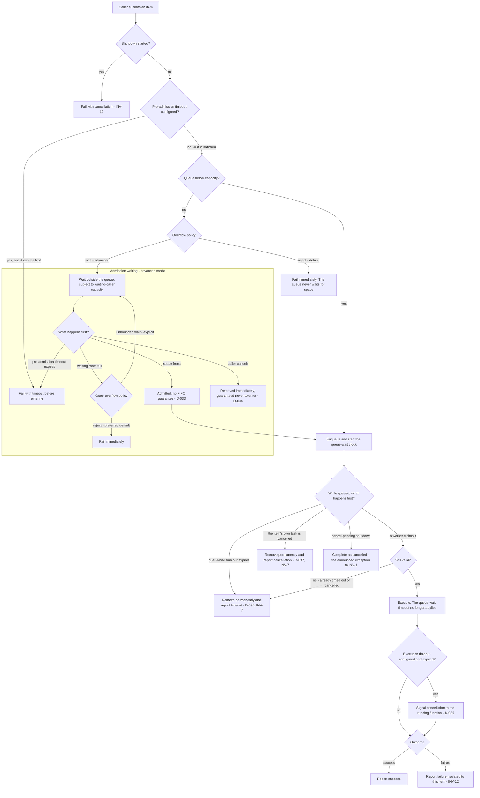

# Queue and Admission

The bounded-queue primitive every Limitful utility is built on. It owns capacity,
overflow behavior, the timeout stages, and the cancellation rules — so that each
utility inherits the same reliability contract instead of reinventing it.

- [The core invariant](#the-core-invariant)
- [Full lifecycle](#full-lifecycle)
- [Overflow policy](#overflow-policy)
- [Timeout stages](#timeout-stages)
- [Cancellation](#cancellation)
- [Shutdown interaction](#shutdown-interaction)
- [Defaults](#defaults)
- [Advanced options](#advanced-options)
- [Invariants](#invariants)
- [Test coverage](#test-coverage)
- [Open items](#open-items)

## The core invariant

**The system is hermetic and end-to-end data reliable at every point: once a job
is queued it is guaranteed to be processed.** A queued job is **never dropped
unannounced**, and never by dropping the oldest
([INV-1](../architecture.md#invariants)).

There are exactly three exceptions, and every one of them is **announced to the
caller** as a cancellation or a timeout
([INV-2](../architecture.md#invariants)):

1. **Cancel-pending shutdown** — queued-but-not-started jobs complete as cancelled
   ([D-070](../decisions.md#d-070-shutdown-is-either-drain-or-cancel-pending)).
2. **An expired queue-wait timeout**
   ([D-036](../decisions.md#d-036-a-queue-wait-timeout-removes-the-item-permanently)).
3. **A job whose own task was cancelled**
   ([D-037](../decisions.md#d-037-a-cancelled-item-never-runs)).

Reliability is **process-lifetime only**. Job persistence across crashes and
restarts is explicitly out of scope
([D-072](../decisions.md#d-072-job-persistence-across-restarts-is-out-of-scope),
[INV-14](../architecture.md#invariants)); a caller who needs a durable queue adds
that layer themselves. Within the process lifetime, reliability must be complete
and precise.

Every queue in the library is **bounded**, with configuration for maximum queued
items, timeouts, and the overflow strategy
([D-003](../decisions.md#d-003-queues-are-always-bounded),
[INV-3](../architecture.md#invariants)). Unbounded growth causes serious memory
problems at scale, and worse when the process is stacked on something more
constrained.

## Full lifecycle

## Overflow policy

When a queue reaches its configured maximum, the user chooses between two
behaviors:

### 1. Reject — the default

Insertion **fails immediately**. The queue never waits for space; waiting is
available only through the explicit wait mode
([D-030](../decisions.md#d-030-a-full-queue-rejects-immediately-by-default)).

This is the default because it avoids admission waiting entirely. Wait mode can
retain bounded memory through its separate waiting-caller capacity; explicit
unbounded waiting deliberately gives up that guarantee
([design-principles.md § What "simple" costs](../design-principles.md#what-simple-costs)).

### 2. Wait — advanced

New items wait on **admission itself**. Callers hold a number of items pending
their own insertion, and as the queue drains those items are admitted and
processed in turn
([D-179](../decisions.md#d-179-wait-mode-has-a-configurable-bounded-waiting-room)).

Three properties of this mode are deliberate and must be documented wherever it
is offered:

- **Waiting callers have a configurable capacity.** The queue bound and the
  waiting-caller bound are separate. If both are full, the preferred default is
  to reject the newcomer.
- **Unbounded waiting is explicit.** A caller may deliberately allow waiting
  beyond that cap, but this gives up the controller's memory guarantee and must be
  documented as an unsafe backpressure choice
  ([D-179](../decisions.md#d-179-wait-mode-has-a-configurable-bounded-waiting-room)).
- **No FIFO guarantee.** Admission order among waiting callers is
  implementation-dependent. Strict FIFO adds unnecessary complexity and is not
  required ([D-033](../decisions.md#d-033-no-fifo-guarantee-for-admission-waiters)).
- **Cancellation is immediate and final.** Cancelling while awaiting insertion
  removes the pending request and guarantees it never enters the queue later
  ([D-034](../decisions.md#d-034-cancellation-while-awaiting-insertion-is-immediate-and-final)).

**Never drop the oldest.** No overflow strategy evicts already-queued work. That
is silent data loss ([INV-1](../architecture.md#invariants)).

## Timeout stages

Timeout scopes are **distinct per lifecycle stage**, and a parameter named simply
"timeout" does not exist
([D-035](../decisions.md#d-035-timeout-scopes-are-distinct-per-lifecycle-stage)).

| Stage | Window | On expiry | Configured |
| --- | --- | --- | --- |
| **Pre-admission** | Before the item gains entry to the queue | The submission fails; the item never enters | Optional |
| **Queue-wait** | While the item waits under backlog | The item is **removed and guaranteed never to execute later** — the caller does not merely stop waiting while the item lingers | Optional |
| **Execution** | Once work is running | **Signals cancellation to the running function**, rather than only timing out the callers | Optional |
| **Whole-batch-function** | Possibly distinct from per-item execution | **Open item** — see [async-accumulator.md](../utilities/async-accumulator.md#open-items) | Undecided |

Hand-off rule: **once an item is dequeued and execution begins, its queue-wait
timeout no longer applies.** The execution timeout policy takes over. The two
windows never overlap, so an item can never be failed twice for time.

The **accumulation interval** of the accumulators is batching and scheduling
behavior, not one of these failure timeouts
([async-accumulator.md](../utilities/async-accumulator.md#batching-worker-lifecycle)).

## Cancellation

Cancellation is terminal everywhere ([INV-5](../architecture.md#invariants)) and
**removal is part of the contract**, not a side effect:

| Cancelled while… | Result |
| --- | --- |
| Awaiting insertion | Pending request removed; guaranteed never to enter the queue ([D-034](../decisions.md#d-034-cancellation-while-awaiting-insertion-is-immediate-and-final)) |
| Queued | Item removed; guaranteed never to execute, even while it still physically resides in the queue ([D-037](../decisions.md#d-037-a-cancelled-item-never-runs)) |
| Executing | Physical work runs to completion. Cancellation wins the caller's eventual outcome, and the eventual work result is discarded ([D-182](../decisions.md#d-182-queued-cancellation-wins-the-caller-outcome-without-stopping-running-work)) |
| Under retry backoff | Terminal; no further attempts ([INV-5](../architecture.md#invariants)) |

**Open item.** The atomic race rules when cancellation or timeout and the
execution claim — or admission — become ready concurrently are not yet defined.
Until they are, a binding must at minimum guarantee that the item resolves
**exactly once**: never executed *and* reported cancelled, never reported twice.

## Shutdown interaction

- **New enqueues stop immediately** once shutdown begins, failing with
  cancellation ([INV-10](../architecture.md#invariants)).
- **Drain** lets queued work finish, then disposes.
- **Cancel pending** cancels every queued-but-not-started job; already-executing
  jobs are not included and may finish under their normal behavior
  ([D-070](../decisions.md#d-070-shutdown-is-either-drain-or-cancel-pending)).
- **Open item:** what happens to callers already *awaiting insertion* when
  shutdown begins is unspecified. The consistent reading is that they fail with
  cancellation like any post-shutdown enqueue, but that has not been decided.

## Defaults

| Option | Default | Notes |
| --- | --- | --- |
| Bounded | Always | Not optional ([INV-3](../architecture.md#invariants)) |
| Max queued | `Undecided` | Each utility inherits this gap; see [rate-controller.md § Open items](../utilities/rate-controller.md#open-items) |
| Overflow policy | `Reject` | ([D-030](../decisions.md#d-030-a-full-queue-rejects-immediately-by-default)) |
| Pre-admission timeout | Not configured | Optional stage |
| Queue-wait timeout | Not configured | Optional stage |
| Execution timeout | `Undecided` | Open |
| Waiting-caller capacity | Configurable | Separate from queue capacity ([D-179](../decisions.md#d-179-wait-mode-has-a-configurable-bounded-waiting-room)) |
| Outer overflow when queue and waiting room are full | Reject preferred | Explicit unbounded waiting is available with a memory warning |
| Admission order among waiters | Unspecified | ([D-033](../decisions.md#d-033-no-fifo-guarantee-for-admission-waiters)) |

## Advanced options

| Option | Shape | Effect |
| --- | --- | --- |
| Overflow policy | enum | Reject, or wait |
| Waiting-caller capacity and outer overflow | number and enum | Bound callers outside the queue; reject or explicitly allow unbounded waiting when full |
| The three timeout stages | durations | Independent per stage |
| Max queued | number | Capacity bound |
| Clock / scheduler | injected | Deterministic timeout tests ([D-103](../decisions.md#d-103-the-clock-is-public-api)) |

## Invariants

[INV-1](../architecture.md#invariants), [INV-2](../architecture.md#invariants),
[INV-3](../architecture.md#invariants), [INV-7](../architecture.md#invariants),
[INV-10](../architecture.md#invariants), [INV-14](../architecture.md#invariants).

Restated as assertions a test can make:

1. An admitted item reaches exactly one terminal outcome.
2. No admitted item disappears without an announcement to its caller.
3. No overflow strategy removes an already-queued item.
4. A timed-out or cancelled queued item never executes afterward.
5. Queue depth never exceeds the configured maximum.
6. No enqueue succeeds after shutdown begins.

## Test coverage

Case IDs `QA-xxx` in [testing.md § Queue and admission](../testing.md#queue-and-admission-qa).
Every utility that owns a queue must pass the `QA` suite against its own surface.

## Open items

| Item | Status |
| --- | --- |
| Utilities beyond `RateController` and `ThroughputController` that expose the controller-style wait mode | Not decided. Both controllers are explicitly covered by [D-179](../decisions.md#d-179-wait-mode-has-a-configurable-bounded-waiting-room) |
| Disposition of callers awaiting insertion when shutdown begins | Not decided ([D-070](../decisions.md#d-070-shutdown-is-either-drain-or-cancel-pending)) |
| Atomic race rules between timeout/cancellation and the execution claim or admission | Not decided ([D-034](../decisions.md#d-034-cancellation-while-awaiting-insertion-is-immediate-and-final)) |
| Default max queued, and default execution timeout | Not decided. Surfaced during consolidation |
| Whether a retry re-entering a full queue uses the configured overflow policy or something else | Not decided ([retry-decorator.md](../utilities/retry-decorator.md#open-items)) |
