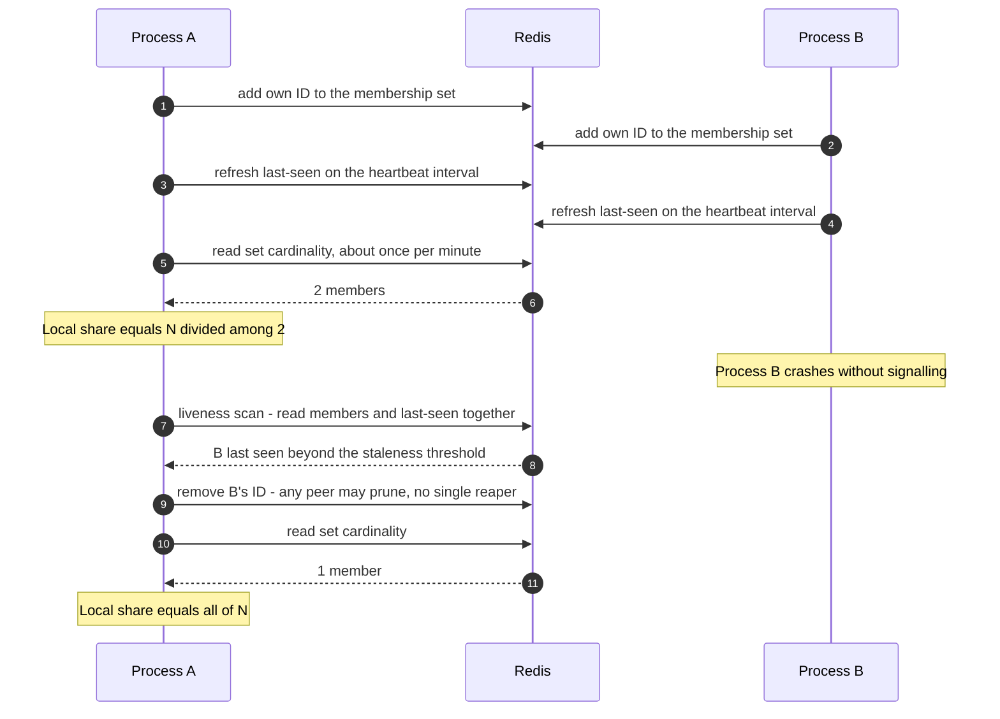
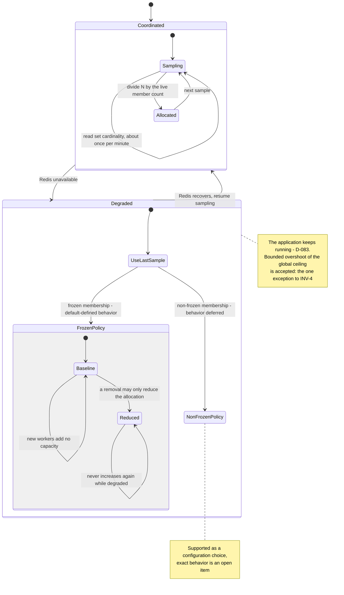

# Redis Coordination

Optional cross-process coordination. By default Limitee is **in-memory and
in-process**; enabling a Redis-backed tracker lets several processes share one
global ceiling ([D-080](../decisions.md#d-080-in-memory-by-default-redis-is-opt-in)).

The architectural commitment: **coordination is advisory, never load-bearing for
availability.** A Redis outage degrades accuracy, never liveness.

- [Scope](#scope)
- [Set-based counting](#set-based-counting)
- [Liveness](#liveness)
- [Fail-open behavior](#fail-open-behavior)
- [The adapter](#the-adapter)
- [Cluster compliance](#cluster-compliance)
- [Defaults](#defaults)
- [Advanced options](#advanced-options)
- [Invariants](#invariants)
- [Test coverage](#test-coverage)
- [Open items](#open-items)

## Scope

When Redis is enabled, **everything is coordinated** across instances:
`RateController` concurrency, `ParallelWorkers` counts, and the accumulators
([D-081](../decisions.md#d-081-enabling-redis-coordinates-every-utility)).

| Owns | Does not own |
| --- | --- |
| Set-based membership and counting | Connecting to Redis — the user injects an adapter ([D-085](../decisions.md#d-085-redis-access-goes-through-a-user-supplied-adapter)) |
| The liveness protocol: heartbeat, last-seen, peer disqualification | Any specific Redis client library |
| Fail-open fallback and frozen membership | Durable job storage ([INV-14](../architecture.md#invariants)) |
| Key naming, prefixing, and deliberate hash-slot design | Cross-process job hand-off — jobs never move between processes |

Limitee coordinates **counts**, not work. A job submitted to one process is
always executed by that process; Redis only tells each process how much of the
global allowance is its share.

## Set-based counting

**Never use increment/decrement** — that loses idempotency on retry
([D-082](../decisions.md#d-082-distributed-counting-is-set-based-never-increment-or-decrement),
[INV-11](../architecture.md#invariants)).

Each counted entity has a specific ID and joins a Redis **set**. To release — a
`ParallelWorker` retiring itself, for instance — it removes **its own ID** from
the set. The effective count is the **cardinality of the set**, which is far more
accurate and retry-safe than a mutated number.

Why this matters: a dropped acknowledgement on an `INCR` leaves the counter
permanently wrong, and a retried `DECR` double-counts. Adding or removing a known
ID is idempotent, so any command can be retried safely.

## Liveness

A distributed, self-cleaning protocol keeps stale IDs from crashed instances from
inflating the set forever
([D-086](../decisions.md#d-086-liveness-is-a-distributed-self-cleaning-protocol)):

1. **Graceful removal on clean death.** A process that dies cleanly signals Redis
   to remove its set members. This is part of ordered disposal
   ([architecture.md § Lifecycle](../architecture.md#lifecycle-and-disposal)).
2. **Heartbeat / keep-alive service.** Enabling Redis for any utility starts a
   heartbeat on a user-configurable interval that periodically refreshes a
   keep-alive.
3. **Last-seen timestamp plus peer disqualification.** A separate key stores each
   member's last keep-alive time. Workers periodically scan the sets and
   disqualify any member whose keep-alive has gone stale.

The third step is **fully distributed**: any worker can prune dead peers, so
there is no single reaper and no leader election, and the set stays frequently and
accurately updated.



## Fail-open behavior

**Redis must never become a dependency whose outage disables the application**
([D-083](../decisions.md#d-083-a-redis-outage-fails-open-to-local-continuation)).

Each process samples the active worker/process count periodically — roughly once
per minute. If Redis becomes unavailable, the process **keeps running** and uses
the **last sampled count** to divide the global allowance locally until Redis
recovers.

Slow membership changes may cause a gradual, **bounded overshoot** of the global
ceiling. That tradeoff is accepted deliberately, and it is **the one documented
exception** to `RateController`'s hard coordinated ceiling
([INV-4](../architecture.md#invariants),
[rate-controller.md](../utilities/rate-controller.md#the-ceiling-and-the-worker-count)).



### Membership policy during an outage

Configurable
([D-084](../decisions.md#d-084-membership-during-an-outage-is-configurable-frozen-is-defined)):

| Policy | Behavior |
| --- | --- |
| **Frozen membership** | Treat the last sampled count as the baseline. Do not add capacity or account for newly appearing workers. Removals may **only reduce** the effective capacity/allocation, never increase it |
| **Non-frozen membership** | Supported as a configuration choice; its exact behavior is **deferred** — see [open items](#open-items) |

Frozen membership is the conservative policy: it can only shrink a process's
share while blind, so overshoot stays bounded by the membership drift that
occurred during the outage.

## The adapter

**The library does not bundle or control a specific Redis library.** Users inject
their own adapter — how to connect, how to read values, how to execute commands —
so any Redis client works
([D-085](../decisions.md#d-085-redis-access-goes-through-a-user-supplied-adapter)).
npm has many clients; C# effectively has one; Go and Rust choices are TBD.

Design goal: **adaptive, comfortable, and highly customizable.**

> Illustrative pseudocode. No public API signature is committed yet.

```text
tracker = redisTracker({
  adapter: {
    execute: (command, keys, args) => myClient.send(command, keys, args),
    # plus whatever each binding needs for multi-key and scripted operations
  },
  keyPrefix: "myapp:limitee",
  heartbeatInterval: seconds(10),
  stalenessThreshold: seconds(45),
  membershipDuringOutage: Membership.Frozen,
})
```

The adapter is also the **test seam**: an in-memory fake adapter, driven by an
injected clock, makes outage, recovery, and stale-peer pruning fully
deterministic ([testing.md § Test doubles](../testing.md#test-doubles-and-override-points)).

## Cluster compliance

**Cluster compliance is a hard requirement**
([D-087](../decisions.md#d-087-cluster-compliance-requires-deliberate-selective-slotting-and-a-user-prefix)).

1. **Key slotting is designed deliberately.** Any operation touching multiple keys
   together — multi-get, multi-key commands, transactions, scripts — must ensure
   those keys land in the **same hash slot**, using hash tags so related keys
   co-locate. **Every multi-key operation is an explicit slotting design point and
   must be called out, not assumed.**
2. **User-defined key prefix.** The user can define a prefix for all Limitee keys,
   so the library coexists with a Redis instance used for other purposes without
   clobbering anything. The prefix also lets multiple rate controllers and
   mechanisms across multiple services intentionally **share or isolate**
   coordination as desired.
3. **Slot selectively, not globally.** Keys only ever touched on their own slot
   **naturally** — let Redis place them, no hash tag needed, since there is no
   batched or multi-key operation on them. Impose explicit hash-tag slotting
   **only** where an operation genuinely reads multiple keys together, such as the
   liveness scan, where a worker checks which peers have died without signalling.

| Operation | Keys touched together | Slotting |
| --- | --- | --- |
| Join / leave membership | One set key | Natural |
| Read effective count | One set key | Natural |
| Heartbeat refresh | One last-seen key | Natural |
| **Liveness scan** | Membership set **and** last-seen keys | **Deliberate** — must co-locate |

**Open item.** Whether the membership set and the last-seen timestamp key share a
hash tag (co-locate) or stay independent is **not yet decided** — it depends on
the final counting mechanism. The distinction between deliberately slotted and
naturally slotted keys is important and must be resolved once that mechanism is
designed.

## Defaults

| Option | Default | Notes |
| --- | --- | --- |
| Distributed coordination | **Off** | In-memory, in-process, zero dependencies ([D-080](../decisions.md#d-080-in-memory-by-default-redis-is-opt-in)) |
| Adapter | None | Required once coordination is enabled |
| Key prefix | `Undecided` | A library-identifying default is expected. Surfaced during consolidation |
| Count sampling interval | About once per minute | ([D-083](../decisions.md#d-083-a-redis-outage-fails-open-to-local-continuation)) |
| Heartbeat interval | User-configurable, no value chosen | ([D-086](../decisions.md#d-086-liveness-is-a-distributed-self-cleaning-protocol)) |
| Staleness threshold | `Undecided` | Must exceed the heartbeat interval by a safe margin. Surfaced during consolidation |
| Outage membership policy | `Undecided` | Frozen is fully defined; which policy is the default is not ([D-084](../decisions.md#d-084-membership-during-an-outage-is-configurable-frozen-is-defined)) |
| Outage behavior | Fail open, keep running | Not configurable ([D-083](../decisions.md#d-083-a-redis-outage-fails-open-to-local-continuation)) |

## Advanced options

| Option | Shape | Effect |
| --- | --- | --- |
| Adapter | injected interface | Any Redis client, or a fake in tests |
| Key prefix | string | Coexistence, and deliberate sharing or isolation across services |
| Heartbeat interval | duration | Liveness refresh frequency |
| Staleness threshold | duration | When a peer becomes disqualifiable |
| Sampling interval | duration | How often the global count is re-read |
| Outage membership policy | enum | Frozen or non-frozen |
| Clock | injected | Deterministic heartbeat, staleness, and outage tests |

## Invariants

- Counting is set-based and idempotent; `INCR`/`DECR` is never used
  ([INV-11](../architecture.md#invariants)).
- An entity only ever removes **its own** ID, except through the explicit
  staleness-based peer disqualification path.
- A Redis outage never blocks admission or stops the application
  ([D-083](../decisions.md#d-083-a-redis-outage-fails-open-to-local-continuation)).
- Under frozen membership, a degraded process's allocation never grows.
- Overshoot during an outage is bounded by membership drift, not unbounded.
- Every multi-key operation has a documented, deliberate slot design.
- All keys carry the user-configured prefix.
- Clean shutdown removes membership before disposal completes.

## Test coverage

Case IDs `RDS-xxx` in [testing.md § Redis coordination](../testing.md#redis-coordination-rds).
All of them run against a **fake in-memory adapter plus an injected clock** — no
real Redis in the business suite. A binding may additionally run an integration
suite against a real cluster as a technical test.

## Open items

| Item | Status |
| --- | --- |
| The non-frozen membership policy and which policy is the default | Not decided ([D-084](../decisions.md#d-084-membership-during-an-outage-is-configurable-frozen-is-defined)) |
| Whether the membership set and the last-seen key co-locate under one hash tag | Not decided, pending the final counting mechanism ([D-087](../decisions.md#d-087-cluster-compliance-requires-deliberate-selective-slotting-and-a-user-prefix)) |
| How `N` is divided across processes, including integer remainders and whether every process may round up | Not decided. Related to grouped allocation normalization ([grouped-rate-controller.md](../utilities/grouped-rate-controller.md#open-items)) |
| The exact adapter interface, including how multi-key and scripted operations are expressed across clients | Not decided. Surfaced during consolidation |
| Default key prefix, heartbeat interval, and staleness threshold | Not decided. Surfaced during consolidation |
| Whether coordination can be enabled per utility or only process-wide | Not decided. `CLAUDE.md` says enabling Redis "for any utility" starts the heartbeat, which implies per-utility opt-in with a shared heartbeat. Surfaced during consolidation |
