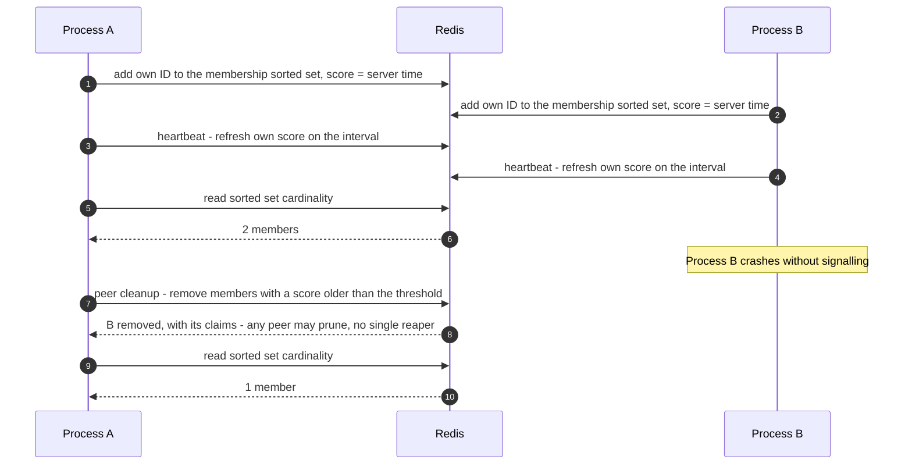

# Redis synchronization

Redis implementations of the
[`SynchronizationProvider`](../utilities/synchronization-provider.md) contract
and its healthcheck. Limitful controllers depend only on the backend-neutral
contract; they never name Redis or receive a Redis adapter
([D-163](../decisions.md#d-163-synchronizationprovider-is-the-backend-neutral-public-contract)).

| Class | Role |
| --- | --- |
| `RedisHealthcheck` | Membership, heartbeats and peer cleanup in Redis; shared by both synchronizers |
| `RedisSynchronization` | **Accurate**: every incoming item asks Redis for permission; the limit is kept exactly across instances |
| `LooseRedisSynchronization` | **Loose**: an in-memory synchronizer that divides each limit by the live instance count sampled from `RedisHealthcheck`; no Redis call per item |

The user picks accuracy or volume by picking the class
([D-206](../decisions.md#d-206-redis-ships-redissynchronization-and-looseredissynchronization)).

- [Scope](#scope)
- [Set-based counting](#set-based-counting)
- [RedisHealthcheck](#redishealthcheck)
- [RedisSynchronization](#redissynchronization)
- [LooseRedisSynchronization](#looseredissynchronization)
- [Outage behavior](#outage-behavior)
- [The Redis adapter](#the-redis-adapter)
- [Cluster compliance](#cluster-compliance)
- [Defaults](#defaults)
- [Advanced options](#advanced-options)
- [Invariants](#invariants)
- [Test coverage](#test-coverage)
- [Open items](#open-items)

## Scope

By default a utility has no synchronizer at all (`null`)
([D-207](../decisions.md#d-207-no-synchronization-by-default)). A utility opts into
cross-instance coordination by receiving one of these synchronizers. Several
utilities may share one synchronizer or one healthcheck instance, but no utility
is coordinated merely because another utility uses Redis.

| Owns | Does not own |
| --- | --- |
| Redis representation of membership, per-item claims, and count-like state | The backend-neutral contract or capability names |
| The heartbeat sorted set and peer cleanup | Any specific Redis client library |
| Redis outage detection, recovery, and the Redis mechanics of the local-share fallback | The outage rule itself, which belongs to the neutral contract ([D-199](../decisions.md#d-199-losing-the-synchronization-backend-never-stops-the-application)) |
| Key naming, prefixing, scripts, and deliberate hash-slot design | Durable job storage or cross-process payload transfer ([INV-14](../architecture.md#invariants)) |

The synchronizers coordinate **permission and shared state**, not work. A job
submitted to one process is always executed by that process.

## Set-based counting

**Never use increment/decrement** — that loses idempotency on retry
([D-082](../decisions.md#d-082-distributed-counting-is-set-based-never-increment-or-decrement),
[INV-11](../architecture.md#invariants)).

Each counted entity has a specific ID and joins a Redis **set** (or sorted set).
To release, it removes **its own ID**. The effective count is the **cardinality of
the set**, which is far more accurate and retry-safe than a mutated number. This
applies to membership and to the per-item claims of `RedisSynchronization`.

Why this matters: a dropped acknowledgement on an `INCR` leaves the counter
permanently wrong, and a retried `DECR` double-counts. Adding or removing a known
ID is idempotent, so any command can be retried safely.

## RedisHealthcheck

The Redis implementation of the shared
[peer healthcheck](../utilities/synchronization-provider.md#peer-healthcheck)
([D-200](../decisions.md#d-200-every-provider-runs-a-distributed-peer-healthcheck),
[D-201](../decisions.md#d-201-redis-membership-and-heartbeats-live-in-one-sorted-set),
[D-205](../decisions.md#d-205-the-healthcheck-is-a-separate-shareable-abstraction)).
Both `RedisSynchronization` and `LooseRedisSynchronization` use it. There is one
`RedisHealthcheck` per process, and its membership is per process, not per scope.

**One sorted set (ZSET) per scope holds both membership and heartbeats.** The
member is the instance ID; the score is the time of that instance's last
heartbeat, taken from Redis server time, never the instance's own clock.

| Step | Redis operation |
| --- | --- |
| Join, and every heartbeat | Add the own ID with the current server time as its score (idempotent: the same ID stays one member) |
| Live count | Cardinality of the sorted set |
| Peer cleanup | Remove members whose score is older than now minus the staleness threshold, and the claims they owned |
| Clean shutdown | Remove the own ID and its claims |

1. **Graceful removal on clean death.** A process that dies cleanly removes its
   own ID. This is part of ordered disposal
   ([architecture.md § Lifecycle](../architecture.md#lifecycle-and-disposal)).
2. **Heartbeat.** The healthcheck refreshes the instance's score on a
   user-configurable interval.
3. **Peer cleanup.** Every healthy instance periodically removes members whose
   score has gone stale, so any instance cleans up the dead state of the others.

Cleanup is **fully distributed**: any instance can prune dead peers, so there is
no single reaper and no leader election. Removing by score range is idempotent,
so two instances pruning at once is harmless.

**Redis Streams** may be added if needed, for example to announce joins and
departures so peers re-divide immediately instead of at the next sample. Whether
and how is [open](#open-items).



## RedisSynchronization

**Accurate.** Every incoming item asks Redis for permission before it starts
([D-206](../decisions.md#d-206-redis-ships-redissynchronization-and-looseredissynchronization)).

- **Concurrency limits** (`RateController`): one atomic script checks the number
  of current claims against the limit and, if there is room, adds the item's claim
  ID tagged with the owning instance. The item removes its claim when it finishes.
  Counting is by claim IDs, not `INCR`/`DECR`.
- **Grouped limits** (`GroupedRateController`): the same script checks the group's
  limit and the global ceiling together, and adds the claim to both.
- **Rates** (`ThroughputController`): one atomic script reads Redis server time,
  advances the shared rate state, and records a reservation ID.

Every Redis call times out after **500 ms** by default (configurable); a timeout
means Redis is treated as down and the synchronizer switches to the local share
([D-208](../decisions.md#d-208-backend-calls-time-out-after-500-ms-and-a-timeout-means-the-backend-is-down)). While Redis is healthy the limit holds exactly
across all instances. The cost is
one Redis round trip per item plus one to release, so Redis capacity bounds the
item rate. A crashed instance's claims are removed by `RedisHealthcheck`'s peer
cleanup.

## LooseRedisSynchronization

**Loose.** An `InMemorySynchronization` whose limits are divided by the live
instance count it samples from `RedisHealthcheck`
([D-206](../decisions.md#d-206-redis-ships-redissynchronization-and-looseredissynchronization)).

- Each instance enforces `limit ÷ live instances` locally: `N ÷ instances` for
  `RateController`, each group limit and the global ceiling ÷ instances for
  `GroupedRateController`, `rate ÷ instances` for `ThroughputController`.
- The per-item admission check is answered in memory. Redis sees only the
  healthcheck traffic, so the item rate is not limited by Redis.
- The instance count is re-read periodically, about once per minute. When
  instances join or leave, totals can briefly exceed a limit until the next
  sample; that bounded overshoot is accepted.

## Outage behavior

Both synchronizers report healthy, degraded/uncertain, and recovered state through
the neutral contract and follow its outage rule: losing Redis never stops the
application
([D-199](../decisions.md#d-199-losing-the-synchronization-backend-never-stops-the-application)).

If Redis becomes unavailable, each process **keeps running** and uses the **last
sampled instance count** to divide each limit locally until Redis recovers.
`LooseRedisSynchronization` simply keeps its last share. `RedisSynchronization`
switches to the same local share, behaving like the loose synchronizer, and
returns to per-item claims after recovery and reconciliation.

Slow membership changes may cause a gradual, **bounded overshoot** of a limit.
That tradeoff is accepted deliberately
([D-199](../decisions.md#d-199-losing-the-synchronization-backend-never-stops-the-application)).
A `ThroughputController` divides its rate rather than copying the whole
last-known global reservoir into every process. No local share is ever reported
as a hard global guarantee.

```mermaid
stateDiagram-v2
  [*] --> Coordinated

  state Coordinated {
    [*] --> Healthy
    Healthy --> Healthy: accurate - per-item claims; loose - share from the live count
  }

  Coordinated --> Degraded: Redis unavailable

  state Degraded {
    [*] --> UseLastSample
    UseLastSample --> FrozenPolicy: frozen membership - default-defined behavior
    UseLastSample --> NonFrozenPolicy: non-frozen membership - behavior deferred

    state FrozenPolicy {
      [*] --> Baseline
      Baseline --> Baseline: new instances add no capacity
      Baseline --> Reduced: a removal may only reduce the share
      Reduced --> Reduced: never increases again while degraded
    }
  }

  Degraded --> Coordinated: Redis recovers, reconcile, resume

  note right of Degraded
    The application keeps running - D-199.
    Bounded overshoot is accepted
  end note
  note right of NonFrozenPolicy
    Supported as a configuration choice,
    exact behavior is an open item
  end note
```

### Membership policy during an outage

Configurable
([D-084](../decisions.md#d-084-membership-during-an-outage-is-configurable-frozen-is-defined)):

| Policy | Behavior |
| --- | --- |
| **Frozen membership** | Treat the last sampled count as the baseline. Do not add capacity or account for newly appearing instances. Removals may **only reduce** the effective share, never increase it |
| **Non-frozen membership** | Supported as a configuration choice; its exact behavior is **deferred** — see [open items](#open-items) |

Frozen membership is the conservative policy: it can only shrink a process's
share while blind, so overshoot stays bounded by the membership drift that
occurred during the outage.

## The Redis adapter

**Limitful does not bundle or control a specific Redis client.** Users construct
`RedisHealthcheck` and the synchronizers with a Redis-specific adapter describing
how to connect and execute commands/scripts, so any client works
([D-085](../decisions.md#d-085-redis-access-goes-through-a-user-supplied-adapter)).

The adapter is private to the Redis classes. It is never accepted by
`RateController`, `ThroughputController`, or another controller API.

> Illustrative pseudocode. No public API signature is committed yet.

```text
health = redisHealthcheck({
  adapter: { execute: (command, keys, args) => myClient.send(command, keys, args) },
  keyPrefix: "myapp:limitful",
  heartbeatInterval: seconds(10),
  stalenessThreshold: seconds(45),
})

exact = redisSynchronization({ healthcheck: health, adapter: ... })   # accurate
fast  = looseRedisSynchronization({ healthcheck: health })            # loose
```

The adapter is also the **test seam**: an in-memory fake adapter, driven by an
injected clock, makes outage, recovery, and stale-peer pruning fully
deterministic ([testing.md § Test doubles](../testing.md#test-doubles-and-override-points)).

## Cluster compliance

**Cluster compliance is a hard requirement**
([D-087](../decisions.md#d-087-cluster-compliance-requires-deliberate-selective-slotting-and-a-user-prefix)).

1. **Key slotting is designed deliberately.** Any operation touching multiple keys
   together — multi-get, multi-key commands, transactions, scripts — must ensure
   those keys land in the **same hash slot**, using hash tags so related keys
   co-locate. **Every multi-key operation is an explicit slotting design point and
   must be called out, not assumed.**
2. **User-defined key prefix.** The user can define a prefix for all Limitful keys,
   so the library coexists with a Redis instance used for other purposes without
   clobbering anything. The prefix also lets multiple controllers across multiple
   services intentionally **share or isolate** coordination as desired.
3. **Slot selectively, not globally.** Keys only ever touched on their own slot
   **naturally**. Impose explicit hash-tag slotting **only** where an operation
   genuinely reads multiple keys together.

| Operation | Keys touched together | Slotting |
| --- | --- | --- |
| Join / leave, heartbeat, live count, peer scan | One membership sorted set | Natural |
| Accurate concurrency claim / release | One claims set per limit | Natural |
| Accurate grouped claim | Group claims **and** global claims | **Deliberate** — must co-locate |
| Peer cleanup of a dead instance's claims | Membership **and** claims keys | **Deliberate** — designed at implementation |

Because membership and heartbeats share one sorted set, the liveness scan touches
a single key and needs no hash tag
([D-201](../decisions.md#d-201-redis-membership-and-heartbeats-live-in-one-sorted-set)).

## Defaults

| Option | Default | Notes |
| --- | --- | --- |
| Synchronizer | **None** (`null` / `None` / `nil`) | No synchronization at all ([D-207](../decisions.md#d-207-no-synchronization-by-default)) |
| Redis call timeout | **500 ms** | Configurable; a timeout means Redis is treated as down ([D-208](../decisions.md#d-208-backend-calls-time-out-after-500-ms-and-a-timeout-means-the-backend-is-down)) |
| Redis adapter | None | Required to construct the Redis classes |
| Key prefix | `Undecided` | A library-identifying default is expected |
| Count sampling interval (loose) | About once per minute | ([D-083](../decisions.md#d-083-a-redis-outage-fails-open-to-local-continuation)) |
| Heartbeat interval | User-configurable, no value chosen | ([D-086](../decisions.md#d-086-liveness-is-a-distributed-self-cleaning-protocol)) |
| Staleness threshold | `Undecided` | Must exceed the heartbeat interval by a safe margin |
| Outage membership policy | `Undecided` | Frozen is fully defined; which policy is the default is not ([D-084](../decisions.md#d-084-membership-during-an-outage-is-configurable-frozen-is-defined)) |
| Outage behavior | Continue on the finite last share | Both synchronizers; failing closed is not available ([D-199](../decisions.md#d-199-losing-the-synchronization-backend-never-stops-the-application)) |

## Advanced options

| Option | Shape | Effect |
| --- | --- | --- |
| Adapter | injected interface | Any Redis client, or a fake in tests |
| Healthcheck | injected `RedisHealthcheck` | One per process, shared by its synchronizers |
| Call timeout | duration | How long a Redis call may take before Redis is treated as down |
| Key prefix | string | Coexistence, and deliberate sharing or isolation across services |
| Heartbeat interval | duration | Liveness refresh frequency |
| Staleness threshold | duration | When a peer is cleaned up |
| Sampling interval | duration | How often a loose synchronizer re-reads the instance count |
| Outage membership policy | enum | Frozen or non-frozen |
| Outage default limit | number | Used by an instance that starts during an outage; falls back to the utility's own limit |
| Clock | injected | Deterministic heartbeat, staleness, and outage tests |

## Invariants

- Counting is set-based and idempotent; `INCR`/`DECR` is never used
  ([INV-11](../architecture.md#invariants)).
- An entity only ever removes **its own** ID, except through staleness-based peer
  cleanup.
- `RedisSynchronization` never admits an item past the global limit while Redis is
  healthy.
- `LooseRedisSynchronization` makes no Redis call for an individual item.
- A Redis outage never stops the application: every coordinated utility continues
  from its finite last sampled share and reports degraded state.
- No degraded path is described as a hard global guarantee.
- Under frozen membership, a degraded process's share never grows.
- Overshoot during an outage is bounded by membership drift, not unbounded.
- Every multi-key operation has a documented, deliberate slot design.
- All keys carry the user-configured prefix.
- Clean shutdown removes membership and claims before disposal completes.

## Test coverage

Case IDs `RDS-xxx` in
[testing.md § Redis synchronization](../testing.md#redis-synchronization-rds).
All of them run against a **fake in-memory adapter plus an injected clock** — no
real Redis in the business suite. A binding may additionally run an integration
suite against a real cluster as a technical test.

## Open items

| Item | Status |
| --- | --- |
| The non-frozen membership policy and which policy is the default | Not decided ([D-084](../decisions.md#d-084-membership-during-an-outage-is-configurable-frozen-is-defined)) |
| ~~Whether the membership set and the last-seen key co-locate under one hash tag~~ | **Resolved:** one sorted set ([D-201](../decisions.md#d-201-redis-membership-and-heartbeats-live-in-one-sorted-set)) |
| Whether Redis Streams are used, and for what | Not decided ([D-201](../decisions.md#d-201-redis-membership-and-heartbeats-live-in-one-sorted-set)) |
| How an evicted peer's claims in other keys are removed, and how those keys are slotted | Out of scope until implementation ([D-206](../decisions.md#d-206-redis-ships-redissynchronization-and-looseredissynchronization)) |
| Key layout and hash tags for the accurate grouped claim | Out of scope until implementation ([D-206](../decisions.md#d-206-redis-ships-redissynchronization-and-looseredissynchronization)) |
| How a limit is divided across processes, including integer remainders and whether every process may round up | Not decided |
| The exact adapter interface, including how multi-key and scripted operations are expressed across clients | Not decided |
| Default key prefix, heartbeat interval, and staleness threshold | Not decided |
| Whether one synchronizer instance may coordinate several scopes atomically, and how multi-scope operations are ordered | Not decided ([synchronization-provider.md](../utilities/synchronization-provider.md#open-design-questions)) |
