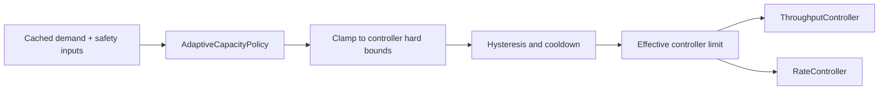

# AdaptiveCapacityPolicy

> An opt-in policy utility for adapting controller capacity from observed
> conditions. It is disabled by default and is not a license to bypass hard
> safety limits.

## Purpose

`AdaptiveCapacityPolicy` is a reusable policy boundary for controllers that can
vary an effective limit over time. It lets an application react to sustained
capacity demand, worker-target saturation, optional downstream safety pressure,
or other supplied signals without embedding application-specific control logic
in `ThroughputController`, `RateController`, or their schedulers.

`DefaultOverclockPolicy` ships in the core library as the built-in opt-in implementation. It may
derive demand saturation from consecutive capacity-limit hits, persistent queue
demand, and worker-target saturation. Optional latency/failure readings act as a
safety veto. Applications that understand their own workload better can supply a
pure custom policy function instead.



## Contract

- The policy receives an immutable, normalized context and returns a requested
  effective capacity plus a bounded reason code.
- Policy evaluation is fast, synchronous, and side-effect free. Remote or costly
  measurements are obtained outside the controller and supplied as cached input.
- The controller validates and clamps every result. Invalid/stale signals or a
  policy exception fall back safely to the normal configured nominal limit;
  they never retain or create an overclock.
- Evaluation and all observer work happen outside scheduling locks and never add
  a polling loop or per-job timer.
- Changes use a minimum evaluation interval, hysteresis, and cooldown to prevent
  noisy feedback from oscillating capacity. Overclock configuration defines
  distinct **enter** and **exit** thresholds (or equivalent policy predicates):
  the condition for enabling overclock must not be the same boundary used to
  disable it. A transition only occurs after the relevant threshold and any
  required dwell/consecutive-sample condition are satisfied.

For the built-in overclock policy, entry requires a **combination** observed for
several samples or a configured dwell time: sustained high capacity utilization
and sustained high throughput at the current configured limit. A single busy
sample is insufficient. For `ParallelWorkers`, capacity is worker/in-flight
utilization; for `ThroughputController`, it is sustained consumption of the
current credit allowance. Optional downstream safety pressure is a separate
veto/exit condition, not the inverse meaning of saturation.

## Controller-specific bounds

The shared policy has no authority to redefine a controller's meaning:

- **ThroughputController:** may adjust effective credits per period. An
  overclock above nominal is possible only when the caller explicitly provides
  an absolute maximum and enables it. Quota, credit cost, queue bounds, and
  chained hard limits still win.
- **RateController:** may influence a configured worker-count/sampling strategy
  or an effective target at or below hard concurrency ceiling `N`. It cannot
  increase in-flight work beyond `N`; that ceiling remains absolute.
- **ParallelWorkers:** may adjust a desired worker target only inside explicit
  minimum/maximum worker bounds and the owning controller's ceiling. It starts
  and gracefully drains workers through normal scaling rules; it never creates
  unbounded threads/tasks or bypasses an owning rate/throughput gate.
- **Other controllers:** must publish their own nominal/minimum/absolute-max
  semantics before accepting the policy.

## Simple and advanced use

There is no adaptive behavior in normal controller construction. The simple
path remains one required controller limit and a function to run.

Advanced callers choose one of:

```text
# Application knows the signal and desired behavior.
adaptive: context => myPolicy(context)

# Built-in, documented conservative inference.
adaptive: DefaultOverclockPolicy({ ...explicit options })
```

The built-in policy is not silently selected by the presence of metrics. It
requires explicit enablement and exposes its inputs, thresholds, bounds,
cooldowns, and decisions in snapshots/events.

### Overclock ramp modes

The opt-in `DefaultOverclockPolicy` uses a simple **jump-to-maximum** ramp by
default: after its sustained-demand trigger, it moves directly to the caller's
explicit absolute maximum. This keeps the ordinary advanced API small; users do
not need to understand step scheduling merely to enable overclock.

Overclock is impossible unless the caller explicitly enables it. Supplying an
absolute maximum above nominal, enabling adaptive observation, or using the
policy utility alone does not imply consent to exceed the normal limit.

Gradual ramps and custom step schedules are explicitly **deferred**. They are
not part of the current design commitment and should not enlarge the public API
until a concrete use case justifies their additional configuration and semantics.
All current behavior remains clamped by controller bounds, hysteresis,
dwell/cooldown, and safety-veto rules. A safety veto, invalid policy, or stale
signal returns to the normal nominal limit immediately.

## Observability and safety

Every accepted or rejected adaptation is observable with nominal/effective/min/
absolute-max capacity, signal age, reason code, phase, cooldown state, and
overclock duration. The policy never exports arbitrary application metadata;
exporters must apply their configured allowlist rules.

An overclock ends on expiry, stale/invalid data, its distinct exit threshold,
policy failure, shutdown, or a hard limit preventing further growth. Unused
headroom never accumulates as a future burst.

## Built-in signal guidance and applicability

The built-in policy follows an 80/20 guidance rule for significant safety
pressure: a failure rate above 80 percent, or latency above the configured 80th
percentile, may be treated as a meaningful veto/exit signal. Applications may
still supply their own normalized signals and policies when these defaults do not
fit their domain.

Any utility with a defined pace/effective bound and observable operating signals
may implement `AdaptiveCapacityPolicy`. `ParallelWorkers` is an explicit example:
it can adjust its worker target within configured bounds from observed demand and
conditions. Every adopting utility must publish its nominal, minimum, maximum,
and safety semantics before accepting the policy.
