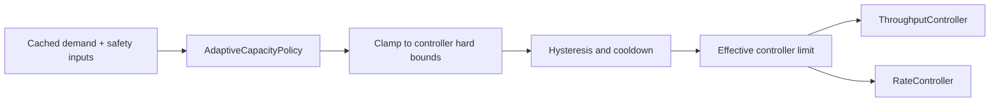

# AdaptiveCapacityPolicy

> An opt-in policy utility for adapting controller capacity from observed
> conditions. It is disabled by default and is not a license to bypass hard
> safety limits.

## Purpose

`AdaptiveCapacityPolicy` is a reusable policy boundary for controllers that can
vary an effective limit over time. It lets an application react to sustained
capacity demand, worker-target saturation, optional downstream safety pressure,
or other supplied signals without embedding application-specific control logic
in `ThroughputController`, `RateController`, or their schedulers.
The policy proposes; the owning controller validates and clamps
([D-167](../decisions.md#d-167-adaptivecapacitypolicy-proposes-controllers-validate-and-clamp)).

`DefaultOverclockPolicy` ships in the core library as the built-in opt-in implementation. It may
derive demand saturation from consecutive capacity-limit hits, persistent queue
demand, and worker-target saturation. Optional latency/failure readings act as a
safety veto. Applications that understand their own workload better can supply a
pure custom policy function instead.



## Contract

- The policy receives an immutable, normalized context and returns a requested
  effective capacity plus a bounded reason code.
- Policy evaluation is fast, synchronous, and side-effect free. Remote or costly
  measurements are obtained outside the controller and supplied as cached input.
- The controller validates and clamps every result. Invalid/stale signals or a
  policy exception fall back safely to the normal configured nominal limit;
  they never retain or create an overclock.
- Evaluation and all observer work happen outside scheduling locks and never add
  a polling loop or per-job timer.
- Changes use a minimum evaluation interval, hysteresis, and cooldown to prevent
  noisy feedback from oscillating capacity. Overclock configuration defines
  distinct **enter** and **exit** thresholds (or equivalent policy predicates):
  the condition for enabling overclock must not be the same boundary used to
  disable it. A transition only occurs after the relevant threshold and any
  required dwell/consecutive-sample condition are satisfied.

For the built-in overclock policy, entry requires a **combination** observed for
several samples or a configured dwell time: sustained high capacity utilization
and sustained high throughput at the current configured limit. A single busy
sample is insufficient. For `ParallelWorkers`, capacity is worker/in-flight
utilization; for `ThroughputController`, it is sustained consumption of the
current credit allowance. Optional downstream safety pressure is a separate
veto/exit condition, not the inverse meaning of saturation.

## Outcome classification

Adaptive capacity is only safe if the controller knows **what a failure meant**.
Guessing from a generic failure is how adaptive limiters cause outages: a burst of
caller-side validation errors looks exactly like downstream collapse if all you
can see is "the function threw".

**The caller classifies outcomes; the library never infers severity from an
exception type** ([D-140](../decisions.md#d-140-callers-classify-outcomes-the-library-never-infers-capacity-pressure-from-generic-failures)).

| Class | Means | Effect on capacity |
| --- | --- | --- |
| `Success` | The operation worked | Evidence capacity is adequate; may contribute to demand saturation |
| `Throttled` | The dependency explicitly refused for rate reasons — HTTP 429, a quota error, a documented backoff signal | **Reduce.** The strongest possible signal: the dependency has stated the limit |
| `Overloaded` | The dependency is saturated — 503, pool exhaustion, timeout under load | **Reduce** |
| `TransientFailure` | A fault with no capacity meaning — a dropped connection, a retryable blip | Neutral by default; eligible for retry |
| `CallerError` | The request itself was wrong — a bad payload, a 400, a validation failure | **No capacity effect.** Load-shedding would be wrong and self-reinforcing |
| `Ignore` | Explicitly excluded from all adaptation | None |

The decisive pair is `Throttled` versus `CallerError`: a downstream `429` must
reduce throughput, and a malformed user payload must not. Without this
distinction, a client sending bad input could drive a service to throttle itself —
which is precisely the failure mode AWS's adaptive retry mode is built to avoid by
treating throttling as its own category
([AWS adaptive retry behavior](https://docs.aws.amazon.com/sdkref/latest/guide/feature-retry-behavior.html)).

```text
# Illustrative only.
classify: outcome => match outcome:
  httpStatus == 429            -> Throttled
  httpStatus == 503 or timeout -> Overloaded
  httpStatus in 400..499       -> CallerError
  connectionReset              -> TransientFailure
  otherwise                    -> Success
```

Rules:

1. **Unclassified is not a license to guess.** With no classifier supplied, the
   controller treats every failure as `TransientFailure` — neutral — so adaptation
   without classification can reduce capacity only from explicit signals, never
   from raw failure counts.
2. **The classifier is pure, cheap, and runs off the scheduler path**, like every
   other injected policy ([design-principles.md](../design-principles.md#functional-conventions)).
3. **Classification never changes the caller's outcome.** The caller still
   receives its own value, failure, or cancellation unmodified; classification is
   observation only.
4. **Cancellation is never a capacity signal.** It is terminal and carries no
   information about the dependency ([INV-5](../architecture.md#invariants)).
5. **Classes are a bounded enum, usable as a metric dimension.** Free-form reason
   strings must never become metric labels
   ([observability.md](../subsystems/observability.md)).

### Shared with the retry predicate

This vocabulary answers a question that was already open elsewhere: what counts
as an **"ordinary failure"** for retry purposes
([D-011](../decisions.md#d-011-retrydecorator-retries-every-ordinary-failure-by-default)).

`TransientFailure`, `Throttled`, and `Overloaded` are retryable; `CallerError` is
not; cancellation is terminal. Defining one classification vocabulary shared by
[`RetryDecorator`](./retry-decorator.md) and this policy is strongly preferred
over two parallel taxonomies of failure
([D-141](../decisions.md#d-141-one-outcome-classification-vocabulary-is-shared-with-the-retry-predicate)).
Whether the two surfaces literally share a type, and whether the retry predicate
is then expressible as a classifier, is an [open item](#open-items).

## Policy presets

Presets are **opt-in, never implicit** ([D-142](../decisions.md#d-142-adaptive-presets-are-opt-in-and-the-congestion-preset-comes-later)).
Their presence in the library is not consent to adapt; a controller built without
naming one has no adaptive behavior at all.

| Preset | Direction | Status |
| --- | --- | --- |
| `DefaultOverclockPolicy` | **Demand-driven upward.** Sustained saturation at the configured limit, with real queued demand, raises capacity toward an explicit absolute maximum | Ships now, opt-in, as documented above |
| Congestion policy | **Pressure-driven downward.** Rising latency or failure pressure reduces capacity below nominal, probing back up as pressure falls | **Later.** Direction accepted, not specified |

The two are complements, not alternatives: one finds spare capacity, the other
finds the point at which a dependency starts degrading. A congestion policy is the
more broadly useful of the two in production — a database whose queueing latency
climbs at 50 concurrent operations wants the controller to back down well before
errors appear, which is the behavior
[Netflix's concurrency-limits](https://github.com/Netflix/concurrency-limits)
demonstrates with gradient and Vegas-style algorithms.

It is sequenced second anyway, because it needs
[outcome classification](#outcome-classification) and a latency signal to be
trustworthy first. A congestion controller fed unclassified failures would reduce
capacity in response to caller errors — the exact outage it exists to prevent.

When it is built, it must satisfy the existing safeguards unchanged: clamped to
the configured envelope, separate enter and exit thresholds, dwell and cooldown,
fast downward movement and slow upward movement, and immediate return to nominal
on stale or invalid signals.

## Controller-specific bounds

The shared policy has no authority to redefine a controller's meaning:

- **ThroughputController:** may adjust effective credits per period. An
  overclock above nominal is possible only when the caller explicitly provides
  an absolute maximum and enables it. Quota, credit cost, queue bounds, and
  chained hard limits still win.
- **RateController:** may influence a configured worker-count/sampling strategy
  or an effective target at or below hard concurrency ceiling `N`. It cannot
  increase in-flight work beyond `N`; that ceiling remains absolute.
- **ParallelWorkers:** may adjust a desired worker target only inside explicit
  minimum/maximum worker bounds and the owning controller's ceiling. It starts
  and gracefully drains workers through normal scaling rules; it never creates
  unbounded threads/tasks or bypasses an owning rate/throughput gate.
- **Other controllers:** must publish their own nominal/minimum/absolute-max
  semantics before accepting the policy.

## Simple and advanced use

There is no adaptive behavior in normal controller construction. The simple
path remains one required controller limit and a function to run.

Advanced callers choose one of:

```text
# Application knows the signal and desired behavior.
adaptive: context => myPolicy(context)

# Built-in, documented conservative inference.
adaptive: DefaultOverclockPolicy({ ...explicit options })
```

The built-in policy is not silently selected by the presence of metrics. It
requires explicit enablement and exposes its inputs, thresholds, bounds,
cooldowns, and decisions in snapshots/events.

### Overclock ramp modes

The opt-in `DefaultOverclockPolicy` uses a simple **jump-to-maximum** ramp by
default: after its sustained-demand trigger, it moves directly to the caller's
explicit absolute maximum. This keeps the ordinary advanced API small; users do
not need to understand step scheduling merely to enable overclock.

Overclock is impossible unless the caller explicitly enables it. Supplying an
absolute maximum above nominal, enabling adaptive observation, or using the
policy utility alone does not imply consent to exceed the normal limit.

Gradual ramps and custom step schedules are explicitly **deferred**. They are
not part of the current design commitment and should not enlarge the public API
until a concrete use case justifies their additional configuration and semantics.
All current behavior remains clamped by controller bounds, hysteresis,
dwell/cooldown, and safety-veto rules. A safety veto, invalid policy, or stale
signal returns to the normal nominal limit immediately.

## Observability and safety

Every accepted or rejected adaptation is observable with nominal/effective/min/
absolute-max capacity, signal age, reason code, phase, cooldown state, and
overclock duration. The policy never exports arbitrary application metadata;
exporters must apply their configured allowlist rules.

An overclock ends on expiry, stale/invalid data, its distinct exit threshold,
policy failure, shutdown, or a hard limit preventing further growth. Unused
headroom never accumulates as a future burst.

## Built-in signal guidance and applicability

The built-in policy follows an 80/20 guidance rule for significant safety
pressure: a failure rate above 80 percent, or latency above the configured 80th
percentile, may be treated as a meaningful veto/exit signal. Applications may
still supply their own normalized signals and policies when these defaults do not
fit their domain.

Any utility with a defined pace/effective bound and observable operating signals
may implement `AdaptiveCapacityPolicy`. `ParallelWorkers` is an explicit example:
it can adjust its worker target within configured bounds from observed demand and
conditions. Every adopting utility must publish its nominal, minimum, maximum,
and safety semantics before accepting the policy.

## Test coverage

Case IDs `AC-xxx` in
[testing.md § AdaptiveCapacityPolicy](../testing.md#adaptivecapacitypolicy-ac).
Every case runs under an injected clock, with signals supplied directly rather
than measured.

## Open items

| Item | Status |
| --- | --- |
| Whether [`RetryDecorator`](./retry-decorator.md) and this policy literally share one outcome-classification type, and whether the retry predicate becomes a classifier | **Not decided.** One vocabulary is agreed; one type is not ([D-141](../decisions.md#d-141-one-outcome-classification-vocabulary-is-shared-with-the-retry-predicate)) |
| Whether `Throttled` should reduce capacity more aggressively than `Overloaded`, given that it is an explicit refusal rather than an inference | Not decided. Surfaced during consolidation |
| Whether a classifier may return a confidence or weight rather than a single class | Not decided. Surfaced during consolidation |
| The congestion preset's algorithm, signals, and whether latency percentiles come from a [`Probe`](./probe.md) or from controller-internal measurement | Not decided ([D-142](../decisions.md#d-142-adaptive-presets-are-opt-in-and-the-congestion-preset-comes-later)) |
| Default sample interval, stale threshold, dead band, dwell, hold time, overclock duration, and cooldown | Not decided ([throughput-controller.md](./throughput-controller.md#unresolved-design-questions)) |
| Whether the 80/20 safety-pressure guidance is a default or only documentation | Not decided. An 80 percent failure rate is a very late signal for a congestion policy |
| Which process owns the authoritative adaptive decision in distributed mode | Not decided ([synchronization-provider.md](./synchronization-provider.md#open-design-questions)) |
