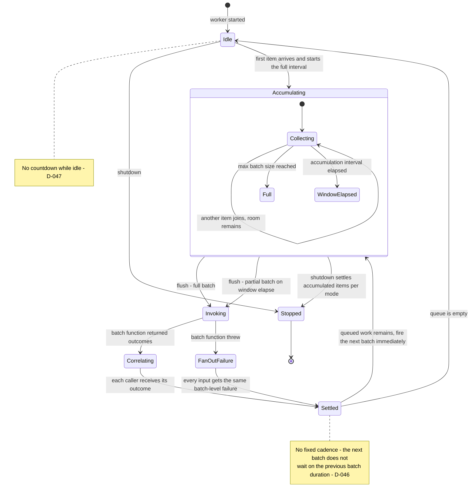

# AsyncAccumulator

**Responsibility.** Accumulate incoming asynchronous requests into batches, invoke
**one batch function per batch**, and return an individual outcome to each
caller.

- [Scope](#scope)
- [Public behavior](#public-behavior)
- [Batching-worker lifecycle](#batching-worker-lifecycle)
- [Outcome correlation](#outcome-correlation)
- [Timeout stages](#timeout-stages)
- [Defaults](#defaults)
- [Advanced options](#advanced-options)
- [Lifecycle and cancellation](#lifecycle-and-cancellation)
- [Compensation](#compensation)
- [Flush triggers](#flush-triggers)
- [Composition](#composition)
- [Invariants](#invariants)
- [Events and metrics](#events-and-metrics)
- [Test coverage](#test-coverage)
- [Open items](#open-items)

## Scope

| Owns | Does not own |
| --- | --- |
| Accumulating items into batches by size and time window | Defining controller semantics; it accepts an optional shared-contract controller ([D-180](../decisions.md#d-180-accumulators-accept-an-optional-controller)) |
| Invoking one true batch function per batch ([D-040](../decisions.md#d-040-asyncaccumulator-invokes-one-true-batch-function-per-batch)) | Retrying a failed batch ([retry-decorator.md](./retry-decorator.md)) |
| Correlating per-input outcomes back to callers | Weight-based batching ([weighted-async-accumulator.md](./weighted-async-accumulator.md)) |
| The three timeout stages and cancellation handling | Durable queueing ([INV-14](../architecture.md#invariants)) |
| The batching-worker loop, via [ParallelWorkers](./parallel-workers.md) | |

**It is a true batch function, not a fan-out.** `AsyncAccumulator` invokes one
batch operation per batch and receives per-input outcomes. It does **not** invoke
each item's own function while merely starting them together
([D-040](../decisions.md#d-040-asyncaccumulator-invokes-one-true-batch-function-per-batch)).

## Public behavior

> Illustrative pseudocode. No public API signature is committed yet.

```text
accumulator = asyncAccumulator({
  batch: async (items, ct) => await bulkLookup(items, ct),   # one call per batch
  maxBatchSize: 100,
  accumulationInterval: milliseconds(20),
  maxQueued: 10_000,
})

user = await accumulator.submit(userId)   # each caller awaits only its own outcome
```

Each caller submits one item and receives one outcome. The batching is invisible
to the caller except in latency.

Batching concurrency is provided by [ParallelWorkers](./parallel-workers.md):
long-lived looping **batching workers** accumulate queued items and invoke the
batch function repeatedly
([D-046](../decisions.md#d-046-batching-runs-on-parallelworkers-with-no-fixed-cadence)).
The "number of parallel groupers" is therefore the `ParallelWorkers` worker count,
subject to what the language's concurrency model can actually deliver
([S-003](../decisions.md#s-003-a-standalone-parallel-groupers-knob)).

## Batching-worker lifecycle

The scheduling rule has three parts
([D-046](../decisions.md#d-046-batching-runs-on-parallelworkers-with-no-fixed-cadence),
[D-047](../decisions.md#d-047-the-accumulation-window-starts-when-the-first-item-arrives-after-idle)):

1. **While queued work remains, batches fire consecutively and immediately.**
   There is no fixed cadence, and the next batch does not wait on the previous
   batch function's duration.
2. **When the queue is empty, no countdown runs.** The **first new item to arrive
   starts the full configured accumulation interval**, so it gets the whole window
   to collect peers.
3. **Within the window, if the batch still has room, keep waiting.** When the
   window elapses, **flush the partial batch immediately** rather than waiting to
   fill it — with tens of thousands of incoming jobs, waiting would add
   unacceptable latency.



**Waiting style.** Prefer event-driven waiting wherever the language supports it —
awaiting the next item from a C# `Channel`, for example. Where polling is
necessary, poll at the same configured batching interval
([D-048](../decisions.md#d-048-prefer-event-driven-waiting-poll-at-the-batching-interval)).
The exact low-level implementation may be language-dependent; the observable
behavior above may not be.

## Outcome correlation

**Positional by default**, keyed as an advanced option
([D-042](../decisions.md#d-042-outcome-correlation-is-positional-by-default-keyed-is-advanced)).
Positional means the batch function returns a same-length sequence in input
order.

Contract violations in positional mode:

| Situation | Behavior | Decision |
| --- | --- | --- |
| **Fewer or more outcomes than inputs, default mode** | Fail the whole batch as a contract violation | [D-181](../decisions.md#d-181-batch-correlation-mismatches-fail-the-whole-batch-by-default) |
| **Fewer outcomes, positional lenient mode** | Deliver the returned prefix in order and fail the remaining inputs | [D-181](../decisions.md#d-181-batch-correlation-mismatches-fail-the-whole-batch-by-default) |
| **Batch function throws before returning** | Every input in that batch completes with the same batch-level failure | [D-045](../decisions.md#d-045-a-throwing-batch-function-fails-every-input-in-that-batch) |

Keyed/ID-based correlation exists for callers who need reordered or partial
results. A missing required key fails the whole batch by default. No keyed
leniency is defined.

## Timeout stages

Four distinct scopes, one per lifecycle stage
([D-035](../decisions.md#d-035-timeout-scopes-are-distinct-per-lifecycle-stage)).
The accumulation interval is **not** one of them: it is batching/scheduling
behavior, not a failure timeout.

| Stage | When it applies | On expiry |
| --- | --- | --- |
| **Pre-admission** | Optional, before the item gains entry to the queue | The submission fails; the item never enters |
| **Queue-wait** | While the item waits under backlog | The item is **removed from the accumulator and guaranteed never to execute later** ([D-036](../decisions.md#d-036-a-queue-wait-timeout-removes-the-item-permanently), [INV-7](../architecture.md#invariants)) |
| **Per-item running signal** | Once the item belongs to a running batch | Completes that caller immediately with timeout/cancellation; the batch continues and the later value is discarded |
| **Batch timeout** | While the batch function is running | Completes every still-pending caller with timeout, does not stop the function, and keeps the slot until it returns |

Once an item is dequeued into a batch and execution begins, its queue-wait
timeout no longer applies; the per-item running and batch-timeout policies take
over.

Queued cancellation or timeout removes the item permanently. Once a batch starts,
per-item signals affect only that item's caller and never cancel the shared batch
([D-187](../decisions.md#d-187-accumulator-item-and-instance-signals-have-distinct-effects)).

## Defaults

| Option | Default | Notes |
| --- | --- | --- |
| `batch` function | **Required** | The whole point of the utility |
| `maxBatchSize` | `Undecided` | Must be bounded. Surfaced during consolidation |
| Accumulation interval | `Undecided` | Must exist so partial batches flush ([D-047](../decisions.md#d-047-the-accumulation-window-starts-when-the-first-item-arrives-after-idle)) |
| Batching workers | `Undecided` | Candidate: 1, so ordering is simple by default. Surfaced during consolidation |
| `maxQueued` | `Undecided` | The queue is always bounded ([INV-3](../architecture.md#invariants)) |
| Overflow policy | `Reject` | ([D-030](../decisions.md#d-030-a-full-queue-rejects-immediately-by-default)) |
| Pre-admission timeout | Not configured | Optional stage |
| Queue-wait timeout | Not configured | Optional stage |
| Per-item timeout | Not configured | Applies while queued and to the caller outcome after batching starts |
| Batch timeout | Not configured | Resolves callers but does not stop physical batch work |
| Correlation mode | Positional | ([D-042](../decisions.md#d-042-outcome-correlation-is-positional-by-default-keyed-is-advanced)) |
| Waiting style | Event-driven where available | ([D-048](../decisions.md#d-048-prefer-event-driven-waiting-poll-at-the-batching-interval)) |
| Clock | System clock | Injectable ([D-103](../decisions.md#d-103-the-clock-is-public-api)) |
| Controller | None | Optional `RateController`, `ThroughputController`, or shared-contract equivalent ([D-180](../decisions.md#d-180-accumulators-accept-an-optional-controller)) |
| Compensation | None | Optional once-per-affected-batch function ([D-188](../decisions.md#d-188-accumulator-compensation-runs-once-per-affected-batch)) |

## Advanced options

| Option | Shape | Effect |
| --- | --- | --- |
| Keyed correlation | key selector | Reordered or partial outcome handling |
| Positional lenient mismatch | enum | Maps the returned prefix and fails the remainder |
| Controller | shared controller | Governs batch-function invocations |
| Compensation | batch function | Reverses possibly completed work for affected items |
| Manual flush | method | Close the current batch now, as a barrier ([flush triggers](#flush-triggers)) |
| Batching worker count / sampler | number or `ctx -> number` | Parallel batching groups |
| Timeout stages | durations | Pre-admission, queue-wait, per-item, and batch |
| Overflow = wait | enum | Callers wait outside a full queue under a configured waiting-caller capacity; explicit unbounded waiting gives up the memory guarantee ([D-179](../decisions.md#d-179-wait-mode-has-a-configurable-bounded-waiting-room)) |
| Clock / scheduler | injected | Deterministic window and timeout tests |
| Event handlers | callbacks | Batch exceeded, max batch, item complete, error, sample |
| Synchronization provider | injected | Optional coordinated batch ownership across instances ([SynchronizationProvider](./synchronization-provider.md#asyncaccumulator)) |
| Synchronization scope | caller-defined string | Namespaces one cross-instance accumulation group |

## Lifecycle and cancellation

- Drain remains the normal graceful path. Instance-wide cancellation is identical
  to cancel-dispose: new submissions stop, queued items complete as cancelled,
  and running batches receive the instance cancellation signal
  ([D-187](../decisions.md#d-187-accumulator-item-and-instance-signals-have-distinct-effects)).
- **Drain** flushes accumulated items — including a partial batch — and lets
  in-flight batch functions finish.
- **Cancel-dispose** completes queued items immediately, signals every running
  batch through the instance-wide cancellation token, and completes their callers
  with cancellation.
- Per-item cancellation and timeout never signal a running batch.
- Disposal waits for running work to settle as required and for every pending
  compensation invocation.

## Compensation

An optional compensation function handles items whose callers timed out or
cancelled after their batch started, plus every affected item after a batch
timeout or instance cancellation
([D-188](../decisions.md#d-188-accumulator-compensation-runs-once-per-affected-batch)).

It runs once per affected batch after that batch eventually succeeds, fails, or
returns following a timeout/cancellation. It receives the affected items and the
available batch results, batch error, or timeout marker. Because physical work
may or may not have happened, compensation must be safe when there is nothing to
undo.

A compensation failure emits a compensation-error event only. It is never
implicitly retried and cannot replace callers' already-settled outcomes. A caller
wanting retries wraps the compensation function explicitly. Disposal waits for
all pending compensation.

## Flush triggers

A batch closes for exactly five reasons, and these are the complete set
([D-131](../decisions.md#d-131-batches-flush-on-size-weight-interval-manual-request-or-shutdown)):

| Trigger | Fires when | Resulting batch |
| --- | --- | --- |
| **Max item count** | `maxBatchSize` items are accumulated | Full |
| **Max weight** | Adding the next item would exceed `maxBatchWeight` | Full, just under the bound ([INV-9](../architecture.md#invariants)) |
| **Accumulation interval** | The window that began with the first item elapses | Partial, flushed immediately ([D-047](../decisions.md#d-047-the-accumulation-window-starts-when-the-first-item-arrives-after-idle)) |
| **Manual flush** | The caller explicitly asks | Partial, whatever is accumulated |
| **Shutdown** | Drain flushes; cancel-dispose cancels queued and running callers ([D-187](../decisions.md#d-187-accumulator-item-and-instance-signals-have-distinct-effects)) | Partial, or nothing |

Max weight applies only to
[`WeightedAsyncAccumulator`](./weighted-async-accumulator.md). The other four are
common to both.

```text
# Batch database writes every 250 ms, but flush immediately at 100 items
writer = asyncAccumulator({
  batch: rows => db.bulkInsert(rows),
  maxBatchSize: 100,
  accumulationInterval: milliseconds(250),
})

await writer.flush()      # close the current batch now; await its completion
```

**Manual flush** is the new capability, and it exists because interval-plus-size
cannot express "I know there is no more input coming" — end of an HTTP request,
end of a file, a test asserting a deterministic batch boundary. Its contract:

1. **It closes the current batch immediately** rather than waiting out the window,
   and the window does not restart until the next item arrives
   ([D-047](../decisions.md#d-047-the-accumulation-window-starts-when-the-first-item-arrives-after-idle)).
2. **It never exceeds a bound.** If more than `maxBatchSize` or `maxBatchWeight`
   is queued, flush closes as many full batches as the bounds require and one
   final partial batch.
3. **Awaiting flush awaits the batch outcomes**, not merely the hand-off, so a
   caller can use it as a barrier before shutdown.
4. **Flushing an empty accumulator is a no-op** that completes successfully and
   invokes no batch function.
5. **It respects admission, not bypasses it.** Flush closes a batch early; it does
   not grant the batch function permission it would not otherwise have, and an
   injected or externally composed controller still gates the call
   ([D-180](../decisions.md#d-180-accumulators-accept-an-optional-controller)).
6. **Concurrent flushes coalesce.** Two overlapping flush requests observe the
   same batch boundary rather than producing two tiny batches.

## Composition

> Illustrative only.

```text
# Limit how many batches run concurrently
accumulator = asyncAccumulator({ batch: limiter.wrap(bulkLookup), maxBatchSize: 100 })

# Or limit submissions into the accumulator
limitedSubmit = limiter.wrap(item => accumulator.submit(item))

# Retry a whole batch: wrap the batch function
accumulator = asyncAccumulator({ batch: retry.wrap(bulkLookup, { attempts: 3 }) })

# Retry one caller's item: wrap the submit call
resilientSubmit = retry.wrap(item => accumulator.submit(item), { attempts: 3 })
```

The last two are genuinely different: wrapping the batch function retries all
items in the batch together; wrapping `submit` re-enters accumulation and may land
in a different batch.

## Invariants

- Exactly one batch function invocation per batch
  ([D-040](../decisions.md#d-040-asyncaccumulator-invokes-one-true-batch-function-per-batch)).
- Every submitted item ends in exactly one terminal outcome: success, failure,
  timeout, or cancellation ([INV-1](../architecture.md#invariants),
  [INV-2](../architecture.md#invariants)).
- A timed-out or cancelled item never executes later
  ([INV-7](../architecture.md#invariants)).
- A partial batch flushes when its window elapses; it is never held waiting to
  fill ([D-047](../decisions.md#d-047-the-accumulation-window-starts-when-the-first-item-arrives-after-idle)).
- While backlog remains, no idle gap is introduced between batches
  ([D-046](../decisions.md#d-046-batching-runs-on-parallelworkers-with-no-fixed-cadence)).
- A batch never exceeds `maxBatchSize`.
- The queue is bounded, and overflow never drops the oldest item
  ([INV-1](../architecture.md#invariants), [INV-3](../architecture.md#invariants)).

## Events and metrics

Batch exceeded, max batch reached, item complete, error, and the periodic sample
event. Compensation failure is a dedicated event carrying the affected items and
error. Snapshots expose queue depth, current batch size, and in-flight batch
count. See [observability.md](../subsystems/observability.md).

## Test coverage

Case IDs `AA-xxx` in [testing.md § AsyncAccumulator](../testing.md#asyncaccumulator-aa).
Shared queue behavior is `QA-xxx`; batching-worker behavior is also covered by
`PW-xxx`.

## Open items

| Item | Status |
| --- | --- |
| The atomic race rule when timeout or cancellation and the execution claim become ready concurrently | Not decided ([D-036](../decisions.md#d-036-a-queue-wait-timeout-removes-the-item-permanently)) |
| Duplicate and unknown keyed results | Not decided; missing keys already fail the whole batch by default |
| The exact C# surface for batch outcomes | Not decided |
| Ownership of the first-item accumulation window when several batching workers are idle | Not decided ([D-047](../decisions.md#d-047-the-accumulation-window-starts-when-the-first-item-arrives-after-idle)) |
| Latency semantics of polling implementations | Not decided ([D-048](../decisions.md#d-048-prefer-event-driven-waiting-poll-at-the-batching-interval)) |
| Default `maxBatchSize`, accumulation interval, batching-worker count, and `maxQueued` | Not decided. Surfaced during consolidation |
