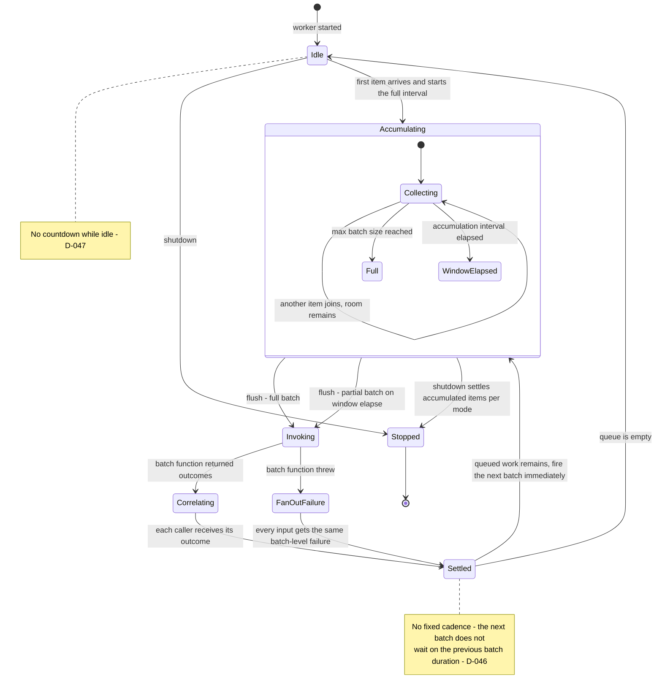

# AsyncAccumulator

**Responsibility.** Accumulate incoming asynchronous requests into batches, invoke
**one batch function per batch**, and return an individual outcome to each
caller.

- [Scope](#scope)
- [Public behavior](#public-behavior)
- [Batching-worker lifecycle](#batching-worker-lifecycle)
- [Outcome correlation](#outcome-correlation)
- [Timeout stages](#timeout-stages)
- [Defaults](#defaults)
- [Advanced options](#advanced-options)
- [Lifecycle and cancellation](#lifecycle-and-cancellation)
- [Flush triggers](#flush-triggers)
- [Composition](#composition)
- [Invariants](#invariants)
- [Events and metrics](#events-and-metrics)
- [Test coverage](#test-coverage)
- [Open items](#open-items)

## Scope

| Owns | Does not own |
| --- | --- |
| Accumulating items into batches by size and time window | Rate limiting ([D-041](../decisions.md#d-041-asyncaccumulator-does-not-integrate-with-ratecontroller)) |
| Invoking one true batch function per batch ([D-040](../decisions.md#d-040-asyncaccumulator-invokes-one-true-batch-function-per-batch)) | Retrying a failed batch ([retry-decorator.md](./retry-decorator.md)) |
| Correlating per-input outcomes back to callers | Weight-based batching ([weighted-async-accumulator.md](./weighted-async-accumulator.md)) |
| The three timeout stages and cancellation handling | Durable queueing ([INV-14](../architecture.md#invariants)) |
| The batching-worker loop, via [ParallelWorkers](./parallel-workers.md) | |

**It is a true batch function, not a fan-out.** `AsyncAccumulator` invokes one
batch operation per batch and receives per-input outcomes. It does **not** invoke
each item's own function while merely starting them together
([D-040](../decisions.md#d-040-asyncaccumulator-invokes-one-true-batch-function-per-batch)).

## Public behavior

> Illustrative pseudocode. No public API signature is committed yet.

```text
accumulator = asyncAccumulator({
  batch: async (items, ct) => await bulkLookup(items, ct),   # one call per batch
  maxBatchSize: 100,
  accumulationInterval: milliseconds(20),
  maxQueued: 10_000,
})

user = await accumulator.submit(userId)   # each caller awaits only its own outcome
```

Each caller submits one item and receives one outcome. The batching is invisible
to the caller except in latency.

Batching concurrency is provided by [ParallelWorkers](./parallel-workers.md):
long-lived looping **batching workers** accumulate queued items and invoke the
batch function repeatedly
([D-046](../decisions.md#d-046-batching-runs-on-parallelworkers-with-no-fixed-cadence)).
The "number of parallel groupers" is therefore the `ParallelWorkers` worker count,
subject to what the language's concurrency model can actually deliver
([S-003](../decisions.md#s-003-a-standalone-parallel-groupers-knob)).

## Batching-worker lifecycle

The scheduling rule has three parts
([D-046](../decisions.md#d-046-batching-runs-on-parallelworkers-with-no-fixed-cadence),
[D-047](../decisions.md#d-047-the-accumulation-window-starts-when-the-first-item-arrives-after-idle)):

1. **While queued work remains, batches fire consecutively and immediately.**
   There is no fixed cadence, and the next batch does not wait on the previous
   batch function's duration.
2. **When the queue is empty, no countdown runs.** The **first new item to arrive
   starts the full configured accumulation interval**, so it gets the whole window
   to collect peers.
3. **Within the window, if the batch still has room, keep waiting.** When the
   window elapses, **flush the partial batch immediately** rather than waiting to
   fill it — with tens of thousands of incoming jobs, waiting would add
   unacceptable latency.



**Waiting style.** Prefer event-driven waiting wherever the language supports it —
awaiting the next item from a C# `Channel`, for example. Where polling is
necessary, poll at the same configured batching interval
([D-048](../decisions.md#d-048-prefer-event-driven-waiting-poll-at-the-batching-interval)).
The exact low-level implementation may be language-dependent; the observable
behavior above may not be.

## Outcome correlation

**Positional by default**, keyed as an advanced option
([D-042](../decisions.md#d-042-outcome-correlation-is-positional-by-default-keyed-is-advanced)).
Positional means the batch function returns a same-length sequence in input
order.

Contract violations in positional mode:

| Situation | Behavior | Decision |
| --- | --- | --- |
| **Fewer outcomes than inputs** | Deliver every matching positional outcome normally; fail only the unmatched inputs. Never fail the whole batch | [D-043](../decisions.md#d-043-fewer-outcomes-than-inputs-fails-only-the-unmatched-inputs) |
| **More outcomes than inputs** | Surface a contract error. Never silently ignore the surplus | [D-044](../decisions.md#d-044-surplus-positional-outcomes-are-a-contract-error) |
| **Batch function throws before returning** | Every input in that batch completes with the same batch-level failure | [D-045](../decisions.md#d-045-a-throwing-batch-function-fails-every-input-in-that-batch) |

Keyed/ID-based correlation exists for callers who need reordered or partial
results. Its edge cases — missing, duplicate, and unknown keys — are open items.

## Timeout stages

Four distinct scopes, one per lifecycle stage
([D-035](../decisions.md#d-035-timeout-scopes-are-distinct-per-lifecycle-stage)).
The accumulation interval is **not** one of them: it is batching/scheduling
behavior, not a failure timeout.

| Stage | When it applies | On expiry |
| --- | --- | --- |
| **Pre-admission** | Optional, before the item gains entry to the queue | The submission fails; the item never enters |
| **Queue-wait** | While the item waits under backlog | The item is **removed from the accumulator and guaranteed never to execute later** ([D-036](../decisions.md#d-036-a-queue-wait-timeout-removes-the-item-permanently), [INV-7](../architecture.md#invariants)) |
| **Execution** | Once work is running | **Signals cancellation to the running batch function**, not merely a caller-side timeout |
| **Whole-batch-function** | Possibly separate | **Open item** — not yet decided |

Once an item is dequeued into a batch and execution begins, its queue-wait
timeout no longer applies; the execution timeout policy takes over.

**Cancelled items never run.** If a queued item's own task has been cancelled,
that item must not run at all, even if it still physically resides in the queue
([D-037](../decisions.md#d-037-a-cancelled-item-never-runs),
[INV-7](../architecture.md#invariants)).

## Defaults

| Option | Default | Notes |
| --- | --- | --- |
| `batch` function | **Required** | The whole point of the utility |
| `maxBatchSize` | `Undecided` | Must be bounded. Surfaced during consolidation |
| Accumulation interval | `Undecided` | Must exist so partial batches flush ([D-047](../decisions.md#d-047-the-accumulation-window-starts-when-the-first-item-arrives-after-idle)) |
| Batching workers | `Undecided` | Candidate: 1, so ordering is simple by default. Surfaced during consolidation |
| `maxQueued` | `Undecided` | The queue is always bounded ([INV-3](../architecture.md#invariants)) |
| Overflow policy | `Reject` | ([D-030](../decisions.md#d-030-a-full-queue-rejects-immediately-by-default)) |
| Pre-admission timeout | Not configured | Optional stage |
| Queue-wait timeout | Not configured | Optional stage |
| Execution timeout | `Undecided` | Open |
| Correlation mode | Positional | ([D-042](../decisions.md#d-042-outcome-correlation-is-positional-by-default-keyed-is-advanced)) |
| Waiting style | Event-driven where available | ([D-048](../decisions.md#d-048-prefer-event-driven-waiting-poll-at-the-batching-interval)) |
| Clock | System clock | Injectable ([D-103](../decisions.md#d-103-the-clock-is-public-api)) |
| Rate limiting | None | The caller composes it ([D-041](../decisions.md#d-041-asyncaccumulator-does-not-integrate-with-ratecontroller)) |

## Advanced options

| Option | Shape | Effect |
| --- | --- | --- |
| Keyed correlation | key selector | Reordered or partial outcome handling |
| Manual flush | method | Close the current batch now, as a barrier ([flush triggers](#flush-triggers)) |
| Batching worker count / sampler | number or `ctx -> number` | Parallel batching groups |
| Timeout stages | durations | Pre-admission, queue-wait, execution |
| Overflow = await insertion | enum | Callers wait outside a full queue, uncapped ([D-032](../decisions.md#d-032-admission-waiters-are-uncapped-and-the-callers-responsibility)) |
| Clock / scheduler | injected | Deterministic window and timeout tests |
| Event handlers | callbacks | Batch exceeded, max batch, item complete, error, sample |
| Synchronization provider | injected | Optional coordinated batch ownership across instances ([SynchronizationProvider](./synchronization-provider.md#asyncaccumulator)) |
| Synchronization scope | caller-defined string | Namespaces one cross-instance accumulation group |

## Lifecycle and cancellation

- Shutdown is drain or cancel pending
  ([D-070](../decisions.md#d-070-shutdown-is-either-drain-or-cancel-pending)).
  New submissions fail immediately with cancellation
  ([INV-10](../architecture.md#invariants)).
- **Drain** flushes accumulated items — including a partial batch — and lets
  in-flight batch functions finish.
- **Cancel pending** completes queued-but-not-batched items as cancelled. A batch
  already executing is not cancelled by shutdown.
- A batching worker is never cancelled mid-batch
  ([D-022](../decisions.md#d-022-workers-drain-gracefully-and-are-never-revived)).
- Execution timeout and caller cancellation both signal the batch function
  through its cancellation parameter. What happens when user code ignores that
  signal is an open item.

## Flush triggers

A batch closes for exactly five reasons, and these are the complete set
([D-131](../decisions.md#d-131-batches-flush-on-size-weight-interval-manual-request-or-shutdown)):

| Trigger | Fires when | Resulting batch |
| --- | --- | --- |
| **Max item count** | `maxBatchSize` items are accumulated | Full |
| **Max weight** | Adding the next item would exceed `maxBatchWeight` | Full, just under the bound ([INV-9](../architecture.md#invariants)) |
| **Accumulation interval** | The window that began with the first item elapses | Partial, flushed immediately ([D-047](../decisions.md#d-047-the-accumulation-window-starts-when-the-first-item-arrives-after-idle)) |
| **Manual flush** | The caller explicitly asks | Partial, whatever is accumulated |
| **Shutdown** | Drain flushes; cancel-pending cancels ([D-070](../decisions.md#d-070-shutdown-is-either-drain-or-cancel-pending)) | Partial, or nothing |

Max weight applies only to
[`WeightedAsyncAccumulator`](./weighted-async-accumulator.md). The other four are
common to both.

```text
# Batch database writes every 250 ms, but flush immediately at 100 items
writer = asyncAccumulator({
  batch: rows => db.bulkInsert(rows),
  maxBatchSize: 100,
  accumulationInterval: milliseconds(250),
})

await writer.flush()      # close the current batch now; await its completion
```

**Manual flush** is the new capability, and it exists because interval-plus-size
cannot express "I know there is no more input coming" — end of an HTTP request,
end of a file, a test asserting a deterministic batch boundary. Its contract:

1. **It closes the current batch immediately** rather than waiting out the window,
   and the window does not restart until the next item arrives
   ([D-047](../decisions.md#d-047-the-accumulation-window-starts-when-the-first-item-arrives-after-idle)).
2. **It never exceeds a bound.** If more than `maxBatchSize` or `maxBatchWeight`
   is queued, flush closes as many full batches as the bounds require and one
   final partial batch.
3. **Awaiting flush awaits the batch outcomes**, not merely the hand-off, so a
   caller can use it as a barrier before shutdown.
4. **Flushing an empty accumulator is a no-op** that completes successfully and
   invokes no batch function.
5. **It respects admission, not bypasses it.** Flush closes a batch early; it does
   not grant the batch function permission it would not otherwise have, and a
   composed controller still gates the call
   ([D-041](../decisions.md#d-041-asyncaccumulator-does-not-integrate-with-ratecontroller)).
6. **Concurrent flushes coalesce.** Two overlapping flush requests observe the
   same batch boundary rather than producing two tiny batches.

## Composition

> Illustrative only.

```text
# Limit how many batches run concurrently
accumulator = asyncAccumulator({ batch: limiter.wrap(bulkLookup), maxBatchSize: 100 })

# Or limit submissions into the accumulator
limitedSubmit = limiter.wrap(item => accumulator.submit(item))

# Retry a whole batch: wrap the batch function
accumulator = asyncAccumulator({ batch: retry.wrap(bulkLookup, { attempts: 3 }) })

# Retry one caller's item: wrap the submit call
resilientSubmit = retry.wrap(item => accumulator.submit(item), { attempts: 3 })
```

The last two are genuinely different: wrapping the batch function retries all
items in the batch together; wrapping `submit` re-enters accumulation and may land
in a different batch.

## Invariants

- Exactly one batch function invocation per batch
  ([D-040](../decisions.md#d-040-asyncaccumulator-invokes-one-true-batch-function-per-batch)).
- Every submitted item ends in exactly one terminal outcome: success, failure,
  timeout, or cancellation ([INV-1](../architecture.md#invariants),
  [INV-2](../architecture.md#invariants)).
- A timed-out or cancelled item never executes later
  ([INV-7](../architecture.md#invariants)).
- A partial batch flushes when its window elapses; it is never held waiting to
  fill ([D-047](../decisions.md#d-047-the-accumulation-window-starts-when-the-first-item-arrives-after-idle)).
- While backlog remains, no idle gap is introduced between batches
  ([D-046](../decisions.md#d-046-batching-runs-on-parallelworkers-with-no-fixed-cadence)).
- A batch never exceeds `maxBatchSize`.
- The queue is bounded, and overflow never drops the oldest item
  ([INV-1](../architecture.md#invariants), [INV-3](../architecture.md#invariants)).

## Events and metrics

Batch exceeded, max batch reached, item complete, error, and the periodic sample
event. Snapshots expose queue depth, current batch size, and in-flight batch
count. See [observability.md](../subsystems/observability.md).

## Test coverage

Case IDs `AA-xxx` in [testing.md § AsyncAccumulator](../testing.md#asyncaccumulator-aa).
Shared queue behavior is `QA-xxx`; batching-worker behavior is also covered by
`PW-xxx`.

## Open items

| Item | Status |
| --- | --- |
| Whether a separate whole-batch-function timeout exists | Not decided ([D-035](../decisions.md#d-035-timeout-scopes-are-distinct-per-lifecycle-stage)) |
| Whether execution deadlines are batch-wide or per item | Not decided |
| Behavior when user code ignores a cancellation signal | Not decided |
| The atomic race rule when timeout or cancellation and the execution claim become ready concurrently | Not decided ([D-036](../decisions.md#d-036-a-queue-wait-timeout-removes-the-item-permanently)) |
| Keyed-correlation edge cases: missing, duplicate, and unknown keys | Not decided ([D-042](../decisions.md#d-042-outcome-correlation-is-positional-by-default-keyed-is-advanced)) |
| Where a surplus-outcome contract error is surfaced, and whether it changes already-matched callers' outcomes | Not decided ([D-044](../decisions.md#d-044-surplus-positional-outcomes-are-a-contract-error)) |
| The exact C# surface for batch outcomes | Not decided |
| Ownership of the first-item accumulation window when several batching workers are idle | Not decided ([D-047](../decisions.md#d-047-the-accumulation-window-starts-when-the-first-item-arrives-after-idle)) |
| Latency semantics of polling implementations | Not decided ([D-048](../decisions.md#d-048-prefer-event-driven-waiting-poll-at-the-batching-interval)) |
| Default `maxBatchSize`, accumulation interval, batching-worker count, and `maxQueued` | Not decided. Surfaced during consolidation |
