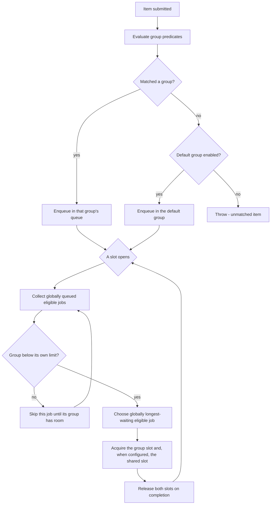

# GroupedRateController

**Responsibility.** Apply different concurrency limits to different kinds of
items by bucketing them into static groups, with an optional shared global
ceiling.

> **Naming note.** `CLAUDE.md` and the round-3 Q&A spelled this
> `GrouppedRateController`. These documents use the corrected spelling
> `GroupedRateController`. Nothing is implemented yet, so no public API changes;
> the spelling is listed as a decision to confirm
> ([decisions.md § Unresolved](../decisions.md#unresolved-items)).

- [Scope](#scope)
- [Public behavior](#public-behavior)
- [Matching and unmatched items](#matching-and-unmatched-items)
- [Shared-ceiling scheduling](#shared-ceiling-scheduling)
- [Reserved shares](#reserved-shares--deferred-advanced-feature)
- [Defaults](#defaults)
- [Advanced options](#advanced-options)
- [Lifecycle, cancellation, and timeouts](#lifecycle-cancellation-and-timeouts)
- [Composition](#composition)
- [Invariants](#invariants)
- [Events and metrics](#events-and-metrics)
- [Test coverage](#test-coverage)
- [Open items](#open-items)

## Scope

| Owns | Does not own |
| --- | --- |
| Static group definitions and their per-group limits | Dynamic group creation ([D-060](../decisions.md#d-060-groups-are-static)) |
| Group matching by predicate, and unmatched-item policy | Per-group retry policy |
| The optional shared global ceiling | Batching |
| Global FCFS arbitration when several groups compete for one shared slot | Time-window limiting |

**Groups are static** — defined upfront, never created or changed at runtime
([D-060](../decisions.md#d-060-groups-are-static)). Dynamic grouping is
deliberately out of scope: it is complex and introduces idle-group cleanup and
memory-leak concerns that are not worth taking on.

## Public behavior

> Illustrative pseudocode. No public API signature is committed yet.

```text
grouped = groupedRateController({
  globalConcurrency: 50, # optional; omit for independent group ceilings
  groups: [
    { name: "premium",  concurrency: 30, matches: item => item.tier == "premium" },
    { name: "free",     concurrency: 10, matches: item => item.tier == "free" },
  ],
  defaultGroup: { name: "other", concurrency: 5 },   # omit to throw on no match
})

result = await grouped.run(item, () => handle(item))
```

Per-group limits are always enforced. The shared global ceiling is optional and
off by default
([D-186](../decisions.md#d-186-grouped-global-ceiling-is-optional-with-global-fcfs-contention)).
Without it, total concurrency may reach the sum of group limits. With it, total
in-flight work also stays at or below that ceiling.

## Matching and unmatched items

Matching is by **per-group predicate**. When an item matches no group, behavior is
configurable ([D-061](../decisions.md#d-061-unmatched-items-route-to-a-default-group-or-throw)):

1. Route it to a **default group**, the normal fallback bucket, or
2. **Throw**, when no default group is enabled.

Whether a default group exists is itself a configuration choice.



Keep predicates **pure and cheap**: they run on every submission and are
mechanism-adjacent hot-path code
([design-principles.md § Policy versus mechanism](../design-principles.md#policy-versus-mechanism)).
Predicate evaluation order and first-match-wins versus multi-match behavior is an
open item.

## Shared-ceiling scheduling

When an enabled global ceiling is contended, the globally longest-waiting
eligible job receives the next slot, regardless of group. Eligibility still
requires that job's group to be below its own limit
([D-186](../decisions.md#d-186-grouped-global-ceiling-is-optional-with-global-fcfs-contention)).

A group slot is always required. When the shared global ceiling is configured, a
global slot is also required. Every acquired slot is released on completion.

## Reserved shares — deferred advanced feature

> **Status: deferred.** The direction is accepted; it is not part of the first
> version ([D-132](../decisions.md#d-132-reserved-group-shares-are-accepted-in-direction-and-deferred-in-scope)).

Per-group limits are **maximums**. They answer "how much may this group take",
never "how much is this group guaranteed". Reserved shares apply only when the
optional shared ceiling is enabled.

A **reserved share** is the missing guarantee: a minimum fraction of the shared
ceiling that a group can always claim when it has queued work, with unused
reservation **reclaimable** by other groups rather than idle.

```text
# Illustrative only. Guarantee checkout 20% of the global ceiling;
# analytics may use everything nobody else is using.
groups: [
  { name: "checkout",  concurrency: 30, reservedShare: 0.20, matches: ... },
  { name: "analytics", concurrency: 40,                       matches: ... },
]
```

Required properties whenever this is built:

1. **Reservations are floors, limits are ceilings.** Both bind; a group gets at
   least its reserved share when it has demand, and never more than its own limit
   ([D-132](../decisions.md#d-132-reserved-group-shares-are-accepted-in-direction-and-deferred-in-scope)).
2. **Unused reservation is reclaimable**, so a reserved-but-idle group costs
   nothing. A reservation that idles capacity would be worse than priority.
3. **Reserved shares must sum to at most the shared ceiling.** Over-subscription
   fails at construction, not at runtime.
4. **Reclaimed capacity is surrendered promptly** when the reserving group's
   demand returns — bounded by in-flight completion, never by preemption, since
   running work is never cancelled ([D-022](../decisions.md#d-022-workers-drain-gracefully-and-are-never-revived)).
5. **It composes with global FCFS.** Reservations would allocate guaranteed
   floors first; globally longest-waiting eligible jobs would compete for the
   remainder.

**Why this is stronger than priority, and why it still waits.** Priority decides
*who goes next*; a reservation decides *how much is always available* — the
difference between "checkout usually wins" and "checkout always has 20%". It
requires a separately specified reservation allocator and remains deferred.

## Defaults

| Option | Default | Notes |
| --- | --- | --- |
| `globalConcurrency` | Not configured | Optional shared ceiling; off by default |
| Per-group `concurrency` | **Required per group** | A group without a limit is just the global ceiling |
| Groups | **Required**, static | ([D-060](../decisions.md#d-060-groups-are-static)) |
| Unmatched-item policy | Throw, unless a default group is configured | ([D-061](../decisions.md#d-061-unmatched-items-route-to-a-default-group-or-throw)) |
| Shared-slot arbitration | Global FCFS | Longest-waiting eligible job when the optional ceiling is contended |
| Reserved shares | None | Deferred; limits are maximums, not guarantees ([D-132](../decisions.md#d-132-reserved-group-shares-are-accepted-in-direction-and-deferred-in-scope)) |
| Job priority | Neutral FIFO | Uses the shared bounded-priority contract when enabled |
| Overflow policy | `Reject` | Inherited from the queue primitive ([D-030](../decisions.md#d-030-a-full-queue-rejects-immediately-by-default)) |
| Max queued per group | `Undecided` | Inherits the undecided default bound ([rate-controller.md § Open items](./rate-controller.md#open-items)) |
| Queue scope | `Undecided` | Whether each group has its own queue or one shared queue is partitioned — see [open items](#open-items) |

## Advanced options

| Option | Shape | Effect |
| --- | --- | --- |
| Job priority | shared job option | Retains the bounded-priority safety rules; the default remains FIFO |
| Reserved share | per-group fraction | **Deferred.** Guaranteed reclaimable minimum of the shared ceiling ([reserved shares](#reserved-shares--deferred-advanced-feature)) |
| Default group | group definition | Turns unmatched-item throwing into fallback routing |
| Per-group timeouts and capacity | per-group values | Different backpressure per group |
| Worker-count sampler | `ctx -> number` | Inherited from [ParallelWorkers](./parallel-workers.md) |
| Clock / scheduler | injected | Deterministic arbitration tests |
| Synchronization provider | injected | Coordinates group and global ceilings across instances, exactly with an accurate synchronizer or by division with a loose one ([SynchronizationProvider](./synchronization-provider.md#groupedratecontroller), [D-204](../decisions.md#d-204-every-backend-has-an-accurate-and-a-loose-synchronizer)) |
| Synchronization scope | caller-defined string | Namespaces one shared grouped-controller domain |

## Lifecycle, cancellation, and timeouts

Identical to [RateController](./rate-controller.md#lifecycle-cancellation-and-timeouts),
applied per group:

- Shutdown is drain or cancel pending, and applies to every group at once
  ([D-070](../decisions.md#d-070-shutdown-is-either-drain-or-cancel-pending)).
- A cancelled item is removed from its group's queue and never executes
  ([INV-7](../architecture.md#invariants)).
- Timeout stages are per item, in the group's queue
  ([queue-and-admission.md § Timeout stages](../subsystems/queue-and-admission.md#timeout-stages)).
- Draining a group never cancels a running item mid-task.

**Open:** whether a group can be drained independently of the whole controller.

## Composition

> Illustrative only.

```text
# Per-tenant batching under one global ceiling
perTenantBatching = tenant => asyncAccumulator(callBulkApi, { maxBatchSize: 100 })
grouped.run(item, () => perTenantBatching(item.tenant).submit(item))

# Retries around the grouped limiter: each attempt re-matches and re-admits
resilient = retry.wrap(item => grouped.run(item, () => handle(item)), { attempts: 3 })
```

Independent per-group ceilings are the default. Configure `globalConcurrency`
when the sum must also be bounded.

## Invariants

- When configured, the shared global ceiling is never exceeded, even when every
  group is below its own limit ([INV-4](../architecture.md#invariants)).
- A group never exceeds its own limit, even when the global ceiling has room.
- Without a global ceiling, groups may reach the sum of their limits.
- An unmatched item either routes to the default group or throws — it is never
  silently dropped ([INV-1](../architecture.md#invariants)).
- Under a contended global ceiling, the longest-waiting eligible job is selected
  regardless of group.

## Events and metrics

Per-group and aggregate snapshots: queue depth, in-flight count, and current
allocation per group, plus global in-flight. Events carry the group identity so a
consumer can attribute them. See
[observability.md](../subsystems/observability.md).

## Test coverage

Case IDs `GRC-xxx` in [testing.md § GroupedRateController](../testing.md#groupedratecontroller-grc).

## Open items

| Item | Status |
| --- | --- |
| The exact public API shape | Not decided ([D-186](../decisions.md#d-186-grouped-global-ceiling-is-optional-with-global-fcfs-contention)) |
| Whether the implementation is one shared admission layer or one `RateController` per group plus an arbitrator | Not decided. Surfaced during consolidation |
| Predicate evaluation order, and whether first match wins when several groups match | Not decided. Surfaced during consolidation |
| Whether a single group can be drained independently | Not decided. Surfaced during consolidation |
| Spelling: `GroupedRateController` versus the earlier `GrouppedRateController` | To confirm. Surfaced during consolidation |
