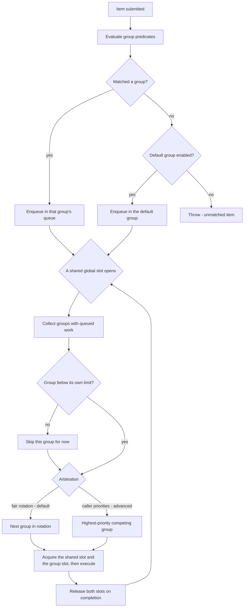

# GroupedRateController

**Responsibility.** Apply different concurrency limits to different kinds of
items by bucketing them into static groups, while holding total concurrency under
one shared global ceiling.

> **Naming note.** `CLAUDE.md` and the round-3 Q&A spelled this
> `GrouppedRateController`. These documents use the corrected spelling
> `GroupedRateController`. Nothing is implemented yet, so no public API changes;
> the spelling is listed as a decision to confirm
> ([decisions.md § Unresolved](../decisions.md#unresolved-items)).

- [Scope](#scope)
- [Public behavior](#public-behavior)
- [Matching and unmatched items](#matching-and-unmatched-items)
- [Shared-ceiling scheduling](#shared-ceiling-scheduling)
- [Defaults](#defaults)
- [Advanced options](#advanced-options)
- [Lifecycle, cancellation, and timeouts](#lifecycle-cancellation-and-timeouts)
- [Composition](#composition)
- [Invariants](#invariants)
- [Events and metrics](#events-and-metrics)
- [Test coverage](#test-coverage)
- [Open items](#open-items)

## Scope

| Owns | Does not own |
| --- | --- |
| Static group definitions and their per-group limits | Dynamic group creation ([D-060](../decisions.md#d-060-groups-are-static)) |
| Group matching by predicate, and unmatched-item policy | Per-group retry policy |
| The shared global ceiling and its allocation across groups | Batching |
| Arbitration when several groups compete for one shared slot | Time-window limiting |

**Groups are static** — defined upfront, never created or changed at runtime
([D-060](../decisions.md#d-060-groups-are-static)). Dynamic grouping is
deliberately out of scope: it is complex and introduces idle-group cleanup and
memory-leak concerns that are not worth taking on.

## Public behavior

> Illustrative pseudocode. No public API signature is committed yet.

```text
grouped = groupedRateController({
  globalConcurrency: 50,
  groups: [
    { name: "premium",  concurrency: 30, matches: item => item.tier == "premium" },
    { name: "free",     concurrency: 10, matches: item => item.tier == "free" },
  ],
  defaultGroup: { name: "other", concurrency: 5 },   # omit to throw on no match
})

result = await grouped.run(item, () => handle(item))
```

Per-group limits and the shared global ceiling are **both** numeric and **both**
enforced ([D-062](../decisions.md#d-062-per-group-limits-plus-a-shared-global-ceiling)).
Groups are therefore *not* fully independent: total concurrency never reaches the
sum of the group limits. In the example above, the group limits sum to 45 plus a
default group of 5, and the global ceiling of 50 is what actually binds.

**Allocation requirement.** Allocation of the shared global capacity must be
normalized relative to both the number of active/contending groups and the global
worker/slot count. The exact normalization algorithm is not yet defined — see
[open items](#open-items).

## Matching and unmatched items

Matching is by **per-group predicate**. When an item matches no group, behavior is
configurable ([D-061](../decisions.md#d-061-unmatched-items-route-to-a-default-group-or-throw)):

1. Route it to a **default group**, the normal fallback bucket, or
2. **Throw**, when no default group is enabled.

Whether a default group exists is itself a configuration choice.



Keep predicates **pure and cheap**: they run on every submission and are
mechanism-adjacent hot-path code
([design-principles.md § Policy versus mechanism](../design-principles.md#policy-versus-mechanism)).
Predicate evaluation order and first-match-wins versus multi-match behavior is an
open item.

## Shared-ceiling scheduling

When a shared global slot opens and several groups have queued work, the next
group is chosen by **fair rotation** by default. Caller-assigned group priorities
are an advanced API option
([D-063](../decisions.md#d-063-fair-rotation-by-default-caller-priorities-advanced)).

Two slots are required to execute: one from the group's own limit and one from the
shared global ceiling. Both are released on completion.

## Defaults

| Option | Default | Notes |
| --- | --- | --- |
| `globalConcurrency` | **Required** | The shared ceiling is the reason this utility exists |
| Per-group `concurrency` | **Required per group** | A group without a limit is just the global ceiling |
| Groups | **Required**, static | ([D-060](../decisions.md#d-060-groups-are-static)) |
| Unmatched-item policy | Throw, unless a default group is configured | ([D-061](../decisions.md#d-061-unmatched-items-route-to-a-default-group-or-throw)) |
| Shared-slot arbitration | Fair rotation | ([D-063](../decisions.md#d-063-fair-rotation-by-default-caller-priorities-advanced)) |
| Group priorities | None | Advanced opt-in |
| Overflow policy | `Reject` | Inherited from the queue primitive ([D-030](../decisions.md#d-030-a-full-queue-rejects-immediately-by-default)) |
| Max queued per group | `Undecided` | Inherits the undecided default bound ([rate-controller.md § Open items](./rate-controller.md#open-items)) |
| Queue scope | `Undecided` | Whether each group has its own queue or one shared queue is partitioned — see [open items](#open-items) |

## Advanced options

| Option | Shape | Effect |
| --- | --- | --- |
| Group priority | per-group value | Overrides fair rotation for shared-slot arbitration |
| Default group | group definition | Turns unmatched-item throwing into fallback routing |
| Per-group timeouts and capacity | per-group values | Different backpressure per group |
| Worker-count sampler | `ctx -> number` | Inherited from [ParallelWorkers](./parallel-workers.md) |
| Clock / scheduler | injected | Deterministic arbitration tests |
| Synchronization provider | injected | Coordinates group and global shared ceilings across instances ([SynchronizationProvider](./synchronization-provider.md#groupedratecontroller)) |
| Synchronization scope | caller-defined string | Namespaces one shared grouped-controller domain |

## Lifecycle, cancellation, and timeouts

Identical to [RateController](./rate-controller.md#lifecycle-cancellation-and-timeouts),
applied per group:

- Shutdown is drain or cancel pending, and applies to every group at once
  ([D-070](../decisions.md#d-070-shutdown-is-either-drain-or-cancel-pending)).
- A cancelled item is removed from its group's queue and never executes
  ([INV-7](../architecture.md#invariants)).
- Timeout stages are per item, in the group's queue
  ([queue-and-admission.md § Timeout stages](../subsystems/queue-and-admission.md#timeout-stages)).
- Draining a group never cancels a running item mid-task.

**Open:** whether a group can be drained independently of the whole controller.

## Composition

> Illustrative only.

```text
# Per-tenant batching under one global ceiling
perTenantBatching = tenant => asyncAccumulator(callBulkApi, { maxBatchSize: 100 })
grouped.run(item, () => perTenantBatching(item.tenant).submit(item))

# Retries around the grouped limiter: each attempt re-matches and re-admits
resilient = retry.wrap(item => grouped.run(item, () => handle(item)), { attempts: 3 })
```

Do **not** emulate this with one `RateController` per group: independent limiters
sum to more than any global ceiling, which is exactly the problem this utility
exists to solve
([S-005](../decisions.md#s-005-fully-independent-groups-summing-to-total-concurrency)).

## Invariants

- The shared global ceiling is never exceeded, even when every group is below its
  own limit ([INV-4](../architecture.md#invariants)).
- A group never exceeds its own limit, even when the global ceiling has room.
- Total concurrency never reaches the sum of group limits when that sum exceeds
  the global ceiling.
- An unmatched item either routes to the default group or throws — it is never
  silently dropped ([INV-1](../architecture.md#invariants)).
- Fair rotation does not starve a competing group with queued work.
- Shared-capacity allocation is normalized against the number of contending
  groups and the global slot count.

## Events and metrics

Per-group and aggregate snapshots: queue depth, in-flight count, and current
allocation per group, plus global in-flight. Events carry the group identity so a
consumer can attribute them. See
[observability.md](../subsystems/observability.md).

## Test coverage

Case IDs `GRC-xxx` in [testing.md § GroupedRateController](../testing.md#groupedratecontroller-grc).

## Open items

| Item | Status |
| --- | --- |
| The exact public API shape | Not decided ([D-062](../decisions.md#d-062-per-group-limits-plus-a-shared-global-ceiling)) |
| The shared-capacity normalization algorithm, including integer-remainder handling | Not decided |
| The definition of an "active" or "contending" group | Not decided |
| Redistribution of unused group capacity | Not decided |
| The exact fair-rotation algorithm, and how advanced priorities interact with fairness and starvation guarantees | Not decided ([D-063](../decisions.md#d-063-fair-rotation-by-default-caller-priorities-advanced)) |
| Whether the implementation is one shared admission layer or one `RateController` per group plus an arbitrator | Not decided. Surfaced during consolidation |
| Predicate evaluation order, and whether first match wins when several groups match | Not decided. Surfaced during consolidation |
| Whether a single group can be drained independently | Not decided. Surfaced during consolidation |
| Spelling: `GroupedRateController` versus the earlier `GrouppedRateController` | To confirm. Surfaced during consolidation |
