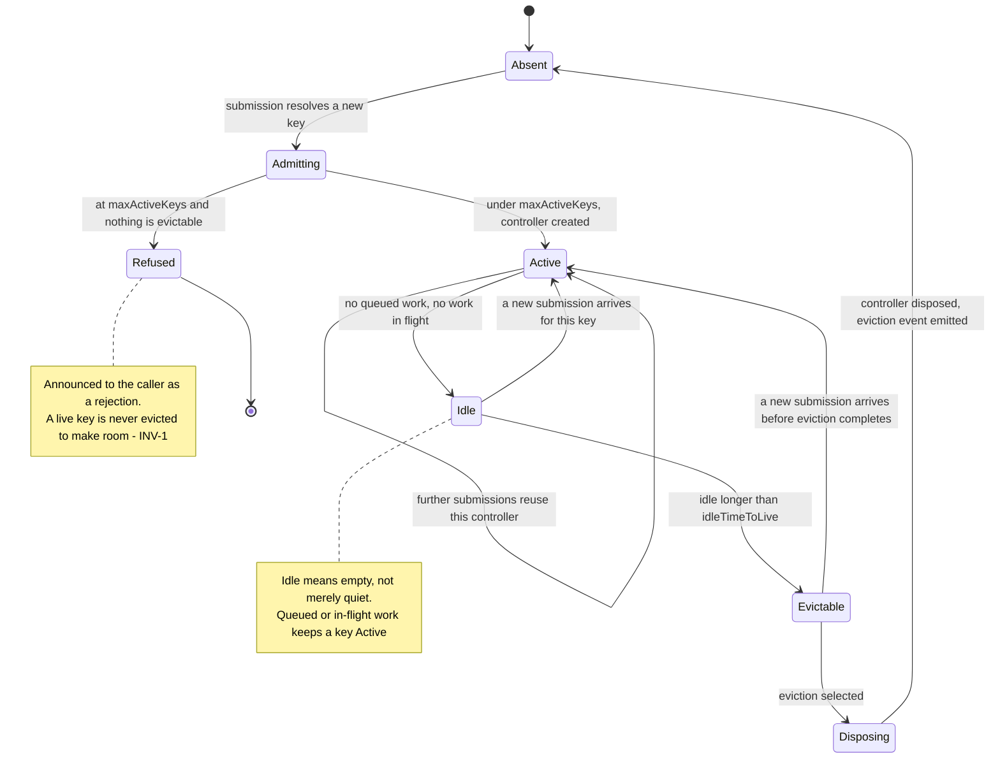
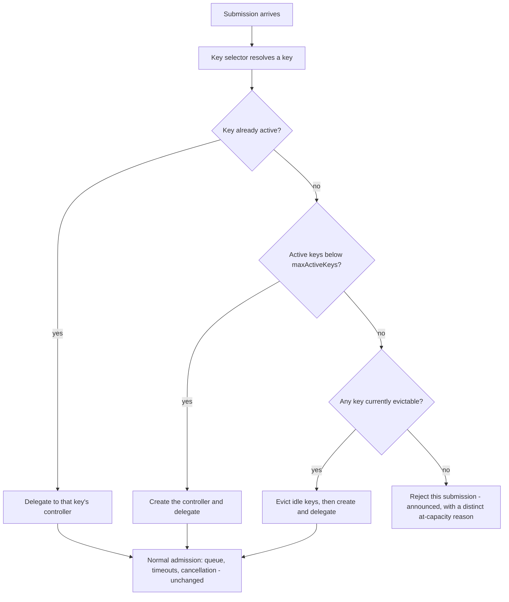

# KeyedControllerRegistry

> **Status: draft.** Accepted as the next utility to build
> ([D-160](../decisions.md#d-160-roadmap-order-keyed-registry-then-shared-job-options-then-supervision-then-outcome-classification)),
> but names, signatures, and several safeguards below are not committed. Resolved
> decisions are marked with their `D-nnn`; everything else is in
> [Open items](#open-items).

**Responsibility.** Create and manage **one controller instance per dynamic key**
— tenant, API key, IP address, customer, shard — from a caller-supplied key
selector, with mandatory bounds on how many keys may exist and how long an idle
key survives.

This is the missing piece between a single controller and
[`GroupedRateController`](./grouped-rate-controller.md): groups are static and
defined upfront ([D-060](../decisions.md#d-060-groups-are-static)), but tenants,
API keys, and IP addresses are discovered at runtime and unbounded in principle.

- [Why this exists](#why-this-exists)
- [Scope](#scope)
- [Public behavior](#public-behavior)
- [Key lifecycle](#key-lifecycle)
- [Mandatory safeguards](#mandatory-safeguards)
- [Aggregate exposure — read this before shipping](#aggregate-exposure--read-this-before-shipping)
- [Defaults](#defaults)
- [Advanced options](#advanced-options)
- [Lifecycle, cancellation, and disposal](#lifecycle-cancellation-and-disposal)
- [Composition](#composition)
- [Invariants](#invariants)
- [Events and metrics](#events-and-metrics)
- [Test coverage](#test-coverage)
- [Open items](#open-items)

## Why this exists

Per-tenant, per-API-key, and per-IP limiting is the most common real-world
limiter requirement, and today Limitful cannot express it: the caller would have
to pre-declare every tenant as a static group. The keyed-limiter demand is
externally validated — Rust's [Governor](https://docs.rs/crate/governor/latest)
ships a keyed limiter as a first-class feature — and the pattern maps cleanly
onto every target language
([D-120](../decisions.md#d-120-keyedcontrollerregistry-creates-one-controller-per-dynamic-key)).

Chosen over framework adapters and a QoS partition utility because it unlocks the
most real workloads without coupling core code to any web framework, and without
a scheduler redesign ([D-160](../decisions.md#d-160-roadmap-order-keyed-registry-then-shared-job-options-then-supervision-then-outcome-classification)).

**The honest cost:** keys are frequently attacker-controlled. A client sending a
random API key per request would otherwise grow memory without bound. Idle expiry
and a maximum key count are therefore **mandatory configuration, not options**
([D-121](../decisions.md#d-121-idle-ttl-and-maximum-active-keys-are-mandatory)).

## Scope

| Owns | Does not own |
| --- | --- |
| Resolving an item to a key, via a caller-supplied selector | What the per-key controller does — it delegates ([D-120](../decisions.md#d-120-keyedcontrollerregistry-creates-one-controller-per-dynamic-key)) |
| Creating a controller on first use of a key | Static group routing ([grouped-rate-controller.md](./grouped-rate-controller.md)) |
| Idle expiry, maximum active keys, and eviction | Per-key retry policy ([retry-decorator.md](./retry-decorator.md)) |
| Eviction safety and eviction metrics | A shared ceiling across keys, unless one is configured ([see below](#aggregate-exposure--read-this-before-shipping)) |
| Per-key and aggregate snapshots | Cross-process key coordination, unless a provider is supplied |

The registry is a **lifecycle manager**, not a scheduler. It holds no queue, no
slots, and no pacing state of its own. Every admission decision belongs to the
controller it created for that key, which keeps all existing queue, timeout, and
cancellation guarantees intact without restating them.

## Public behavior

> Illustrative pseudocode. No public API signature is committed yet.

```text
# Level 0 — a factory, a key selector, and the two mandatory bounds
registry = keyedControllerRegistry({
  key:            request => request.apiKey,
  create:         key => rateController({ concurrency: 10 }),
  idleTimeToLive: minutes(10),      # mandatory
  maxActiveKeys:  10_000,           # mandatory
})

result = await registry.run(request, () => handle(request))

# Level 1 — per-key configuration from the key itself
registry = keyedControllerRegistry({
  key:    request => request.tenantId,
  create: tenantId => rateController({ concurrency: limitFor(tenantId) }),
  idleTimeToLive: minutes(10),
  maxActiveKeys:  5_000,
  onKeyEvicted:   key => metrics.increment("limitful.key.evicted", key),
})

# Level 2 — bounded aggregate exposure across all keys
registry = keyedControllerRegistry({
  key:    request => request.clientIp,
  create: ip => rateController({ concurrency: 5 }),
  idleTimeToLive: minutes(2),
  maxActiveKeys:  50_000,
  globalCeiling:  200,              # strongly recommended — see aggregate exposure
})
```

The `create` factory returns any controller satisfying the shared controller
contract ([controller-contract.md](../subsystems/controller-contract.md)), so a
registry works identically over `RateController`,
[`ThroughputController`](./throughput-controller.md), or a composition of both.
That is the whole reason the contract exists
([D-110](../decisions.md#d-110-a-shared-controller-contract-owns-submission-job-options-and-admission-queries)).

The key selector is **pure, cheap, and runs on every submission**. It must not
perform I/O. A key is an opaque equatable value; its string form is used only for
diagnostics.

## Key lifecycle



Only a key whose controller holds **no queued work and nothing in flight** is
ever idle, and only an idle key can be evicted
([D-122](../decisions.md#d-122-eviction-never-discards-live-work)). Eviction
disposes the controller through its normal disposal path, so there is nothing to
drain by construction.

Resolution of an existing key is a lookup on the hot path and must not take the
registry's creation lock. Creation, eviction, and the at-capacity decision are
the only operations that synchronize.

## Mandatory safeguards

All four are required, because the failure mode they prevent is
attacker-triggered memory growth
([D-121](../decisions.md#d-121-idle-ttl-and-maximum-active-keys-are-mandatory)).

| Safeguard | Rule |
| --- | --- |
| **Idle time-to-live** | Required. An idle key — empty queue, nothing in flight — becomes evictable after this duration. There is no "never expire" setting |
| **Maximum active keys** | Required, finite. Reaching it is an **announced rejection** of the new submission, never an eviction of a live key |
| **Eviction metrics** | Evictions, refusals, active-key count, and high-water mark are always observable, never debug-only |
| **Explicit disposal** | Disposing the registry disposes every live controller under the registry's chosen shutdown mode ([D-124](../decisions.md#d-124-registry-disposal-propagates-and-evictions-are-observable)) |

### What happens at `maxActiveKeys`



Rejecting the newcomer rather than evicting an active key is forced by
[INV-1](../architecture.md#invariants): evicting a controller with queued work
would drop that work unannounced. The rejection carries its own reason code,
distinct from a full queue, so an operator can tell "this tenant is overloaded"
from "we are tracking too many tenants"
([D-123](../decisions.md#d-123-at-capacity-refusal-is-distinct-from-queue-overflow)).

## Aggregate exposure — read this before shipping

**Per-key controllers are independent by default, so worst-case total
concurrency is `maxActiveKeys × perKeyLimit`.** With the first example above
that is 10,000 × 10 = 100,000 concurrent operations.

This is exactly the arrangement rejected for `GroupedRateController`
([S-005](../decisions.md#s-005-fully-independent-groups-summing-to-total-concurrency)),
and it is not acceptable as an undocumented default. Two things follow
([D-123](../decisions.md#d-123-at-capacity-refusal-is-distinct-from-queue-overflow)):

1. **An optional `globalCeiling` across all keys is part of the first version**,
   not a later addition. When set, a submission needs both a per-key slot and a
   global slot, reusing `GroupedRateController`'s shared-ceiling semantics
   ([D-062](../decisions.md#d-062-per-group-limits-plus-a-shared-global-ceiling)).
2. **Aggregate exposure is reported in the snapshot** as a computed worst case, so
   the number is visible rather than inferred.

Whether `globalCeiling` should be *mandatory* — which would make the safe
configuration the only configuration, consistent with how idle TTL and
`maxActiveKeys` are handled — is an [open item](#open-items). The argument for
mandatory is strong and the argument against is ergonomic only.

## Defaults

| Option | Default | Notes |
| --- | --- | --- |
| `key` selector | **Required** | Pure, cheap, no I/O |
| `create` factory | **Required** | Receives the key; returns any shared-contract controller |
| `idleTimeToLive` | **Required** | No "never expire" value exists ([D-121](../decisions.md#d-121-idle-ttl-and-maximum-active-keys-are-mandatory)) |
| `maxActiveKeys` | **Required**, finite | Same |
| `globalCeiling` | Not set | Strongly recommended; see [aggregate exposure](#aggregate-exposure--read-this-before-shipping) |
| Eviction sweep timing | Lazy, on access, plus the owning controller's existing sampling | No dedicated polling timer ([D-122](../decisions.md#d-122-eviction-never-discards-live-work)) |
| Registry shutdown mode | Inherited from the registry's disposal call | Propagated to every live controller |
| Clock | System clock | Injectable ([D-103](../decisions.md#d-103-the-clock-is-public-api)) |
| Synchronization provider | None | Per-key state is process-local unless a provider is supplied |

Four required inputs is more ceremony than any other Limitful utility, and that
is deliberate: two of them exist solely to make the memory bound explicit. This
is the one place the library prefers an explicit choice over a friendly default
([design-principles.md § What "simple" costs](../design-principles.md#what-simple-costs)).

## Advanced options

| Option | Shape | Effect |
| --- | --- | --- |
| `globalCeiling` | number | Shared ceiling across all keys |
| `onKeyCreated` / `onKeyEvicted` / `onKeyRefused` | callbacks | Raw lifecycle events per key |
| Per-key configuration | derived inside `create` | Different limits per tenant tier |
| Key normalization | `raw -> key` | Case folding, IP prefix grouping, tenant aliasing |
| Clock | injected | Deterministic TTL and eviction tests |
| Synchronization provider and scope | injected | Shared per-key limits across instances ([synchronization-provider.md](./synchronization-provider.md)) |

## Lifecycle, cancellation, and disposal

- The registry performs **no background work before its first submission**
  ([design-principles.md](../design-principles.md#functional-conventions)).
- **Disposal propagates.** Disposing the registry stops accepting new keys and new
  submissions immediately ([INV-10](../architecture.md#invariants)), then disposes
  every live controller under the chosen mode — drain or cancel-pending
  ([D-070](../decisions.md#d-070-shutdown-is-either-drain-or-cancel-pending)) —
  and returns only when all of them are disposed
  ([D-124](../decisions.md#d-124-registry-disposal-propagates-and-evictions-are-observable)).
- **Cancellation and timeouts are entirely the per-key controller's**, unchanged.
  The registry adds no stage and no deadline of its own.
- An at-capacity refusal and a key-selector failure both surface at submission,
  before any queue is involved.

## Composition

> Illustrative only.

```text
# Per-API-key concurrency, with retries outside so each attempt re-resolves its key
resilient = retry.wrap(
  request => registry.run(request, () => callApi(request)),
  { attempts: 3 })

# Per-tenant pacing instead of per-tenant concurrency
registry = keyedControllerRegistry({
  key:    r => r.tenantId,
  create: _ => throughputController({ credits: 100, per: seconds(1) }),
  idleTimeToLive: minutes(10),
  maxActiveKeys:  5_000,
})

# Per-tenant batching: the registry manages accumulators' controllers,
# not the accumulators themselves
```

**Choosing between this and `GroupedRateController`:**

| Use | When |
| --- | --- |
| `GroupedRateController` | The buckets are known upfront and few — tiers, priorities, queue classes |
| `KeyedControllerRegistry` | The buckets are discovered at runtime and unbounded — tenants, API keys, IPs |

Nesting them is valid and expected: a registry per tenant whose `create` returns
a `GroupedRateController` over that tenant's static traffic classes.

## Invariants

- **No live key is ever evicted.** Only a key with an empty queue and nothing in
  flight is evictable ([INV-1](../architecture.md#invariants),
  [D-122](../decisions.md#d-122-eviction-never-discards-live-work)).
- **Active keys never exceed `maxActiveKeys`.**
- **At-capacity is announced**, never silent, and distinguishable from queue
  overflow ([INV-2](../architecture.md#invariants)).
- **One controller per live key** — concurrent first submissions for the same key
  create exactly one controller, and all of them use it.
- **Eviction disposes.** A removed key's controller is disposed, never abandoned
  for the garbage collector.
- **The registry adds no queue, no slot, and no timeout stage**, so every
  per-controller guarantee holds unmodified ([INV-3](../architecture.md#invariants)).
- **Worst-case aggregate concurrency is bounded and reported**, whether or not a
  global ceiling is configured.

## Events and metrics

Per-key: created, evicted, refused-at-capacity, plus whatever the underlying
controller emits, tagged with the key. Aggregate snapshot: active-key count,
high-water mark, eviction and refusal counts, and computed worst-case aggregate
concurrency.

**Keys must not become unbounded metric labels.** An attacker-controlled key is
exactly the cardinality-explosion hazard that
[observability.md](../subsystems/observability.md) warns about: raw keys belong in
events, while exported metrics use bounded dimensions and an exporter allowlist.

## Test coverage

Case IDs `KCR-xxx` in
[testing.md § KeyedControllerRegistry](../testing.md#keyedcontrollerregistry-kcr).
Every `QA-xxx` queue case must still pass through a registry-wrapped controller,
unchanged — that is the proof the registry adds no admission semantics.

## Open items

| Item | Status |
| --- | --- |
| Should `globalCeiling` be **mandatory** rather than recommended? | **Not decided, and consequential.** Mandatory makes the safe configuration the only one; optional keeps the simple path shorter |
| Is `idleTimeToLive` measured from last submission, or from the moment the controller became empty? | Not decided. They differ for a key with long-running work |
| Eviction selection when several keys are evictable and room is needed for one | Not decided. Candidates: oldest-idle first, or evict all evictable |
| Whether eviction may be preemptive — evicting idle keys before capacity is reached, to cap steady-state memory | Not decided |
| Whether a key's controller can be reconfigured without eviction, when per-tenant limits change | Not decided |
| Cross-instance keyed limits: whether each key becomes its own synchronization scope, and the cost of that at 10,000 keys | Not decided ([synchronization-provider.md](./synchronization-provider.md#open-design-questions)) |
| Whether key normalization is a separate seam or just the caller's job inside `key` | Not decided |
| Whether per-key *snapshots* are enumerable, given that enumerating 50,000 keys is itself a hazard | Not decided |
