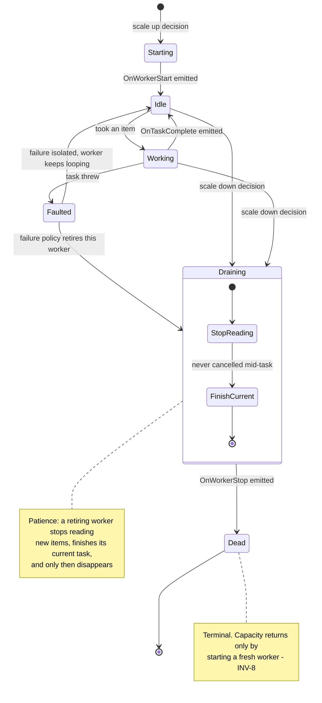
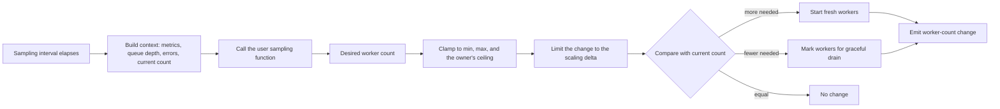

# ParallelWorkers

**Responsibility.** Run a recurring task across a dynamically adjusted number of
concurrent workers, where the desired worker count comes from a user-supplied
sampling function.

`ParallelWorkers` is a core primitive. `RateController` and the accumulators are
both built on it.

- [Scope](#scope)
- [Public behavior](#public-behavior)
- [Worker lifecycle](#worker-lifecycle)
- [Sampling and scaling](#sampling-and-scaling)
- [Defaults](#defaults)
- [Advanced options](#advanced-options)
- [Lifecycle, cancellation, and timeouts](#lifecycle-cancellation-and-timeouts)
- [Composition](#composition)
- [Invariants](#invariants)
- [Events and metrics](#events-and-metrics)
- [Test coverage](#test-coverage)
- [Open items](#open-items)

## Scope

| Owns | Does not own |
| --- | --- |
| Worker creation, drain, and teardown | Queue capacity or overflow policy |
| The sampled desired worker count and clamping | Global concurrency ceilings — the owner clamps ([INV-4](../architecture.md#invariants)) |
| Scaling delta per sampling interval | What the work is |
| Task distribution across workers | Retries ([retry-decorator.md](./retry-decorator.md)) |
| Per-work-item error reporting | Worker-loop supervision or replacement |

It is useful on its own for maximizing CPU utilization and throughput in
high-concurrency environments, not only as an internal building block.

## Public behavior

> Illustrative pseudocode. No public API signature is committed yet.

```text
workers = parallelWorkers({
  work: async ctx => { item = await queue.take(ctx); await handle(item) },
  minWorkers: 1,
  maxWorkers: 16,
  sample: ctx => ctx.queueDepth > 1000 ? 16 : 4,
  sampleInterval: seconds(5),
})
```

Each worker runs a long-lived loop: take work, do work, repeat. Workers are
interchangeable; distribution is "whichever worker is free takes the next item",
not a partitioned assignment.

## Worker lifecycle

A worker moves through explicit states. There is no transition back from
`Dead` — **a worker marked dead is never revived**
([D-022](../decisions.md#d-022-workers-drain-gracefully-and-are-never-revived),
[INV-8](../architecture.md#invariants)). If capacity is needed again, a *fresh*
worker is started. Kill and recreate, never resurrect — this keeps the state
machine simple.



**Patience with dying workers** is a hard rule: a worker selected for removal
stops reading more items from the queue, finishes the task in hand, and only then
disappears. It is never cancelled mid-work.

**Work-item failure is isolated:** the worker catches it, emits the error event,
and continues looping ([INV-12](../architecture.md#invariants)). A worker loop is
an internal protected `try`/`catch`/`finally` mechanism and is not expected to
escape or die. Consequently Parallel Workers exposes no worker-supervision,
replacement, backoff, or stop-on-worker-failure API ([D-176](../decisions.md#d-176-parallelworkers-does-not-model-worker-loop-failure)).

Outcome classification remains separate from work-item handling: for example, a
downstream `429` may guide an adaptive policy without terminating a worker.

## Sampling and scaling

The number of active workers is decided by a **user-supplied sampling function**
evaluated on a configurable interval
([D-020](../decisions.md#d-020-worker-count-comes-from-a-user-sampling-function)).
The function receives a context of metrics and data and returns the desired number
of active workers at that moment.

When a sampler is configured, it runs **immediately when the worker pool first
starts** by default, before the first sampling interval elapses
([D-170](../decisions.md#d-170-parallelworkers-makes-startup-sampling-configurable)).
Callers may instead defer the first sample until after one full interval. The
recurring schedule begins from the initial evaluation in either mode.



**Scaling cap.** By default the worker count changes by **one at a time per
sample** — analogous to Kubernetes scaling pods one at a time. The user may
optionally define a **max delta**: the maximum number of worker changes, adding
or retiring, allowed per sampling interval
([D-021](../decisions.md#d-021-worker-count-changes-by-one-per-sample-by-default)).

**Clamping is the owner's job.** When `ParallelWorkers` runs inside
`RateController`, the sampled count is clamped so that total allowed in-flight
work never exceeds `N`
([D-002](../decisions.md#d-002-n-is-the-hard-global-in-flight-ceiling)). The
sampler divides a fixed budget; it never enlarges it.

**Sampling pauses during a resize.** While a scale-up or graceful scale-down is
still transitioning the worker count, scheduled sampling ticks are skipped rather
than evaluated or queued ([D-171](../decisions.md#d-171-parallelworkers-skips-sampling-during-worker-count-transitions)). Once the
transition settles, the next regular tick may sample again. This prevents
overlapping decisions from acting on a count that has not yet become real.

## Defaults

| Option | Default | Notes |
| --- | --- | --- |
| `work` | **Required** | The loop body |
| Min workers | 1 | The pool never scales itself to zero ([D-172](../decisions.md#d-172-parallelworkers-defaults-to-one-minimum-worker)) |
| Max workers | **Required** | Finite explicit bound; never inferred from CPU capacity ([D-173](../decisions.md#d-173-parallelworkers-requires-an-explicit-maximum-worker-count)) |
| Sampling function | A fixed count | Absent a sampler, the count does not change |
| Sampling interval | 1 second | Used when a sampler is supplied; configurable ([D-174](../decisions.md#d-174-parallelworkers-defaults-sampling-to-one-second)) |
| Startup sampling | Immediate | May be deferred until after the first full interval |
| Scaling delta | 1 per sample | ([D-021](../decisions.md#d-021-worker-count-changes-by-one-per-sample-by-default)) |
| Clock | System clock | Injectable ([D-103](../decisions.md#d-103-the-clock-is-public-api)) |
| Synchronization provider | None | In-process by default; opt in for cross-instance membership/allocation ([SynchronizationProvider](./synchronization-provider.md)) |

## Advanced options

| Option | Shape | Effect |
| --- | --- | --- |
| Sampling function | `ctx -> number` | Dynamic worker count from live metrics |
| Sampling interval | duration | Evaluation frequency |
| Startup sampling | immediate or deferred | Whether the sampler runs at first start or after the first full interval |
| Max scaling delta | number | More than one change per interval |
| Min / max workers | numbers | Hard bounds around the sampled value |
| Event handlers | callbacks | `OnWorkerStart`, `OnWorkerStop`, `OnWorkerError`, `OnTaskComplete`, worker-count change |
| Clock / scheduler | injected | Deterministic sampling in tests |
| Synchronization provider | injected | Coordinated membership and worker allocation across instances ([SynchronizationProvider](./synchronization-provider.md#parallelworkers)) |
| Synchronization scope | caller-defined string | Namespaces one shared worker group |
| Adaptive capacity policy | injected, off by default | Adjusts the desired worker target within min/max/owner bounds ([AdaptiveCapacityPolicy](./adaptive-capacity-policy.md)) |

## Lifecycle, cancellation, and timeouts

- Shutdown drains every worker: stop reading, finish the current task, stop
  ([D-022](../decisions.md#d-022-workers-drain-gracefully-and-are-never-revived)).
- Cancel-pending shutdown cancels queued work, not the task a worker is currently
  running ([D-070](../decisions.md#d-070-shutdown-is-either-drain-or-cancel-pending)).
- Disposal waits for every worker to reach `Dead` before releasing resources, and
  removes synchronized membership on the way out
  ([SynchronizationProvider](./synchronization-provider.md#shared-contract)).
- `ParallelWorkers` enforces no execution timeout of its own; timeouts belong to
  the owning utility's queue stages
  ([queue-and-admission.md](../subsystems/queue-and-admission.md#timeout-stages)).

## Composition

> Illustrative only.

```text
# What RateController does internally: workers pull from a bounded queue
# and the sampled count is clamped to N.

# What AsyncAccumulator does internally: each worker is a long-lived
# batching worker that accumulates items and invokes the batch function.
```

Both uses are documented in [rate-controller.md](./rate-controller.md) and
[async-accumulator.md](./async-accumulator.md). Direct use is equally valid for
recurring background work.

An optional [AdaptiveCapacityPolicy](./adaptive-capacity-policy.md) may
guide worker-target selection from saturation signals. It composes with, rather
than replaces, the user sampling function and normal clamp/scaling-delta rules.
When owned by `RateController`, it can never raise total in-flight work above
hard ceiling `N`. When used alongside `ThroughputController`, extra workers can
only consume work already released by the throughput credit scheduler.

## Invariants

- A dead worker is never revived ([INV-8](../architecture.md#invariants)).
- A retiring worker is never cancelled mid-task.
- The worker count never exceeds the owner's ceiling
  ([INV-4](../architecture.md#invariants)).
- Worker-count changes per sample never exceed the scaling delta.
- A failing work item never stops a worker's loop ([INV-12](../architecture.md#invariants)).

## Events and metrics

`OnWorkerStart`, `OnWorkerStop`, `OnWorkerError`, `OnTaskComplete`, worker
increment, worker-count change, and the periodic sample event. Snapshots expose
the current and desired worker counts. See
[observability.md](../subsystems/observability.md).

## Test coverage

Case IDs `PW-xxx` in [testing.md § ParallelWorkers](../testing.md#parallelworkers-pw).

## Open items

| Item | Status |
| --- | --- |
| Ownership of the first-item accumulation window when several batching workers are idle | Not decided ([async-accumulator.md](./async-accumulator.md#open-items)) |
