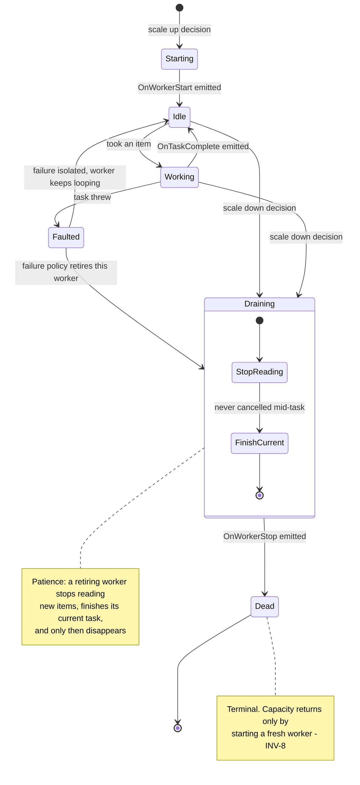
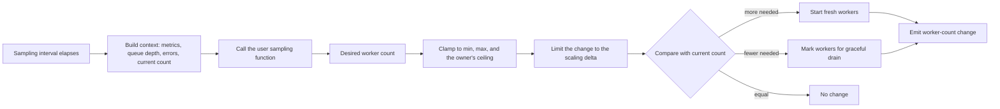

# ParallelWorkers

**Responsibility.** Run a recurring task across a dynamically adjusted number of
concurrent workers, where the desired worker count comes from a user-supplied
sampling function.

`ParallelWorkers` is a core primitive. `RateController` and the accumulators are
both built on it.

- [Scope](#scope)
- [Public behavior](#public-behavior)
- [Worker lifecycle](#worker-lifecycle)
- [Sampling and scaling](#sampling-and-scaling)
- [Defaults](#defaults)
- [Advanced options](#advanced-options)
- [Lifecycle, cancellation, and timeouts](#lifecycle-cancellation-and-timeouts)
- [Composition](#composition)
- [Invariants](#invariants)
- [Events and metrics](#events-and-metrics)
- [Test coverage](#test-coverage)
- [Open items](#open-items)

## Scope

| Owns | Does not own |
| --- | --- |
| Worker creation, drain, and teardown | Queue capacity or overflow policy |
| The sampled desired worker count and clamping | Global concurrency ceilings — the owner clamps ([INV-4](../architecture.md#invariants)) |
| Scaling delta per sampling interval | What the work is |
| Task distribution across workers | Retries ([retry-decorator.md](./retry-decorator.md)) |
| Worker failure handling and worker events | |

It is useful on its own for maximizing CPU utilization and throughput in
high-concurrency environments, not only as an internal building block.

## Public behavior

> Illustrative pseudocode. No public API signature is committed yet.

```text
workers = parallelWorkers({
  work: async ctx => { item = await queue.take(ctx); await handle(item) },
  minWorkers: 1,
  maxWorkers: 16,
  sample: ctx => ctx.queueDepth > 1000 ? 16 : 4,
  sampleInterval: seconds(5),
})
```

Each worker runs a long-lived loop: take work, do work, repeat. Workers are
interchangeable; distribution is "whichever worker is free takes the next item",
not a partitioned assignment.

## Worker lifecycle

A worker moves through explicit states. There is no transition back from
`Dead` — **a worker marked dead is never revived**
([D-022](../decisions.md#d-022-workers-drain-gracefully-and-are-never-revived),
[INV-8](../architecture.md#invariants)). If capacity is needed again, a *fresh*
worker is started. Kill and recreate, never resurrect — this keeps the state
machine simple.



**Patience with dying workers** is a hard rule: a worker selected for removal
stops reading more items from the queue, finishes the task in hand, and only then
disappears. It is never cancelled mid-work.

**Worker failure** is isolated by default: the task's failure is surfaced through
the error event and the worker continues looping
([INV-12](../architecture.md#invariants)). The user can react to error events by
changing the worker count — including retiring workers — since errors are exported
as events. What happens to the *worker* after a failure is a supervision
decision — see below.

## Supervision

A failing **task** is isolated ([INV-12](../architecture.md#invariants)). A failing
**worker loop** is different: if a worker dies and is not replaced, throughput
silently drops and stays dropped. One poisoned worker function must not leave a
controller permanently at half capacity
([D-130](../decisions.md#d-130-worker-failure-behavior-is-an-explicit-enumerated-supervision-policy)).

Supervision is therefore an **explicit enumerated policy**, not an open question,
and every outcome emits a worker-failure event carrying the error, the worker
identity, and the policy applied.

| Policy | Behavior | Use when |
| --- | --- | --- |
| **Isolate** *(default)* | Surface the error; the worker keeps looping. Capacity unchanged | Task failures are expected and independent — the ordinary case |
| **Replace** | Retire this worker and start a **fresh** one. Capacity restored, never resurrected ([INV-8](../architecture.md#invariants)) | The loop may be corrupted but the workload is sound |
| **Reduce capacity** | Retire this worker without replacement, down to the minimum worker bound | Failures indicate the pool is too large for what the dependency can take |
| **Stop controller** | Drain every worker and move the owner to shutdown | A failure means the whole component is unsafe to keep running |

Rules that bind every policy:

1. **Replacement is creation, never revival.** A dead worker is never restarted;
   `Replace` starts a new worker with a new identity
   ([D-022](../decisions.md#d-022-workers-drain-gracefully-and-are-never-revived)).
2. **Retirement is always graceful.** Even under `Stop controller`, a worker stops
   reading and finishes its current task; supervision never cancels mid-task.
3. **Replacement is rate-limited.** A worker function failing instantly on every
   iteration must not become a create/destroy spin. Replacement obeys the
   scaling delta and a backoff between replacements of the same pool.
4. **A failure event is always emitted**, including under `Isolate`, so silent
   capacity loss is impossible by construction.
5. **`Reduce capacity` never goes below the configured minimum**, and the
   reduction is visible in the worker-count-change event.
6. **A supervision callback may select the policy per failure**, receiving the
   error and recent failure history. The enum is the simple path; the callback is
   the advanced one.

Supervision answers "what happens to the worker", while
[outcome classification](./adaptive-capacity-policy.md#outcome-classification)
answers "what does this failure mean for capacity". They are deliberately
separate: a downstream `429` should reduce *throughput* without retiring a
worker, and a crashing worker loop should be replaced even when the downstream
service is perfectly healthy.

The operational lessons here are borrowed from Go worker pools such as
[ants](https://github.com/panjf2000/ants) — tunable sizing, non-blocking pool
behavior, and never silently leaking workers — not their API shape.

## Sampling and scaling

The number of active workers is decided by a **user-supplied sampling function**
evaluated on a configurable interval
([D-020](../decisions.md#d-020-worker-count-comes-from-a-user-sampling-function)).
The function receives a context of metrics and data and returns the desired number
of active workers at that moment.



**Scaling cap.** By default the worker count changes by **one at a time per
sample** — analogous to Kubernetes scaling pods one at a time. The user may
optionally define a **max delta**: the maximum number of worker changes, adding
or retiring, allowed per sampling interval
([D-021](../decisions.md#d-021-worker-count-changes-by-one-per-sample-by-default)).

**Clamping is the owner's job.** When `ParallelWorkers` runs inside
`RateController`, the sampled count is clamped so that total allowed in-flight
work never exceeds `N`
([D-002](../decisions.md#d-002-n-is-the-hard-global-in-flight-ceiling)). The
sampler divides a fixed budget; it never enlarges it.

## Defaults

| Option | Default | Notes |
| --- | --- | --- |
| `work` | **Required** | The loop body |
| Min workers | `Undecided` | Candidate: 1. Surfaced during consolidation |
| Max workers | `Undecided` | Candidate: the owner's ceiling, or a CPU-derived value |
| Sampling function | A fixed count | Absent a sampler, the count does not change |
| Sampling interval | `Undecided` | Required once a sampler is supplied |
| Scaling delta | 1 per sample | ([D-021](../decisions.md#d-021-worker-count-changes-by-one-per-sample-by-default)) |
| Worker failure policy | `Isolate` | Four enumerated policies plus an optional callback ([D-130](../decisions.md#d-130-worker-failure-behavior-is-an-explicit-enumerated-supervision-policy)) |
| Replacement backoff | `Undecided` | Required so a permanently failing worker cannot spin. Surfaced during consolidation |
| Clock | System clock | Injectable ([D-103](../decisions.md#d-103-the-clock-is-public-api)) |
| Synchronization provider | None | In-process by default; opt in for cross-instance membership/allocation ([SynchronizationProvider](./synchronization-provider.md)) |

## Advanced options

| Option | Shape | Effect |
| --- | --- | --- |
| Sampling function | `ctx -> number` | Dynamic worker count from live metrics |
| Sampling interval | duration | Evaluation frequency |
| Max scaling delta | number | More than one change per interval |
| Min / max workers | numbers | Hard bounds around the sampled value |
| Worker failure policy | enum or callback | `Isolate`, `Replace`, `Reduce capacity`, or `Stop controller` ([supervision](#supervision)) |
| Event handlers | callbacks | `OnWorkerStart`, `OnWorkerStop`, `OnWorkerError`, `OnTaskComplete`, worker-count change |
| Clock / scheduler | injected | Deterministic sampling in tests |
| Synchronization provider | injected | Coordinated membership and worker allocation across instances ([SynchronizationProvider](./synchronization-provider.md#parallelworkers)) |
| Synchronization scope | caller-defined string | Namespaces one shared worker group |
| Adaptive capacity policy | injected, off by default | Adjusts the desired worker target within min/max/owner bounds ([AdaptiveCapacityPolicy](./adaptive-capacity-policy.md)) |

## Lifecycle, cancellation, and timeouts

- Shutdown drains every worker: stop reading, finish the current task, stop
  ([D-022](../decisions.md#d-022-workers-drain-gracefully-and-are-never-revived)).
- Cancel-pending shutdown cancels queued work, not the task a worker is currently
  running ([D-070](../decisions.md#d-070-shutdown-is-either-drain-or-cancel-pending)).
- Disposal waits for every worker to reach `Dead` before releasing resources, and
  removes synchronized membership on the way out
  ([SynchronizationProvider](./synchronization-provider.md#shared-contract)).
- `ParallelWorkers` enforces no execution timeout of its own; timeouts belong to
  the owning utility's queue stages
  ([queue-and-admission.md](../subsystems/queue-and-admission.md#timeout-stages)).

## Composition

> Illustrative only.

```text
# What RateController does internally: workers pull from a bounded queue
# and the sampled count is clamped to N.

# What AsyncAccumulator does internally: each worker is a long-lived
# batching worker that accumulates items and invokes the batch function.
```

Both uses are documented in [rate-controller.md](./rate-controller.md) and
[async-accumulator.md](./async-accumulator.md). Direct use is equally valid for
recurring background work.

An optional [AdaptiveCapacityPolicy](./adaptive-capacity-policy.md) may
guide worker-target selection from saturation signals. It composes with, rather
than replaces, the user sampling function and normal clamp/scaling-delta rules.
When owned by `RateController`, it can never raise total in-flight work above
hard ceiling `N`. When used alongside `ThroughputController`, extra workers can
only consume work already released by the throughput credit scheduler.

## Invariants

- A dead worker is never revived ([INV-8](../architecture.md#invariants)).
- A retiring worker is never cancelled mid-task.
- The worker count never exceeds the owner's ceiling
  ([INV-4](../architecture.md#invariants)).
- Worker-count changes per sample never exceed the scaling delta.
- A failing task never stops a worker's loop unless the failure policy says so
  ([INV-12](../architecture.md#invariants)).
- **Capacity is never silently lost.** Every worker failure emits an event, and a
  worker that disappears either reduces the reported count or is replaced by a
  fresh worker ([D-130](../decisions.md#d-130-worker-failure-behavior-is-an-explicit-enumerated-supervision-policy)).
- Replacement never exceeds the scaling delta, and never produces a
  create/destroy spin.

## Events and metrics

`OnWorkerStart`, `OnWorkerStop`, `OnWorkerError`, `OnTaskComplete`, worker
increment, worker-count change, and the periodic sample event. Snapshots expose
the current and desired worker counts. See
[observability.md](../subsystems/observability.md).

## Test coverage

Case IDs `PW-xxx` in [testing.md § ParallelWorkers](../testing.md#parallelworkers-pw).

## Open items

| Item | Status |
| --- | --- |
| Default min and max worker counts | Not decided. Surfaced during consolidation |
| Default sampling interval | Not decided. Surfaced during consolidation |
| Whether the sampler may run concurrently with a resize still settling, and whether sampling is skipped while a drain is in progress | Not decided. Surfaced during consolidation |
| ~~Whether the worker failure policy is an enum, a callback, or both~~ | **Resolved:** both — an enum of four policies plus an optional per-failure callback ([D-130](../decisions.md#d-130-worker-failure-behavior-is-an-explicit-enumerated-supervision-policy)) |
| Replacement backoff default, and whether repeated replacement failures escalate to `Stop controller` automatically | Not decided. Surfaced during consolidation |
| Whether `Stop controller` is available when `ParallelWorkers` is used standalone, with no owning controller | Not decided. Surfaced during consolidation |
| Ownership of the first-item accumulation window when several batching workers are idle | Not decided ([async-accumulator.md](./async-accumulator.md#open-items)) |
