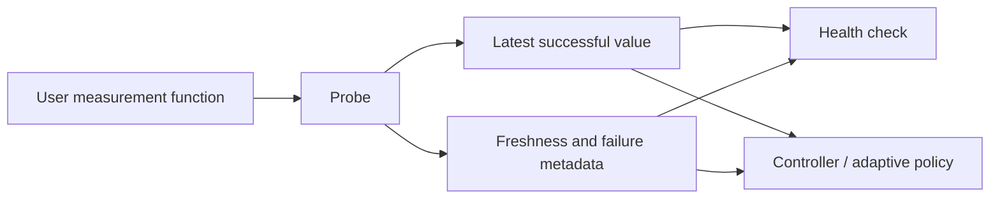

# Probe

> A small periodic value reader. It is not a Prometheus/Grafana aggregation system.

## Purpose

`Probe<T>` runs a user-supplied measurement function periodically and publishes its most recently successful value. Health checks, controllers, and diagnostics consume its `ProbeSnapshot<T>` without being directly coupled to an expensive, remote, or failure-prone source.

If a refresh fails, the last successful value remains available. Its age, last successful check, last attempted check, and latest error remain visible so each consumer can decide whether it is safe to use.
These contracts are recorded in
[D-168](../decisions.md#d-168-probe-retains-the-latest-successful-value-with-freshness-metadata)
and
[D-169](../decisions.md#d-169-probe-refreshes-serially-and-coalesces-missed-intervals).



## Simple use

The only required inputs are a function and an interval.

```text
probe = Probe(read: () => downstreamHealth(), every: seconds(5))
value = probe.current()             # latest known good value, if one exists
snapshot = probe.snapshot()
if snapshot.hasValue and snapshot.isFresh: use(snapshot.value)
```

The value can be any type: a health result, latency reading, CPU pressure, external quota, feature-flag snapshot, or composite domain metric. Getting the current value is the primary purpose of the utility; the snapshot is the optional diagnostic/freshness view around it.

## Snapshot and failure contract

Each immutable snapshot exposes:

- `value`: latest successfully read value, if one exists;
- `lastSuccessfulAt`: when `value` was obtained;
- `lastAttemptAt`: when the function was last invoked;
- `lastFailure`: latest refresh failure, if any;
- `isFresh`: whether `lastSuccessfulAt` is inside the configured freshness allowance; and
- `generation`: a monotonically increasing successful-refresh version.

By default, the probe retains exactly this one last-known-good value. On failure, it updates attempt/failure metadata but does not clear or replace that value. Before the first success, there is no value and the consumer chooses its own fallback.

`current()` returns the retained last-known-good value even when the latest refresh failed or the underlying source is down. Before the first successful refresh it returns the language-idiomatic absence type (`Option`, nullable/optional value, `Result`, and so on), never an invented replacement value.

## Periodic execution with ParallelWorkers

Probe uses `ParallelWorkers` for its long-lived refresh loop. Each probe permits only one active measurement invocation: a slow refresh never causes overlapping calls, timer buildup, or a polling loop. If an interval becomes due while a refresh is active, the missed tick is coalesced into one later refresh.

The scheduler uses a monotonic clock and one next-refresh wake-up. The user function runs outside probe state synchronization; publishing success or failure is one atomic snapshot transition. Readers see a complete old or complete new snapshot, never partially updated fields.

ParallelWorkers may host many independent probes efficiently, but it must not make one probe run its measurement concurrently unless a future explicit multi-reader feature defines how values are combined.

## ProbeFactory and shared scheduling

A `Probe<T>` may receive a **scheduler** option that decides when a refresh may
begin. The default scheduler is private to that probe and preserves standalone
behavior. A `ProbeFactory` creates several probes with one shared scheduler, so a
large managed collection does not require one timer loop per probe
([D-177](../decisions.md#d-177-probefactory-shares-due-time-scheduling-across-probes)).

`ProbeFactory` is a creation and lifecycle owner, not an aggregation system: its
probes retain their own measurement functions, snapshots, freshness rules,
failure metadata, and read APIs. It only shares scheduling and optional execution
concurrency beneath them.

### Due-time algorithm

The shared scheduler tracks each created probe's next due instant and waits only
until the earliest one. When one or more probes become due, it refreshes those
probes and calculates their following due instants. It does **not** compute an
LCM/GCD timing grid: arbitrary intervals, jitter, and dynamic probe creation
would make a common grid either impractically coarse or needlessly frequent.

Creation, removal, interval changes, and explicit start/stop update the due-time
schedule directly. Every probe still allows at most one active measurement. If an
interval elapses while that probe is already refreshing, the existing missed-tick
coalescing rule applies unchanged.

### Shared refresh concurrency

`ProbeFactory.maxConcurrentRefreshes` limits refreshes across its probes. Its
default is **unlimited**, so all probes that are due may begin immediately. A
caller may set any finite positive cap to protect a shared downstream dependency.

When the cap is reached, a due probe remains due until capacity is available; it
does not accumulate one refresh request per missed interval. The first eligible
refresh runs once, then its normal interval is recalculated. This keeps deferred
work bounded by the probes the factory already owns and preserves every probe's
one-active-measurement invariant.

`ParallelWorkers` may execute refreshes that the scheduler has declared due, but
it is not the scheduler: the factory owns due-time calculation and coalescing,
while ParallelWorkers provides bounded concurrent execution when a finite cap is
configured.

### Factory boundaries

The factory addresses timer and downstream-call pressure for an explicitly managed
collection. It does not make an unbounded caller-created population safe by
itself; callers remain responsible for probe membership and lifecycle. A generic
scheduling utility is deliberately deferred until a second non-Probe consumer
needs the same due-time contract.

## Freshness and health checks

Refresh interval and freshness allowance are distinct. A probe may refresh every five seconds while a health check accepts its latest successful value for fifteen seconds. A transient failure therefore does not erase useful data, but prolonged staleness is observable.

```text
if no successful value exists: unknown / caller-defined fallback
else if snapshot is fresh: use latest successful value
else: stale / caller-defined fallback
```

Probe reports data; it does not decide whether stale means healthy, unhealthy, overclocked, or disabled.

## Defaults and advanced options

Ordinary use needs only the function and interval. The first refresh begins immediately on creation. Each later interval begins after the preceding refresh completes, so a slow read never overlaps the next one. Default freshness is slightly longer than the refresh interval, allowing a transient refresh failure without immediately making the last successful value stale. The refresh receives cancellation/timeout support by default; its timeout equals the probe interval.

Advanced options may add an injected monotonic clock/scheduler, explicit freshness allowance, explicit start/stop, success/failure callbacks, failure classifier or fallback value, custom refresh timeout, optional jitter, and numeric `historyCapacity`. `historyCapacity` retains the latest `N` successful values and is always bounded; its default is `1`. No histogram, percentile calculation, or telemetry exporter belongs here.

For a factory-created probe, the advanced `scheduler` option is supplied by the
factory. `ProbeFactory` additionally accepts `maxConcurrentRefreshes`, which is
unlimited by default and may be set to a finite positive cross-probe limit.

## Relationship to controllers

Controllers may receive a `Probe<T>` only as an optional read-only source. For example, `DefaultOverclockPolicy` can read a probed health or saturation value without invoking its measurement function or waiting in a controller hot path. Probe remains independent and usable without any controller across C#, TypeScript, Rust, Go, and Python.

## Test coverage

Case IDs `PB-xxx` in [testing.md § Probe](../testing.md#probe-pb) cover
last-known-good retention, freshness, serial refresh, timeout/cancellation,
bounded history, and factory scheduling under a virtual clock.
