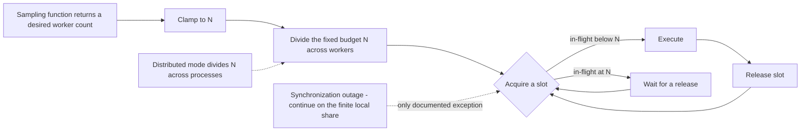

# RateController

**Responsibility.** Keep total in-flight work at or under a hard concurrency
ceiling `N`, pulling from a bounded queue as slots free up.

`RateController` is the core primitive of the library. Everything else either
builds on it or composes around it.

- [Scope](#scope)
- [Public behavior](#public-behavior)
- [Shared controller contract](../subsystems/controller-contract.md)
- [Defaults](#defaults)
- [Advanced options](#advanced-options)
- [Lifecycle, cancellation, and timeouts](#lifecycle-cancellation-and-timeouts)
- [Composition](#composition)
- [Invariants](#invariants)
- [Events and metrics](#events-and-metrics)
- [Test coverage](#test-coverage)
- [Open items](#open-items)

## Scope

**It is a concurrency limiter, not a time-window limiter**
([D-001](../decisions.md#d-001-ratecontroller-limits-by-concurrency-not-by-time-window)).
Up to `N` jobs run at any given moment. There is no fixed window, no sliding
window, no token bucket, and no per-second cap. 1,000 jobs arriving in the first
millisecond are processed as fast as the concurrency configuration allows.

Limitful implements a deliberate **subset of Bottleneck**: rate control plus the
concurrency `ParallelWorkers` already provides. Minimum job spacing is explicitly
not a goal.

| Owns | Does not own |
| --- | --- |
| The hard in-flight ceiling `N` | Retries ([D-004](../decisions.md#d-004-ratecontroller-never-retries)) |
| The bounded queue of submitted jobs | Batching ([async-accumulator.md](./async-accumulator.md)) |
| Failure isolation per job | Time-window or per-second limiting |
| Rate and queue metrics | Minimum spacing between jobs |
| Dividing `N` across a sampled worker count | Grouping ([grouped-rate-controller.md](./grouped-rate-controller.md)) |

## Public behavior

A caller submits work; `RateController` queues it and runs it through
`ParallelWorkers` under the configured constraints.

> Illustrative pseudocode. No public API signature is committed yet.

```text
limiter = rateController({ concurrency: 10 })

result  = await limiter.run(() => callApi(x))   # submit one job
limited = limiter.wrap(callApi)                 # wrap a function once, call it many times
```

`RateController` and [`ThroughputController`](./throughput-controller.md) are peer
implementations of the
[shared controller contract](../subsystems/controller-contract.md), which owns
submission, optional [`JobOptions`](../subsystems/controller-contract.md#joboptions)
— identity, priority, cost, cancellation, start deadline — and the advisory
admission queries ([D-110](../decisions.md#d-110-a-shared-controller-contract-owns-submission-job-options-and-admission-queries)).
Three consequences are specific to this controller:

- **`cost` is rejected at submission.** Weighted concurrency — one job occupying
  several of `N` slots — is deferred until a bounded-starvation rule exists for a
  heavy job that can never find enough free slots
  ([D-116](../decisions.md#d-116-weighted-concurrency-cost-for-ratecontroller-is-deferred)).
  It fails loudly rather than being silently ignored.
- **`estimatedStartAt` may return absence.** A slot frees when user code finishes,
  which this controller cannot predict; any estimate is statistical and is marked
  as such ([D-114](../decisions.md#d-114-estimatedstartat-is-best-effort-and-may-be-absent)).
- **Deadline rejection at submission is conservative.** It rejects only when
  infeasibility is provable — such as a provably unclearable queue — and otherwise
  accepts and lets the queue-wait deadline do its job
  ([D-115](../decisions.md#d-115-deadline-aware-admission-rejects-at-submission-with-controller-bounded-accuracy)).

### The ceiling and the worker count

`RateController` enforces `N` on **slot acquisition**. The worker count supplied
by the `ParallelWorkers` sampling function only decides how that fixed budget is
divided; it can never enlarge it, and any requested count is clamped to `N`
([D-002](../decisions.md#d-002-n-is-the-hard-global-in-flight-ceiling),
[INV-4](../architecture.md#invariants)). Across coordinated instances, an accurate synchronizer keeps `N` exact with a
backend call per item; a loose synchronizer has each instance enforce its own
share of `N` with no per-item call, so the total can briefly exceed `N` while
membership changes propagate
([D-204](../decisions.md#d-204-every-backend-has-an-accurate-and-a-loose-synchronizer)).



The only exception to the hard ceiling is a synchronization-provider outage,
during which each instance continues on its finite local share
([D-199](../decisions.md#d-199-losing-the-synchronization-backend-never-stops-the-application)). Any temporary overshoot must be
bounded, visible, and never described as a hard global guarantee; see
[SynchronizationProvider](./synchronization-provider.md#failure-and-degraded-mode).

### Queueing

The queue is **always bounded**
([D-003](../decisions.md#d-003-queues-are-always-bounded), [INV-3](../architecture.md#invariants)).
Unbounded growth is a memory failure at scale, and worse when the process is
stacked on something constrained. Capacity, overflow strategy, and the timeout
stages come from the shared queue primitive — see
[queue-and-admission.md](../subsystems/queue-and-admission.md).

### Failure isolation

A job that throws is isolated to itself: the failure is surfaced to that job's
caller and through the error event, and the queue and workers continue unaffected
([D-005](../decisions.md#d-005-a-failing-task-is-isolated-to-itself),
[INV-12](../architecture.md#invariants)). One task failing never disturbs the rest.

### No retries

`RateController` does not support retries at all
([D-004](../decisions.md#d-004-ratecontroller-never-retries)). Retry logic lives
in [RetryDecorator](./retry-decorator.md), which the caller composes. A retrying
job releases its slot during backoff and re-enters normal admission for each
attempt ([INV-6](../architecture.md#invariants)).

## Defaults

| Option | Default | Notes |
| --- | --- | --- |
| `concurrency` (`N`) | **Required** — the one value a caller must supply | It is the entire point of the utility; there is no defensible default |
| Overflow policy | `Reject` | Insertion fails immediately when full ([D-030](../decisions.md#d-030-a-full-queue-rejects-immediately-by-default)) |
| Max queued | `Undecided` | The queue must be bounded; the default bound is not chosen — see [open items](#open-items) |
| Pre-admission timeout | Not configured | Optional stage, absent unless set |
| Queue-wait timeout | Not configured | Optional stage, absent unless set |
| Execution timeout | `Undecided` | See [queue-and-admission.md § Timeout stages](../subsystems/queue-and-admission.md#timeout-stages) |
| Worker count | Derived from `N` | A fixed division until a sampling function is supplied |
| Sampling interval | `Undecided` | See [parallel-workers.md § Defaults](./parallel-workers.md#defaults) |
| Scaling delta | 1 change per sample | ([D-021](../decisions.md#d-021-worker-count-changes-by-one-per-sample-by-default)) |
| Clock | System clock | Injectable ([D-103](../decisions.md#d-103-the-clock-is-public-api)) |
| Synchronization provider | None | In-memory, in-process by default; opt in for cross-instance coordination ([SynchronizationProvider](./synchronization-provider.md)) |
| Retries | None, not configurable | ([D-004](../decisions.md#d-004-ratecontroller-never-retries)) |
| `JobOptions` | Entirely absent | Function-only submission is the simple path ([controller-contract.md](../subsystems/controller-contract.md#joboptions)) |
| `JobOptions.cost` | Rejected at submission | Weighted concurrency deferred ([D-116](../decisions.md#d-116-weighted-concurrency-cost-for-ratecontroller-is-deferred)) |
| `JobOptions.priority` | Neutral, FIFO | Banded and aging-protected when enabled ([D-112](../decisions.md#d-112-priority-is-optional-banded-and-protected-by-aging)) |

## Advanced options

| Option | Shape | Effect |
| --- | --- | --- |
| Worker-count sampler | `ctx -> number` | Dynamically divides `N`; clamped to `N`. Receives live metrics |
| Sampling interval | duration | How often the sampler runs |
| Max scaling delta | number | Allows more than one worker change per sample ([D-021](../decisions.md#d-021-worker-count-changes-by-one-per-sample-by-default)) |
| Overflow = wait | enum | Callers wait outside a full queue under a configured waiting-caller capacity; explicit unbounded waiting gives up the memory guarantee ([D-179](../decisions.md#d-179-wait-mode-has-a-configurable-bounded-waiting-room)) |
| Queued-job deduplication | hash/key function | Reject a duplicate queued submission as `AlreadyQueued` ([D-184](../decisions.md#d-184-optional-queued-job-deduplication-rejects-duplicates)) |
| Timeout stages | durations | Pre-admission, queue-wait, execution |
| Clock / scheduler | injected | Deterministic tests, custom time sources |
| Synchronization provider | injected | Cross-process shared ceiling ([SynchronizationProvider](./synchronization-provider.md#ratecontroller)) |
| Synchronization scope | caller-defined string | Namespaces one shared cross-instance limit |
| Event handlers | callbacks | Raw observability ([observability.md](../subsystems/observability.md)) |
| `JobOptions` | per-submission envelope | Identity, priority, cancellation, start deadline ([controller-contract.md](../subsystems/controller-contract.md#joboptions)) |
| `canStartNow` / `estimatedStartAt` | advisory queries | Early load shedding; never reserve capacity ([D-113](../decisions.md#d-113-admission-estimation-is-advisory-and-never-reserves-capacity)) |
| Adaptive capacity policy | injected, off by default | May guide worker/target behavior but never raise hard ceiling `N` ([AdaptiveCapacityPolicy](./adaptive-capacity-policy.md)) |

## Lifecycle, cancellation, and timeouts

- Follows the shared lifecycle: `Created → Running → Draining | Cancelling → Disposed`
  ([architecture.md § Lifecycle](../architecture.md#lifecycle-and-disposal)).
- **Shutdown modes:** drain, or cancel pending
  ([D-070](../decisions.md#d-070-shutdown-is-either-drain-or-cancel-pending)). In both,
  new enqueues fail immediately with cancellation
  ([INV-10](../architecture.md#invariants)).
- **Cancel pending** completes queued-but-not-started jobs as cancelled;
  already-executing jobs are not cancelled and may finish normally.
- **Workers are never cancelled mid-task.** A stopping worker finishes its
  current job first ([D-022](../decisions.md#d-022-workers-drain-gracefully-and-are-never-revived)).
- **Cancelling a submitted job** before it starts removes it and guarantees it
  never executes later ([INV-7](../architecture.md#invariants)).
- **Cancelling after execution starts** wins the caller's eventual outcome, lets
  physical work complete, and discards the eventual result
  ([D-182](../decisions.md#d-182-queued-cancellation-wins-the-caller-outcome-without-stopping-running-work)).
- **Timeout stages** are owned by the queue primitive and are distinct per stage
  ([D-035](../decisions.md#d-035-timeout-scopes-are-distinct-per-lifecycle-stage)).
- **Nothing survives process exit**
  ([D-072](../decisions.md#d-072-job-persistence-across-restarts-is-out-of-scope),
  [INV-14](../architecture.md#invariants)).

## Composition

> Illustrative only.

```text
# Resilience outside the limit — recommended.
# Each attempt takes its own slot; backoff holds nothing.
resilient = retry.wrap(limiter.wrap(callApi), { attempts: 3 })

# Limit how many batches run at once.
accumulator = asyncAccumulator(limiter.wrap(myBatchFn), { maxBatchSize: 50 })

# Per-tenant limits under one global ceiling: use GroupedRateController instead
# of many independent RateControllers, which would sum to more than N.
```

See [architecture.md § Composition guidance](../architecture.md#composition-guidance)
for the full ordering discussion, including which order is usually wrong.

## Invariants

[INV-1](../architecture.md#invariants), [INV-2](../architecture.md#invariants),
[INV-3](../architecture.md#invariants), [INV-4](../architecture.md#invariants),
[INV-10](../architecture.md#invariants), [INV-12](../architecture.md#invariants),
[INV-13](../architecture.md#invariants), [INV-14](../architecture.md#invariants).

Specifically:

1. In-flight count never exceeds `N` during coordinated operation.
2. A sampled worker count never increases total allowed in-flight work.
3. No submitted job is dropped unannounced.
4. A failing job never affects another job, the queue, or the workers.
5. No enqueue succeeds after shutdown begins.

## Events and metrics

Metrics snapshots expose queue depth, in-flight count, current worker count, and
rate statistics. Events include item complete, error, worker-count change, and
the periodic sample event. All raw; see
[observability.md](../subsystems/observability.md).

## Test coverage

Case IDs `RC-xxx` in [testing.md § RateController](../testing.md#ratecontroller-rc).
Queue behavior shared with other utilities is covered by `QA-xxx`; worker
behavior by `PW-xxx`.

## Open items

| Item | Status |
| --- | --- |
| Default `maxQueued` value | Not decided. The queue must be bounded, but no default bound has been chosen. Surfaced during consolidation |
| Default execution timeout, if any | Not decided |
| ~~Whether a separate **per-second rate limiter** utility is built~~ | **Resolved:** it is [`ThroughputController`](./throughput-controller.md), a peer utility with its own document ([S-010](../decisions.md#s-010-a-per-second-limiter-is-merely-under-consideration)) |
| The bounded-starvation rule that would unblock weighted concurrency `cost` | Not decided ([D-116](../decisions.md#d-116-weighted-concurrency-cost-for-ratecontroller-is-deferred)) |
| Whether `estimatedStartAt` accepts a caller-supplied duration estimator | Not decided ([controller-contract.md](../subsystems/controller-contract.md#open-items)) |
| How `N` is divided across processes in distributed mode, including remainders | Not decided; owned by the synchronization provider and concrete provider contract |
