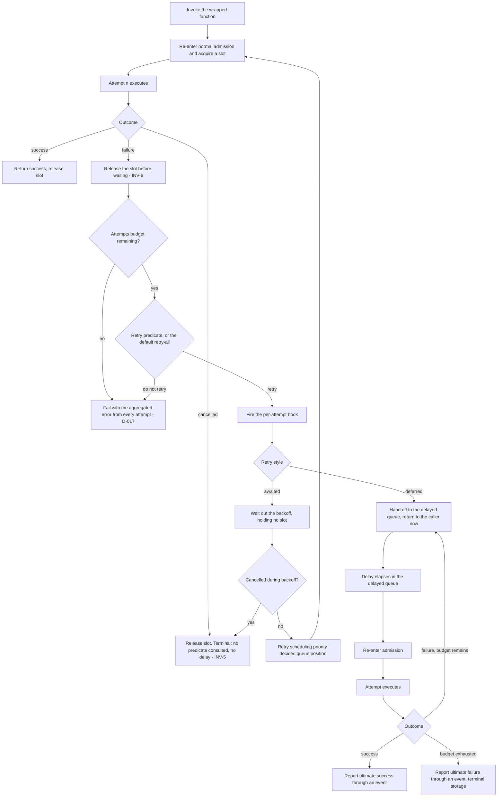

# RetryDecorator

**Responsibility.** Wrap a function so that it re-runs on failure under an
explicit attempt budget, a delay policy, and an optional predicate — with full
visibility into every attempt.

`RetryDecorator` depends on no other Limitful utility. It composes *around* them.

- [Scope](#scope)
- [Attempts, not retries](#attempts-not-retries)
- [The friendly default](#the-friendly-default)
- [Cancellation is terminal](#cancellation-is-terminal)
- [Slot ownership and backoff](#slot-ownership-and-backoff)
- [Two retry API styles](#two-retry-api-styles)
- [Retry scheduling priority](#retry-scheduling-priority)
- [Aggregated errors and hooks](#aggregated-errors-and-hooks)
- [Defaults](#defaults)
- [Advanced options](#advanced-options)
- [Composition](#composition)
- [Invariants](#invariants)
- [Events and metrics](#events-and-metrics)
- [Test coverage](#test-coverage)
- [Open items](#open-items)

## Scope

| Owns | Does not own |
| --- | --- |
| The attempt budget and attempt counting | Concurrency or queueing — it holds no slot while waiting ([INV-6](../architecture.md#invariants)) |
| The delay between attempts, from a context-aware policy | Batching |
| Which failures deserve another attempt, via predicate | Deciding that cancellation is retryable — it never is ([INV-5](../architecture.md#invariants)) |
| Per-attempt hooks and the aggregated final error | Durable storage of deferred work ([INV-14](../architecture.md#invariants)) |
| The deferred fire-and-forget retry path and its event | |

## Attempts, not retries

**The public configuration field is `Attempts`** — or equivalent total-attempts
wording — and it **includes the initial execution**
([D-010](../decisions.md#d-010-the-retry-budget-is-named-attempts-and-includes-the-initial-execution)).

`Attempts = 3` means **at most three executions overall**: the initial call plus
two more. It is never named `Retries` and never described as a retry count
([S-001](../decisions.md#s-001-retry-count-semantics)).

| Configuration | Executions | Delays |
| --- | --- | --- |
| `Attempts = 1` | 1 | 0 — retrying is effectively off |
| `Attempts = 3` | at most 3 | at most 2 |

## The friendly default

With **no retry predicate supplied**, `RetryDecorator` retries every ordinary
failure automatically, and a simple fixed delay must be configurable without
defining any predicate at all
([D-011](../decisions.md#d-011-retrydecorator-retries-every-ordinary-failure-by-default)).

> Illustrative pseudocode. No public API signature is committed yet.

```text
# Level 0 — attempts only
resilient = retry.wrap(callApi, { attempts: 3 })

# Level 1 — a fixed delay, still no predicate
resilient = retry.wrap(callApi, { attempts: 3, delay: milliseconds(100) })

# Level 2 — advanced: predicate, context-aware backoff, hooks
resilient = retry.wrap(callApi, {
  attempts: 5,
  shouldRetry: (error, ctx) => error.isTransient && ctx.attempt < 4,
  backoff:     ctx => milliseconds(100) * (2 ** ctx.attempt) + jitter(ctx.random),
  onAttempt:   ctx => log.warn("attempt failed", ctx.attempt, ctx.error),
})
```

The 100 ms figure is an **ease-of-configuration example, not a chosen default**
([S-002](../decisions.md#s-002-100-ms-as-the-default-retry-delay)). Advanced users
opt into complex, explicit retry conditions; the simple path must never require
them.

## Cancellation is terminal

Cancellation **immediately stops retry and backoff, is never retried, and can
never be overridden by the user's retry predicate**
([D-012](../decisions.md#d-012-cancellation-is-terminal-during-retry),
[INV-5](../architecture.md#invariants)).

The predicate is not even consulted for cancellation. This is a hard rule, not a
default: a predicate that returns `true` for everything still does not cause a
cancelled operation to be retried.

## Slot ownership and backoff

**A retrying job does not hold its concurrency slot during backoff**
([D-013](../decisions.md#d-013-a-retrying-job-releases-its-concurrency-slot-during-backoff),
[INV-6](../architecture.md#invariants)). A failed attempt releases its in-flight
slot *before* waiting.

This is what makes retries safe under a limiter: otherwise a retry storm with
`concurrency: 10` would park all ten slots in `sleep` and deadlock the queue.

## Two retry API styles

Both are supported
([D-014](../decisions.md#d-014-two-retry-api-styles-awaited-and-deferred)):

1. **Awaited retry path.** The caller awaits the final outcome. Each attempt
   re-enters normal admission
   ([D-015](../decisions.md#d-015-awaited-retries-re-enter-normal-admission)).
2. **Deferred fire-and-forget retry path.** Failed work is placed into a
   delayed / dead-letter-style queue, and ultimate success or failure is reported
   through an **event** rather than to the original caller.



The boundary between a **delayed retry queue** and **terminal dead-letter
storage** is an open item, as is the exact API shape and naming of both paths.

## Retry scheduling priority

Awaited retries **re-enter normal admission** rather than bypassing it, acquiring
a new in-flight slot for each attempt
([D-015](../decisions.md#d-015-awaited-retries-re-enter-normal-admission)). Where
the retry lands in the queue is configurable
([D-016](../decisions.md#d-016-retry-scheduling-priority-is-configurable)):

| Mode | Behavior | Trade-off |
| --- | --- | --- |
| **Full retry prioritization** | The retry jumps ahead of queued work | Timely retries; can starve new work |
| **No prioritization** | Normal queued work goes first | Fair; retries may be delayed arbitrarily |
| **Probabilistic prioritization** | A configurable probability `X` decides whether the retry jumps ahead | Tunable middle ground |

The goal is **timely retries that never starve normal queued jobs**. Exact
arbitration and starvation guarantees for the three modes are open items.

Probabilistic mode draws from the **injected random source**, so tests can seed
it and assert the distribution deterministically
([testing.md § Test doubles](../testing.md#test-doubles-and-override-points)).

## Aggregated errors and hooks

**Wherever possible, an exhausted retry returns an aggregated exception** — the
combination of every error encountered across all attempts, not only the last one
([D-017](../decisions.md#d-017-exhausted-retries-surface-an-aggregated-error)).
Where a language has no natural aggregate type, the binding uses the idiomatic
equivalent and still exposes every underlying error.

**Hooks and callbacks** give full visibility and control: a per-attempt hook
receives the attempt number, the error, the elapsed time, and the computed next
delay, for logging, monitoring, or custom handling.

**Backoff is context-aware.** The delay policy receives the item, the received
error, and the current metrics, so exponential, jittered, and domain-aware
strategies (such as honoring a `Retry-After`) are all expressible without the
library knowing about any of them.

## Defaults

| Option | Default | Notes |
| --- | --- | --- |
| `attempts` | `Undecided` | Total executions including the first. The default value is **not decided** ([D-010](../decisions.md#d-010-the-retry-budget-is-named-attempts-and-includes-the-initial-execution)) |
| Retry predicate | None — retry every ordinary failure | ([D-011](../decisions.md#d-011-retrydecorator-retries-every-ordinary-failure-by-default)) |
| Delay / backoff | `Undecided` | A simple fixed delay must be settable without a predicate; the default value, curve, and jitter are not decided |
| Cancellation handling | Terminal, not configurable | ([D-012](../decisions.md#d-012-cancellation-is-terminal-during-retry)) |
| Slot behavior during backoff | Released | Not configurable ([INV-6](../architecture.md#invariants)) |
| Retry style | Awaited | Deferred is opt-in ([D-014](../decisions.md#d-014-two-retry-api-styles-awaited-and-deferred)) |
| Retry scheduling priority | `Undecided` | Three modes exist; which is the default is not decided ([D-016](../decisions.md#d-016-retry-scheduling-priority-is-configurable)) |
| Attempt hooks | None | |
| Random source | System randomness | Injectable, needed for probabilistic prioritization |
| Clock | System clock | Injectable ([D-103](../decisions.md#d-103-the-clock-is-public-api)) |

## Advanced options

| Option | Shape | Effect |
| --- | --- | --- |
| `shouldRetry` | `(error, ctx) -> bool` | Fine-grained control over which errors retry. Never consulted for cancellation |
| `backoff` | `(ctx) -> duration` | Context-aware delay from the item, the error, and current metrics |
| `onAttempt` and related hooks | callbacks | Logging, monitoring, custom per-attempt handling |
| Retry style | enum | Awaited, or deferred fire-and-forget |
| Retry priority mode | enum plus probability | Full, none, or probabilistic |
| Random source | injected | Deterministic probabilistic prioritization in tests |
| Clock / scheduler | injected | Virtual-time backoff tests |

## Composition

> Illustrative only.

```text
# Recommended: retry outside the limiter.
# Each attempt takes its own slot; the backoff holds nothing.
resilient = retry.wrap(limiter.wrap(callApi), { attempts: 3 })

# Retry a whole batch together
accumulator = asyncAccumulator({ batch: retry.wrap(bulkLookup, { attempts: 3 }) })

# Rarely right: retry inside the limiter.
# One slot is held across every attempt AND every backoff, starving the queue.
limited = limiter.wrap(retry.wrap(callApi, { attempts: 3 }))
```

See [architecture.md § Composition guidance](../architecture.md#composition-guidance)
for the sequence diagram of slot release across attempts.

## Invariants

- `Attempts` counts total executions, including the first
  ([D-010](../decisions.md#d-010-the-retry-budget-is-named-attempts-and-includes-the-initial-execution)).
- Cancellation ends everything immediately and is never retried
  ([INV-5](../architecture.md#invariants)).
- No concurrency slot is held during a delay
  ([INV-6](../architecture.md#invariants)).
- An awaited retry re-enters admission; it never bypasses it
  ([D-015](../decisions.md#d-015-awaited-retries-re-enter-normal-admission)).
- A function that succeeds on attempt 1 incurs no delay and no hook invocation
  beyond the success path.
- An exhausted budget surfaces every error encountered, not just the last
  ([D-017](../decisions.md#d-017-exhausted-retries-surface-an-aggregated-error)).
- The deferred path always reports a terminal outcome through an event — success
  or failure, never silence ([INV-1](../architecture.md#invariants)).

## Events and metrics

Per-attempt hooks, plus the deferred path's ultimate success/failure event.
Snapshots expose attempt counts and delayed-queue depth. See
[observability.md](../subsystems/observability.md).

## Test coverage

Case IDs `RD-xxx` in [testing.md § RetryDecorator](../testing.md#retrydecorator-rd).

## Open items

| Item | Status |
| --- | --- |
| The exact API shape and naming of both retry paths | Not decided ([D-014](../decisions.md#d-014-two-retry-api-styles-awaited-and-deferred)) |
| The distinction between a delayed retry queue and terminal dead-letter storage | Not decided |
| Default `attempts` value | Not decided |
| Default delay, backoff curve, and jitter | Not decided ([S-002](../decisions.md#s-002-100-ms-as-the-default-retry-delay)) |
| The cross-language definition of an "ordinary failure" | Not decided ([D-011](../decisions.md#d-011-retrydecorator-retries-every-ordinary-failure-by-default)) |
| Default retry scheduling priority mode, and exact arbitration and starvation guarantees for all three | Not decided ([D-016](../decisions.md#d-016-retry-scheduling-priority-is-configurable)) |
| What happens when a retry re-enters a **full** bounded queue — which overflow behavior applies | Not decided ([D-015](../decisions.md#d-015-awaited-retries-re-enter-normal-admission)) |
| Whether the deferred path's delayed queue is bounded, and its overflow policy | Not decided. Surfaced during consolidation |
| Whether the aggregated error includes errors from attempts the predicate declined to retry | Not decided. Surfaced during consolidation |
