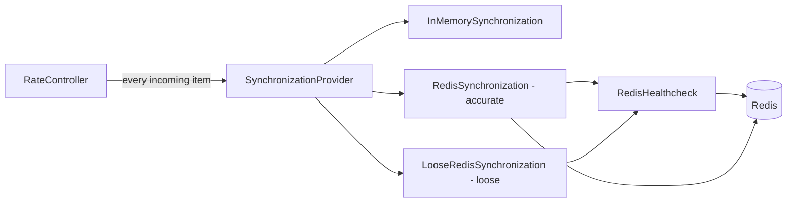

# SynchronizationProvider

**Responsibility.** Coordinate compatible Limitful utilities across processes,
service instances, and services without coupling their public contracts to any
one storage or messaging technology.

`SynchronizationProvider` is the neutral distributed boundary. Controllers use
its semantic operations; they never receive a database/cache client, issue raw
commands, or name a particular backend in their own API
([D-163](../decisions.md#d-163-synchronizationprovider-is-the-backend-neutral-public-contract)).

By default a utility has **no synchronization provider**: it is `null` / `None` /
`nil` ([D-207](../decisions.md#d-207-no-synchronization-by-default)). The utility enforces its limits inside
the process and makes no synchronization calls at all. Users who use controllers
the simple way never see or configure a synchronizer. Cross-instance coordination is
opted into **per utility**; not every utility has to be coordinated.

## Implementations

Every backend comes in **two implementations**, and the user chooses one by
choosing the class
([D-204](../decisions.md#d-204-every-backend-has-an-accurate-and-a-loose-synchronizer)):

| Implementation | How limits are shared | Backend calls | Use when |
| --- | --- | --- | --- |
| None (`null`, the default) | Not shared; the utility enforces its own limit in the process | None | A single process, or no coordination wanted |
| `InMemorySynchronization` | Not shared; the in-process base that loose synchronizers build on | None | Rarely chosen directly |
| `XSynchronization` (accurate) | Every incoming item asks the backend for permission; the limit is kept exactly across all instances | One per item, plus a release | Accuracy matters more than throughput |
| `LooseXSynchronization` (loose) | Each instance enforces `limit ÷ number of live instances` locally | None per item; only the healthcheck | High volume the backend cannot serve per item |

`X` is the backend: `RedisSynchronization` and `LooseRedisSynchronization` first,
then for example `PostgresSynchronization` and `LoosePostgresSynchronization`, and
future backends the same way.

A loose synchronizer is an `InMemorySynchronization` whose limit is divided by the
live instance count it samples from a [healthcheck](#peer-healthcheck). It never
talks to the backend for an individual item.

The Redis implementations are specified in
[Redis synchronization](../subsystems/redis-synchronization.md).

## Scope

A synchronizer coordinates **permission and shared state**, not executable user
work. Queues, callbacks, tasks, and workers remain local to their owning
process. Global queue order and global priority are not promised.

## Shared contract

### Admission check per item

When a synchronizer is configured, the abstraction includes an **admission check
for every incoming item**
([D-204](../decisions.md#d-204-every-backend-has-an-accurate-and-a-loose-synchronizer)):
before an item may start, the utility asks its synchronizer whether it can enter.
The answer is a grant (with a claim the utility releases when the item finishes,
for concurrency limits) or a denial, after which the item stays in the utility's
own bounded queue under the normal admission rules.

| Implementation | How the check is answered |
| --- | --- |
| `InMemorySynchronization` | Locally, against the full configured limit |
| `LooseXSynchronization` | Locally, against this instance's share of the limit |
| `XSynchronization` | By the backend, in one atomic operation against the global limit |

Only the permission request crosses the boundary: limit, cost, group key and
claim identity. The item's payload and the user's function never do.

### Backend call timeout

Every backend call made by a synchronizer or a healthcheck has a timeout:
**500 ms by default**, configurable by the user
([D-208](../decisions.md#d-208-backend-calls-time-out-after-500-ms-and-a-timeout-means-the-backend-is-down)). A call that does not answer in time is treated
as a dead backend. The synchronizer stops using the backend and continues on its
finite local share, exactly as in an [outage](#failure-and-degraded-mode), until
the healthcheck reaches the backend again and recovery reconciles state.

An item whose claim call timed out has an uncertain claim. It proceeds under the
local share, and its claim ID is reconciled idempotently after recovery.

### Core concepts

- **scope**: caller-controlled namespace identifying one shared limit or worker
  group across instances/services;
- **instance identity**: unique, restart-safe incarnation identity for liveness
  and idempotency;
- **healthcheck**: membership, heartbeats and peer cleanup, provided by a separate
  [healthcheck](#peer-healthcheck) component;
- **atomic claim and release** (accurate synchronizers): idempotent per-item
  reservation operations with uncertain-result recovery;
- **authoritative coordination time**: backend time or logical time for globally
  ordered leases, windows, and expiry; never compare local monotonic timestamps
  across machines;
- **configuration epoch**: atomic shared configuration/version updates;
- **health/degradation signal**: availability, uncertainty, and recovery, so the
  utility can continue on its finite local share
  ([below](#failure-and-degraded-mode)).

The contract is semantic rather than a generic key/value or command interface.
Backend-specific transactions, scripts, locks, notifications, and storage layout
are implementation details.

## Peer healthcheck

The healthcheck is **its own abstraction**, separate from the synchronizers
([D-205](../decisions.md#d-205-the-healthcheck-is-a-separate-shareable-abstraction)).
Several synchronizer implementations share one healthcheck implementation: for
example `RedisSynchronization` and `LooseRedisSynchronization` both use
`RedisHealthcheck`. There is **one healthcheck per process**: it tracks membership
per process (the service instance), not per scope, and every synchronizer in that
process uses it, so the process heartbeats once.

Every healthcheck implementation provides the same behavior
([D-200](../decisions.md#d-200-every-provider-runs-a-distributed-peer-healthcheck)):

1. **Own heartbeat.** Each instance refreshes its own heartbeat on a configurable
   interval, timestamped with authoritative coordination time, never its local
   clock.
2. **Peer cleanup.** Every healthy instance periodically checks the other
   instances' heartbeats and cleans up the state of any instance whose heartbeat
   is older than the staleness threshold: its membership and everything it owned
   (claims, leases).
3. **No single reaper.** Any healthy instance may clean up, so dead state is
   removed as long as one instance is alive. There is no leader election.
4. **Idempotent.** Two instances cleaning up the same dead peer at once leave one
   consistent result.
5. **Clean shutdown** removes the instance's own entries before disposal
   completes.
6. **Observable.** The live member count, evicted peers, and backend health are
   reported through the neutral contract.

Loose synchronizers divide their limits by the live member count the healthcheck
reports. Accurate synchronizers use it for crash cleanup of claims and for the
outage fallback.

For Redis, see
[Redis synchronization § RedisHealthcheck](../subsystems/redis-synchronization.md#redishealthcheck)
([D-201](../decisions.md#d-201-redis-membership-and-heartbeats-live-in-one-sorted-set)).

## Capability declaration

A synchronizer **declares** what it supports; a utility **requires** what it
needs; configuration **fails** when the two do not match
([D-150](../decisions.md#d-150-providers-declare-capabilities-and-insufficient-providers-fail-configuration)).
An accurate synchronizer that cannot perform the atomic operation a utility needs
is rejected at startup rather than silently given a weaker guarantee it would go
on describing as exact.

| Capability | Means the synchronizer can | Without it |
| --- | --- | --- |
| **Atomic claim** | Check a limit and commit a claim in one indivisible operation | No exact shared limit is possible |
| **Leases and TTL** | Grant time-bounded ownership that expires without the owner | A crashed instance leaks capacity until manual intervention |
| **Healthcheck** | Membership, heartbeats and [peer cleanup](#peer-healthcheck) | Limits cannot be divided across instances and dead state is never cleaned |
| **Idempotent identity sets** | Add, remove, and count stable IDs idempotently | Retries and uncertain outcomes double-count ([INV-11](../architecture.md#invariants)) |
| **Authoritative coordination time** | Supply non-decreasing coordination time | Exact cross-instance pacing is impossible; monotonic clocks are incomparable across machines |
| **Configuration epoch** | Version shared configuration atomically | A stale instance may raise its limit on obsolete configuration |
| **Health and degradation signal** | Report availability, uncertainty, and recovery | The utility cannot tell "coordinated" from "guessing" |

### Requirement matrix

Every coordinated utility needs a healthcheck and the health signal, because the
outage rule needs a last known instance count
([D-199](../decisions.md#d-199-losing-the-synchronization-backend-never-stops-the-application)).
Loose synchronizers need nothing else. Accurate synchronizers also need:

| Utility | Accurate synchronizer must also support |
| --- | --- |
| `RateController` | Atomic per-item claim and release · idempotent identity sets · leases/TTL |
| `ThroughputController` | Atomic reservation · **authoritative coordination time** · idempotent identity sets · epoch |
| `GroupedRateController` | One atomic claim checking the group limit and the global ceiling together · idempotent identity sets · leases/TTL |
| `ParallelWorkers` | Idempotent identity sets · leases/TTL (worker allocation is not per item) |
| `KeyedControllerRegistry` | Whatever its per-key controller requires, per scope |

### Rules

1. **Declaration is explicit and machine-checkable**, not documentation. A
   synchronizer states its capability set; it is not inferred from its backend
   name.
2. **Mismatch fails at configuration time**, loudly, naming the missing capability
   and the utility that required it — never at the first contended claim.
3. **Partial support is no support.** A capability that holds only under some
   conditions is not declared. "Atomic except during failover" is not atomic.
4. **An accurate synchronizer must never emulate exactness** with local guesses in
   order to satisfy a requirement it cannot meet. Users who accept approximation
   choose the loose synchronizer explicitly.
5. **Capabilities are per scope, not per connection.** The same synchronizer may
   be sufficient for one utility and insufficient for another in the same process.
6. **Degraded operation is not a capability downgrade.** Losing health mid-flight
   moves the utility onto its finite local share
   ([below](#failure-and-degraded-mode)); it does not retroactively re-approve a
   configuration that was rejected.

## Idempotency is mandatory

Every synchronization operation must be idempotent by stable identity. This is a
correctness requirement, not an optional optimization: retries, duplicate
delivery, uncertain network outcomes, crashes, and recovery must not add capacity
twice or release capacity that was never owned.

For membership, worker allocation, per-item claims, and other count-like state,
the authoritative representation is a set (or relational equivalent) of unique
IDs—not an increment/decrement counter as the source of truth:

1. Build a stable ID from the synchronization scope, instance incarnation, and
   operation/claim identity.
2. Add that ID to the authoritative set/row collection to claim or join.
3. Repeat adds safely: the same ID remains one member/claim.
4. Remove that exact ID to release or leave.
5. Repeat removals safely: an absent ID remains absent.
6. Derive the active count from the set cardinality/row count, or from an
   atomically maintained projection that can always be reconstructed from those
   IDs.

Accurate mode's "count every item" is implemented this way: each admitted item
adds its claim ID and removes it on release
([D-082](../decisions.md#d-082-distributed-counting-is-set-based-never-increment-or-decrement)).
Counters may be cached projections for performance, but the identity set/rows are
what make recovery and reconciliation correct.

For example, a Redis implementation can use scoped sets and stable IDs for
idempotent add/remove/cardinality operations; a PostgreSQL implementation can
use uniquely constrained rows with conflict-safe insert/delete and row counting.
The observable contract is identical even though the backend mechanics differ.

Temporal-credit reservations use the same principle: each atomic reservation has
an idempotency ID. Repeating an uncertain claim returns its original grant or
denial rather than spending credits again. IDs must have defined retention,
expiry, and incarnation rules so a stale process cannot remove a newer owner's
state.

## Utility integration

### RateController

With an **accurate** synchronizer, every item obtains an atomic, idempotent claim
on one of the `N` global slots before it starts and releases it when it finishes,
so the total in flight across all instances never exceeds `N` while the backend is
healthy. Claims carry their owning instance, so the healthcheck removes a crashed
instance's claims.

With a **loose** synchronizer, each instance enforces `N ÷ live instances` locally
with no backend call per item. When instances join or leave, the total can briefly
exceed `N` until the next membership sample; that bounded overshoot is accepted.

In both cases the worker sampling function only divides the instance's allowance
and cannot increase it.

### ThroughputController

With an **accurate** synchronizer, one atomic operation per item reads
authoritative time, advances refill/reset state, checks cost and configuration
epoch, commits a reservation ID, and returns a grant or next eligibility. This
prevents independent instances from multiplying a configured global rate.

With a **loose** synchronizer, each instance paces locally at
`global rate ÷ live instances` (1,000 jobs/s across 4 instances is 250 jobs/s
each), with no backend call per item.

### ParallelWorkers

A synchronizer coordinates membership and shared worker allocation across
instances. It can supply active-instance information, allocation epochs, and
lease/liveness events. `ParallelWorkers` still applies its own min/max bounds,
scaling delta, and graceful-draining rules; coordination never creates unbounded
workers or overrides an owning controller's hard ceiling.

### GroupedRateController

With an **accurate** synchronizer, every item's claim checks the selected group's
limit and the global ceiling together in one atomic operation. With a **loose**
synchronizer, each instance enforces its share of every group limit and of the
global ceiling locally (each limit ÷ live instances), with no backend call per
item. Global first-come, first-served selection remains owned by
`GroupedRateController`; with a loose synchronizer it applies within each
instance.

### AsyncAccumulator

A synchronizer may coordinate which instance owns a cross-instance batch window
or batch invocation. It coordinates ownership and liveness, not arbitrary
in-memory input transfer. A true global batch that moves input payloads between
services requires an explicit durable transport/payload contract and is not
implied by enabling synchronization.

## Failure and degraded mode

**Losing the synchronization backend never stops the application**
([D-199](../decisions.md#d-199-losing-the-synchronization-backend-never-stops-the-application)).
This rule holds for every synchronizer, accurate or loose, and every coordinated
utility.

While the backend is unreachable, each coordinated utility continues locally with
a **finite local share**: the last known global limit divided by the last known
number of instances. An accurate synchronizer therefore behaves like its loose
counterpart until the backend recovers.

- **Membership while degraded** follows
  [D-084](../decisions.md#d-084-membership-during-an-outage-is-configurable-frozen-is-defined):
  under frozen membership a share may shrink but never grow, and newly appearing
  instances add no capacity until recovery.
- **Degradation is visible.** The utility emits a degraded event and its snapshot
  marks the share as local. It never describes a local share as a globally
  enforced limit.
- **Time-based limits divide the same way.** A `ThroughputController` sharing
  1,000 jobs/s across 4 instances continues at 250 jobs/s per instance; no process
  ever copies the whole global reservoir.
- **Recovery reconciles first.** Stale membership, leases, and configuration epochs
  are reconciled before any share grows again.
- **Failing closed is not an available policy**
  ([S-008](../decisions.md#s-008-failing-closed-during-a-redis-outage)).

The synchronizer must expose enough state to make this honest:

- no claim is reported successful unless its commit is known or recovered
  idempotently;
- health transitions (healthy, degraded/uncertain, recovered) are reported through
  the neutral contract; and
- the healthcheck keeps membership current while healthy, so a last known
  instance count exists when an outage begins.

**Accepted cost.** The shared limit can be exceeded by a bounded amount during an
outage, because instances that start while the backend is unreachable are not
counted until it recovers.

**Example.** Three instances share a `RateController` with `N = 90`, so each runs 30.
The backend becomes unreachable: each instance keeps running 30 and reports
degraded state. Instance C crashes during the outage; A and B cannot see that and
stay at 30 each. When the backend recovers, reconciliation removes C, and A and B
re-divide to 45 each.

Concrete implementations apply this rule with their own mechanics; for Redis, see
[Redis synchronization § Outage behavior](../subsystems/redis-synchronization.md#outage-behavior).

**Instances that start during an outage** (user decision, 2026-10-10). An
instance of the user's service that starts while the backend is unreachable has
no last known share. It uses a **default limit supplied by the user** until the
backend recovers and it receives a normal share.

A limit always exists, so nothing has to fail at startup: the synchronizer may be
given its own outage default limit, and when it is not, the instance falls back
to the utility's normal configured limit (for example `RateController`'s `N`),
which the utility's options already require. Falling back to the full normal
limit is part of the accepted bounded overshoot.

## Packaging and portability

The neutral interfaces (`SynchronizationProvider` and the healthcheck) belong with
the Limitful contracts so every native implementation shares the same behavior.
`InMemorySynchronization` ships with the core and has no dependencies. Backend
implementations may be optional packages or a separate library. Each target
language receives idiomatic interfaces, but the implementation names, capability
names, failure categories, idempotency rules, and observable state transitions
remain common.

## Test coverage

Case IDs `SP-xxx` in
[testing.md § SynchronizationProvider](../testing.md#synchronizationprovider-sp)
exercise the neutral contract: admission checks, accurate and loose behavior,
healthcheck, capabilities, idempotency, failure, and recovery. Redis-specific
representation and cluster behavior are `RDS-xxx` cases in
[testing.md § Redis synchronization](../testing.md#redis-synchronization-rds).

## Open design questions

1. ~~Which capabilities are required for each utility versus offered as optional
   provider extensions?~~ **Resolved** by the
   [requirement matrix](#requirement-matrix)
   ([D-150](../decisions.md#d-150-providers-declare-capabilities-and-insufficient-providers-fail-configuration)).
   Still open: whether a capability can be declared at a *level* — for example
   "atomic claim, single limit only" versus "atomic claim, multi-limit" — rather
   than as a boolean.
2. Is one synchronizer instance allowed to coordinate several scopes atomically,
   and how are multi-scope reservations ordered?
3. What exact degraded-mode defaults apply to each utility?
4. Which diagnostics are exposed in snapshots/events without leaking
   backend-specific details?
5. Which concrete backend ships first, and does it live in this repository or a
   separate synchronization package?
6. ~~When one healthcheck instance serves several synchronizers, does it track
   membership per scope or per process?~~ **Resolved:** per process.
7. ~~What an accurate synchronizer does when the per-item backend call is slow but
   the backend is not down.~~ **Resolved:** [500 ms timeout, then treated as down](#backend-call-timeout).
