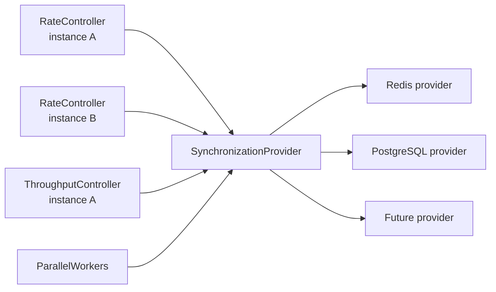

# SynchronizationProvider

**Responsibility.** Coordinate compatible Limitful utilities across processes,
service instances, and services without coupling their public contracts to any
one storage or messaging technology.

`SynchronizationProvider` is the neutral distributed boundary. Controllers use
its semantic operations; they never receive a database/cache client, issue raw
commands, or name a particular backend in their own API.

Concrete implementations may live in separate packages or a separate library:

- `RedisSynchronizationProvider`;
- `PostgresSynchronizationProvider`; and
- future providers for other coordination systems.

All implementations must satisfy the same observable synchronization contract.

## Scope

The provider coordinates **permission and shared state**, not executable user
work. Queues, callbacks, tasks, and workers remain local to their owning
process. Global queue order and global priority are not promised unless a future
provider capability explicitly defines them.

## Shared contract

The public contract is capability-based. A controller requests only the semantic
operation it needs; a provider either supports it atomically or configuration
fails clearly. It must not silently emulate a strict distributed guarantee with
eventual local guesses.

Core concepts:

- **scope**: caller-controlled namespace identifying one shared limit or worker
  group across instances/services;
- **instance identity**: unique, restart-safe incarnation identity for liveness
  and idempotency;
- **membership and heartbeat**: discover active instances and remove stale ones
  according to a provider-defined, observable expiry protocol;
- **atomic claim and release**: idempotent reservation/lease operations with
  uncertain-result recovery;
- **authoritative coordination time**: provider time/logical time for globally
  ordered leases, windows, and expiry; never compare local monotonic timestamps
  across machines;
- **configuration epoch**: atomic shared configuration/version updates;
- **health/degradation signal**: a provider reports availability, uncertainty,
  and recovery so the controller can apply its documented degraded policy.

The contract is semantic rather than a generic key/value or command interface.
Provider-specific transactions, scripts, locks, notifications, and storage layout
are implementation details.

## Idempotency is mandatory

Every synchronization operation must be idempotent by stable identity. This is a
correctness requirement, not an optional optimization: retries, duplicate
delivery, uncertain network outcomes, crashes, and recovery must not add capacity
twice or release capacity that was never owned.

For membership, worker allocation, concurrency claims, and other count-like
state, the authoritative representation is a set (or relational equivalent) of
unique IDs—not an increment/decrement counter as the source of truth:

1. Build a stable ID from the synchronization scope, instance incarnation, and
   operation/claim identity.
2. Add that ID to the authoritative set/row collection to claim or join.
3. Repeat adds safely: the same ID remains one member/claim.
4. Remove that exact ID to release or leave.
5. Repeat removals safely: an absent ID remains absent.
6. Derive the active count from the set cardinality/row count, or from an
   atomically maintained projection that can always be reconstructed from those
   IDs.

The provider must never treat a mutable numerical counter as the only authority
for ownership. Counters may be cached projections for performance, but the
identity set/rows are what make recovery and reconciliation correct.

For example, a Redis implementation can use scoped sets and stable IDs for
idempotent add/remove/cardinality operations; a PostgreSQL implementation can
use uniquely constrained rows with conflict-safe insert/delete and row counting.
The observable contract is identical even though the backend mechanics differ.

Temporal-credit reservations use the same principle: each atomic reservation has
an idempotency ID. Repeating an uncertain claim returns its original grant or
denial rather than spending credits again. IDs must have defined retention,
expiry, and incarnation rules so a stale process cannot remove a newer owner's
state.

## Utility integration

### RateController

An optional provider gives multiple instances one shared hard concurrency ceiling.
Each execution obtains an atomic, idempotent global slot claim before launch and
releases it on terminal completion. Crash recovery uses lease expiry/heartbeat
and incarnation identity. While synchronization is healthy, the provider must
mechanically enforce the shared ceiling; worker sampling only divides the budget
and cannot increase it.

### ThroughputController

An optional provider gives multiple instances one shared temporal-credit quota.
One atomic operation reads authoritative time, advances refill/reset state,
checks cost and configuration epoch, commits a reservation ID, and returns a
grant or next eligibility. This prevents independent instances from multiplying
a configured global rate.

### ParallelWorkers

An optional provider coordinates membership and shared worker allocation across
instances. It can supply active-instance information, allocation epochs, and
lease/liveness events. `ParallelWorkers` still applies its own min/max bounds,
scaling delta, and graceful-draining rules; coordination never creates unbounded
workers or overrides an owning controller's hard ceiling.

### GroupedRateController

An optional provider coordinates the shared global ceiling and per-group limits
across instances. Atomic group-aware claims must check both the selected group's
limit and the global limit in one observable operation; independent local group
counters cannot provide that guarantee. Group selection, fair rotation, and
priority policy remain owned by `GroupedRateController`.

### AsyncAccumulator

An optional provider may coordinate which instance owns a cross-instance batch
window or batch invocation. The provider coordinates ownership and liveness, not
arbitrary in-memory input transfer. A true global batch that moves input payloads
between services requires an explicit durable transport/payload contract and is
not implied by enabling synchronization.

## Failure and degraded mode

Controllers own their product-level outage choice—fail closed, use a finite
preallocated local share, or use a clearly configured emergency local limit.
The provider must expose enough state to make that choice honest:

- no claim is reported successful unless its commit is known or recovered
  idempotently;
- a degraded controller never labels a local approximation as a hard global
  guarantee;
- a newly started instance without an allocated share follows the controller's
  configured degraded policy; and
- recovery reconciles epochs, leases, and stale membership before capacity is
  raised.

## Packaging and portability

The neutral interface belongs with the Limitful contracts so every native
implementation shares the same behavior. Concrete providers may be optional
packages or a separate library, keeping the default in-memory controller
dependency-free. Each target language receives an idiomatic provider interface,
but the capability names, failure categories, idempotency rules, and observable
state transitions remain common.

## Open design questions

1. Which capabilities are required for each utility versus offered as optional
   provider extensions?
2. Is one provider instance allowed to coordinate several scopes atomically, and
   how are multi-scope reservations ordered?
3. What exact degraded-mode defaults apply to each utility?
4. Which provider diagnostics are exposed in snapshots/events without leaking
   backend-specific details?
5. Which concrete provider ships first, and does it live in this repository or a
   separate synchronization package?
