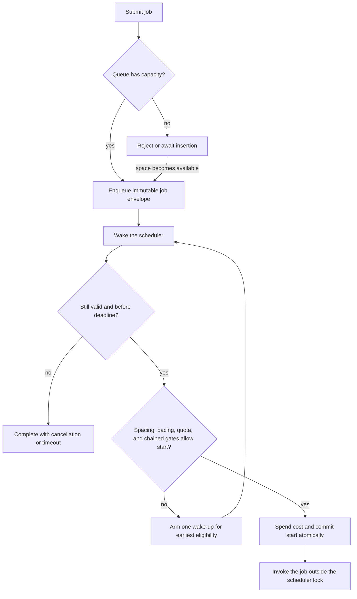
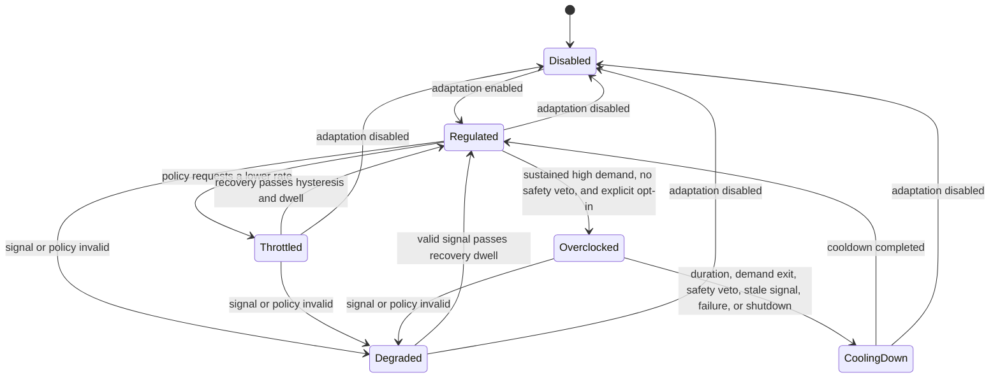

# ThroughputController

> **Status:** utility design. Resolved decisions are recorded here; remaining
> choices are collected under [Unresolved design questions](#unresolved-design-questions).

`ThroughputController` is the time-based counterpart to
[`RateController`](./rate-controller.md). `RateController` limits how
many jobs are in flight. `ThroughputController` limits **when work may start** and
how much time-based quota each start consumes
([D-165](../decisions.md#d-165-throughputcontroller-spends-time-credits-atomically-at-launch),
[D-166](../decisions.md#d-166-throughputcontroller-uses-one-bounded-event-driven-scheduler)).

The two utilities are deliberately separate:

| Concern | `ThroughputController` | `RateController` |
| --- | --- | --- |
| Primary bound | Starts or weighted credit cost over time | Concurrent work in flight |
| Credit released | Never; a time credit is spent at start | When the job finishes |
| Slow jobs | May accumulate in flight | Remain under the concurrency ceiling |
| Fast jobs | Still obey pacing and quota | May run as quickly as slots recycle |
| Typical composition | External API quotas and burst smoothing | Database pools, CPU, memory, downstream concurrency |

This design is informed at the behavior level by the public feature families of
[Bottleneck](https://github.com/SGrondin/bottleneck#docs), including minimum
spacing, reservoirs, weighted jobs, priority, lifecycle inspection, live
settings, chaining, and distributed synchronization. The design and wording here are
independent and follow Limitful's own reliability and portability principles.

## Contents

- [Responsibility and boundaries](#responsibility-and-boundaries)
- [Terminology](#terminology)
- [Simple public behavior](#simple-public-behavior)
- [Start eligibility and accounting](#start-eligibility-and-accounting)
- [Optional minimum spacing and smooth pacing](#optional-minimum-spacing-and-smooth-pacing)
- [Quota and reservoir behavior](#quota-and-reservoir-behavior)
- [Job options](#job-options)
- [Queue, admission, deadlines, and cancellation](#queue-admission-deadlines-and-cancellation)
- [Adaptive saturation and temporary overclock](#adaptive-saturation-and-temporary-overclock)
- [Scheduler and performance model](#scheduler-and-performance-model)
- [Lifecycle](#lifecycle)
- [Live updates](#live-updates)
- [Composition and chaining](#composition-and-chaining)
- [Cross-instance synchronization](#cross-instance-synchronization)
- [Observability](#observability)
- [Proposed defaults](#proposed-defaults)
- [Cross-language portability](#cross-language-portability)
- [Draft invariants](#draft-invariants)
- [Test coverage](#test-coverage)
- [Unresolved design questions](#unresolved-design-questions)

## Responsibility and boundaries

| Owns | Does not own |
| --- | --- |
| A time-based permission to start work | A concurrency ceiling; compose with `RateController` |
| Smooth pacing and an optional explicit minimum start spacing | Retries; compose with `RetryDecorator` |
| Optional quota capacity, refill, reset, and manual adjustment | Batching; compose with an accumulator |
| Immutable weighted credit cost per queued job | Durable work or restart recovery |
| The bounded queue and time-aware scheduler | Discovering what "saturated" means for an application |
| Optional priority, identity, and start-deadline metadata | Forcibly terminating non-cooperative user code |
| Optional adaptive effective throughput and temporary overclock | Silently exceeding a configured hard quota |
| Time-based snapshots and events | Logging or an OpenTelemetry dependency in core |

The controller limits the **launch boundary**. Once a job has started, its
duration does not return quota and does not delay quota replenishment. Without a
separate concurrency controller, an arbitrary number of slow jobs can be in
flight even though their starts were correctly paced.

The controller never retries a failed job. When a caller composes
`RetryDecorator` outside it, every attempt re-enters time-based admission and
spends a new credit.

## Terminology

| Term | Meaning |
| --- | --- |
| **Credit** | One unit of time-based throughput budget |
| **Cost** | Positive integral credits consumed by one job; default `1` |
| **Nominal throughput** | The ordinary configured credit rate |
| **Effective throughput** | The currently enforced paced rate after optional adaptation |
| **Absolute maximum throughput** | A hard ceiling no adaptive policy may exceed |
| **Minimum start spacing** | A lower bound on elapsed time between two launch commits |
| **Quota / reservoir** | Optional stored credits that are consumed at start and replenished by explicit rules |
| **Burst capacity** | How many credits can be available at once; it is never enlarged implicitly |
| **Launch commit** | The atomic transition at which a valid queued job spends its cost and becomes started |
| **Saturation** | Caller-defined downstream pressure normalized to a documented scale |
| **Overclock** | Explicitly enabled, temporary throughput above nominal but below an absolute maximum |

Weighted credit cost follows the same conceptual model as `WeightedAsyncAccumulator`:
each job has an immutable positive cost, defaulting to `1`, and an advanced
caller may supply a larger cost for heavier work. Cost is evaluated before queue
admission/launch and cannot change while the job is queued.

All local elapsed-time calculations use an injected **monotonic** clock and
scheduler. Wall time is unsuitable for pacing because it can move backward or
jump forward. Public snapshots should expose durations such as "eligible in"
rather than process-local monotonic timestamps.

Rates and costs are normalized to finite integer or rational values. Scheduling
must not accumulate binary floating-point drift, and rounding must always be
conservative: a job may start late, never early.

## Simple public behavior

> Illustrative pseudocode. Names and signatures are not committed.

The beginner path has exactly two required inputs across its normal use: the
throughput rate at construction and the function to run at submission. No queue
size, timeout, quota, priority, clock, scheduler, worker, saturation value, or
adapter is required to get a complete working controller. Every other behavior
has a documented safe default. Advanced behavior is opt-in through named
options or functional injection, so the common path remains fully functional
without configuration ceremony.

```text
# Level 0 — one required rate and safe defaults
controller = throughputController({ credits: 100, per: seconds(1) })

result = await controller.run(() => callApi())
limitedCall = controller.wrap(callApi)

# Level 1 — ordinary named options
controller = throughputController({
  credits: 100,
  per: seconds(1),
  maxQueued: 1024,
  minimumStartSpacing: milliseconds(10),
})

# Level 2 — explicit quota and injected policies
controller = throughputController({
  credits: 100,
  per: seconds(1),
  quota: refill({ capacity: 500, amount: 100, every: seconds(1) }),
  cost: item => item.requestUnits,
  priority: item => item.priority,
  adaptive: saturationPolicy,
  clock: testClock,
  scheduler: testScheduler,
})
```

The proposed simple meaning of `100 credits per second` is a **fixed-window
allowance**: up to 100 cost-one starts may be released in each second, including
as a burst when a queued peak arrives or a new window opens. This favors a simple
default and fast peak handling. It is not a promise of even spacing.

Optional smoothing lets a caller limit starts within smaller sub-windows or set
an explicit minimum start spacing (for example, roughly one cost-one start every
10 ms for 100 per second). Smoothing is an advanced traffic-shaping choice for a
downstream service that benefits from steadier arrivals; it must not silently
change the default burst allowance.

Unused credits in the default fixed window expire at that window's boundary.
They do not carry forward or enlarge a later burst. Callers that need stored
allowance use the explicit quota/reservoir configuration instead.

The first submitted task starts the controller's first default window on the
monotonic clock. Subsequent windows advance by that configured period; they are
not aligned to wall-clock seconds. The first eligible task may start immediately
within that first window.

Every submission returns one promise/task/future for the operation's **eventual
terminal outcome**. The controller is transparent: awaiting `run` observes the
operation's value, failure, cancellation, or defined admission failure—not only
the fact that it entered a queue. Fire-and-forget is equally valid: the caller
simply does not retain or await that same handle. It must not be a distinct
scheduling path. Events and metrics still expose its terminal outcome, and any
library-provided fire-and-forget helper must safely account for host-language
unobserved-failure rules.

An explicit quota is the mechanism for callers who need a stored allowance,
bursts, periodic resets, or refills. Pacing and quota can be enabled together;
the stricter constraint wins for every start.

## Shared controller contract

`ThroughputController` and [`RateController`](./rate-controller.md) are **peer**
implementations of one neutral abstraction. That surface — submission, the
returned awaitable outcome, [`JobOptions`](../subsystems/controller-contract.md#joboptions),
advisory admission queries, bounded admission, cancellation, stage deadlines,
drain/cancel-pending disposal, immutable snapshots, and raw events — is specified
once in [controller-contract.md](../subsystems/controller-contract.md)
([D-110](../decisions.md#d-110-a-shared-controller-contract-owns-submission-job-options-and-admission-queries)).

What this controller contributes to that contract:

- **`cost` is fully supported**, spent at launch and never refunded — unlike
  `RateController`, where weighted cost is deferred
  ([D-116](../decisions.md#d-116-weighted-concurrency-cost-for-ratecontroller-is-deferred)).
- **`estimatedStartAt` is computable, not statistical.** Next eligibility follows
  deterministically from the pacing schedule, the quota balance, and the refill
  clock, so this controller returns a computed value where `RateController` can
  only estimate ([D-114](../decisions.md#d-114-estimatedstartat-is-best-effort-and-may-be-absent)).
- **Deadline rejection at submission is sound**, for the same reason: "cannot
  start before `X`" is a proof here
  ([D-115](../decisions.md#d-115-deadline-aware-admission-rejects-at-submission-with-controller-bounded-accuracy)).

A shared interface must not imply that pacing and concurrency mean the same
thing; the contract document names every place the surface is common but the
semantics are not.

## Start eligibility and accounting

A job may launch only when every enabled gate permits it:

1. Shutdown has not invalidated it.
2. It is still queued, not cancelled, and its queue-wait deadline has not
   expired.
3. The pacing and explicit minimum-spacing gates permit a start.
4. The optional quota contains at least the job's immutable cost.
5. Every explicitly chained controller has also granted permission.



The credit reservation and transition to `Started` are one linearization point.
Before it, cancellation or timeout can win and the job spends nothing. After it,
the cost is spent exactly once even if cancellation arrives immediately, the job
fails, or user code never completes. Automatically refunding after launch could
violate an external service's quota because the side effect may already have
escaped.

The user function is invoked immediately after launch commit, with no unrelated
await or queue between commit and invocation. Events are emitted outside the
scheduler lock.

## Optional minimum spacing and smooth pacing

Smooth pacing is optional. When enabled, the configured credit rate derives a
paced interval. Conceptually, if effective
throughput is `R` credits per period `P`, one credit occupies `P / R` of the
virtual schedule.

For a job of cost `C`:

- it cannot start before the current paced eligibility time;
- its launch advances the virtual schedule by `C × P / R`; and
- an explicit `minimumStartSpacing`, when configured, independently prevents the
  next job from starting too close to this one.

When smoothing is enabled, the job's cost affects both paced throughput and any configured quota.
This gives `100 credits per second` the same meaning whether work arrives as one
cost-10 job or ten cost-1 jobs.

The scheduler uses actual launch time as the baseline after idle or timer
lateness. It does **not** replay every missed pacing tick and create a catch-up
burst. If the event loop wakes late, throughput is lower for that interval rather
than temporarily exceeding the configured pace.

The default fixed-window mode leaves smoothing disabled and allows its configured
burst. A caller explicitly enables smoothing when it needs steadier starts;
enabling it must not add stored credit or change the configured window allowance.

## Quota and reservoir behavior

Quota is optional and independent of pacing. It has a non-negative current
balance, a finite capacity, and one replenishment mode.

| Mode | Behavior |
| --- | --- |
| **Manual** | Balance changes only through explicit adjustment or reset |
| **Refill** | Add a configured amount each interval, capped at capacity |
| **Reset** | Replace the balance with a configured amount at each boundary; unused quota is discarded |

All three modes are supported in advanced quota configuration. They remain
separate from the simple fixed-window-credit default so ordinary users do not
need to reason about reservoir behavior.

Refill and reset intervals are anchored explicitly. The proposed local default
is the controller's activation time on the monotonic clock. Wall-clock-aligned
boundaries, if supported later, are a separate advanced feature with explicit
clock-jump semantics.

Replenishment is calculated lazily from elapsed time whenever the scheduler
wakes. The controller does not keep a repeating timer alive while idle merely to
increment a number. Long suspension may replenish up to capacity, never beyond
it.

At launch commit, the job's cost is deducted atomically. Completion and failure
do not refund it. Cancellation before commit spends nothing.

Advanced quota operations may include:

- reading the current balance through an immutable snapshot;
- adding or subtracting credits atomically;
- resetting the balance immediately; and
- updating capacity or replenishment rules through the live-settings protocol.

A manual adjustment wakes the scheduler. Subtraction clamps at zero or fails
atomically; it never creates a negative balance. Reducing capacity clamps the
stored balance to the new capacity and never revokes a start already committed.

A job whose cost exceeds the maximum balance the configured quota can ever hold
must fail at submission with a configuration/admission error. Accepting work
that can never start would violate the queue reliability contract.

## Job options

The shared envelope — identity, priority, cost, cancellation, start deadline —
is specified in
[controller-contract.md § JobOptions](../subsystems/controller-contract.md#joboptions).
This section records how `ThroughputController` accounts for each field.

### Weighted cost

Cost defaults to `1`. An advanced constant, per-call value, or pure function may
provide another positive integral cost. It is evaluated exactly once at
submission and stored in the immutable queued envelope. It is never recomputed
inside the scheduling lock.

Zero, negative, non-finite, or out-of-range costs fail at submission. The common
portable numeric range and overflow rules must be identical in all five
languages.

### Priority

Priority is an explicit advanced per-job option and neutral/FIFO by default. The
caller supplies a pure priority function over the submitted item (or an explicit
per-job value) because only the application knows what is important. Across all
five languages it maps to one documented, bounded priority-band value with
stable first-in-first-out order inside each band. When priority is enabled,
selection defaults to aging or weighted-fair service so normal work receives a
guaranteed turn. A strict-priority expert mode may be offered for genuine
emergencies, but it must prominently warn that a sustained higher-priority stream
can starve lower-priority work.

Priority changes selection order only. It cannot bypass pacing, quota,
cancellation, or deadlines. Admission order among callers waiting *outside* a
full queue remains implementation-dependent, as documented by the shared queue
contract.

Weighted jobs create a head-of-line question: if the highest-ranked job cannot
currently fit the remaining credits but a cheaper job can, the default preserves
queue order: the controller waits for the next window or replenishment rather
than spending the remaining credits out of order. This deliberately trades some
credit utilization for predictable ordering. An advanced work-conserving bypass
policy may select smaller eligible jobs behind the blocked head, but it must
carry an explicit bounded-starvation rule for the bypassed job.

### Identity and status

Every accepted job has an externally visible unique ID for correlation across
events, snapshots, diagnostics, and opt-in OpenTelemetry/exporters. Callers may
supply their own opaque ID; otherwise the controller generates one. A caller ID
is not automatically a deduplication or idempotency key, and completed-job
retention remains opt-in and bounded.

If per-job lookup is included, the portable lifecycle is:

```text
Received -> AwaitingAdmission -> Queued -> LaunchCommitted -> Executing -> Terminal
```

Completed-job retention must be opt-in and bounded. Aggregate snapshots are
always available; retaining every finished ID forever is not.

An optional `wouldStartNow(cost)`-style query may report whether a hypothetical
job appears immediately eligible. It is advisory, not a reservation, and may be
stale as soon as it returns.

### Deadlines

Timeouts retain the stage-specific names from the shared
[queue and admission design](../subsystems/queue-and-admission.md):

- **pre-admission timeout** while waiting to enter a full queue;
- **queue-wait timeout** or latest-start deadline before launch commit; and
- **execution timeout** after start, which signals cooperative cancellation to
  user code.

There is no ambiguous option named only `timeout`. Relative durations are
captured at submission and converted to the local monotonic domain. If the
controller can prove that the next possible eligibility is after a job's latest
start, it may fail that job early rather than arm a useless timer.

## Queue, admission, deadlines, and cancellation

`ThroughputController` inherits the shared bounded-queue contract:

- the queue is always bounded;
- a full queue rejects immediately by default;
- when the queue has capacity, submission always enqueues first and the central
  scheduler releases the item at its calculated pace; there is no separate
  "run now or reject" admission path based on current rate availability;
- await-insertion is an explicit advanced mode whose external waiters are the
  caller's responsibility;
- an accepted queued job is never evicted to admit newer work;
- cancellation or queue-wait expiry guarantees the job never starts later; and
- every accepted job reaches exactly one announced terminal outcome.

Cancellation and launch commit race through one atomic state transition. Either
cancellation wins before commit and no credit is spent, or launch wins and the
job is treated as started. Runtime channel behavior or `select` ordering must not
silently choose different semantics per language.

Once execution begins, cancellation is cooperative. If user code ignores the
signal, the controller cannot safely claim that physical work stopped. The
snapshot should distinguish logical terminal outcomes from currently observed
executions if those can diverge.

## Adaptive saturation and temporary overclock

Adaptive saturation is optional and disabled by default. It changes the
effective paced throughput in response to a caller-defined pressure signal. It
does not alter queue capacity, priority, job cost, cancellation, concurrency, or
a hard quota balance.

### Signal and policy

For overclock, **demand saturation** has one portable direction:

- `0` — the controller is not using its available capacity; and
- `1` — it has repeatedly reached its current configured limit while eligible
  work remains waiting.

The built-in policy derives demand saturation only when a combination persists:
consecutive fully consumed throughput windows together with sustained high
capacity utilization, measured across several samples or a configured dwell
time. `ParallelWorkers` contributes sustained worker/in-flight utilization when
it is part of the composition. A separate optional **safety-pressure**
signal represents downstream latency, rejection rate, CPU, connection pressure,
or a caller-defined health measure. Demand saturation asks for more capacity;
safety pressure can veto or end an overclock. They are not the same signal.

The usual advanced path is therefore a user-supplied saturation function. The
shared [AdaptiveCapacityPolicy](./adaptive-capacity-policy.md)
defines the cross-controller policy boundary; its built-in
`DefaultOverclockPolicy` implementation ships now and may be opted into by
callers who want documented automatic inference from sustained capacity hits and
worker saturation, with optional safety-pressure input. It is not enabled merely
because those measurements exist and it is not hidden default behavior of any
controller.

Signal acquisition must not block the scheduler. A pull provider is fast and
synchronous, normally reading a cached measurement. Expensive or remote
measurement runs outside the controller and pushes or caches its latest sample.

The controller evaluates a pure policy against an immutable context:

```text
AdaptiveContext:
  demand saturation, consecutive limit hits, and sample age
  worker-target saturation and backlog state
  optional safety pressure and sample age
  nominal, current, minimum, and maximum throughput
  queue depth and queued cost
  recently started and completed cost
  current phase and time in phase
  previous accepted decision

AdaptiveDecision:
  desired effective throughput
  bounded reason code
```

The policy proposes a target; it never mutates controller state. Multipliers may
be ergonomic input, but the library normalizes them to an absolute rational rate
before scheduling.

### Throughput envelope

Four values remain distinct:

1. **Nominal throughput** — the independently safe ordinary rate.
2. **Minimum effective throughput** — the lowest adaptive target.
3. **Maximum effective throughput** — the highest target currently allowed.
4. **Effective throughput** — the rate in force now.

Without overclock, maximum effective throughput equals nominal throughput, so
adaptation can only reduce the rate. Overclock is impossible unless the caller
explicitly enables it; an absolute maximum above nominal alone does not enable
it. Enabling overclock also requires that explicit finite absolute maximum.

Adaptation affects pacing prospectively. It never mints stored quota, forgives
spent cost, enlarges burst capacity, or bypasses a stricter chained controller.
If pacing and quota disagree, the stricter gate wins.

### Controller-enforced safeguards

Safeguards apply after the user policy returns, so a custom policy cannot bypass
them:

1. Reject invalid, non-finite, or out-of-range samples and decisions.
2. Clamp the proposed rate to the configured envelope.
3. Ignore changes inside a configured dead band.
4. Use separate enter and exit thresholds for hysteresis.
5. Require a dwell time or consecutive healthy samples before increasing.
6. Apply the simple jump-to-maximum overclock behavior only after explicit
   enablement; gradual ramps and custom step schedules are deferred.
7. Permit faster or immediate downward movement for safety.
8. Enforce a minimum hold time between ordinary adjustments.
9. Commit only if the configuration generation is still current.

Policy evaluation is serialized, runs outside internal locks, and occurs at a
configured sampling interval or in response to a pushed sample—not per job.
Values used at boundaries are quantized to a shared fixed-point representation
so all languages make the same decision.

### Temporary overclock

Overclock is a separate explicit opt-in. Enabling it requires:

- an absolute maximum throughput above nominal;
- a maximum continuous overclock duration;
- a cooldown before another overclock period;
- fresh high-demand saturation samples;
- actual queued demand and/or saturated worker target; and
- no active safety-pressure veto; and
- entry and exit thresholds with hysteresis.

Overclock ends immediately when demand saturation falls below its distinct exit
threshold, safety pressure vetoes it, its duration expires, a required signal is
stale or invalid, policy evaluation fails, shutdown begins, or a hard quota
prevents more work. Cooldown begins whenever overclock ends. Unused headroom
never accumulates as overclock credit.

Overclock may exceed the nominal paced rate but never the explicit absolute
maximum, stored quota, or another chained hard limit. If nominal is itself an
external contractual ceiling, the caller must not enable overclock.



### Adaptive failure behavior

Invalid samples, stale data, and throwing policies never fail queued jobs or
corrupt scheduling state. They emit an isolated error/degraded event.

If failure occurs during overclock, overclock ends immediately. During a
configurable grace period, the controller holds the lower of nominal and the
last valid effective rate, so failure cannot cause an upward jump. After the
grace period it uses a configured failure target; the proposed default is the
nominal rate because nominal must already be safe without adaptation. A caller
may choose a more conservative target, including the minimum effective rate.

## Scheduler and performance model

The scheduler is event-driven:

- one scheduling loop per controller;
- at most one armed wake-up timer for the earliest known eligibility, quota
  boundary, deadline, overclock expiry, cooldown expiry, or adaptive sample;
- no busy polling, timer per item, sleep per item, or worker per queued job;
- enqueue, cancellation, live update, quota adjustment, signal update, and
  synchronization-provider recovery wake the same loop;
- refill/reset state advances lazily from elapsed monotonic time;
- snapshots read maintained scalar counters instead of scanning the queue; and
- user functions, policies, and event handlers run outside scheduler locks.

When several jobs are immediately eligible—because spacing is zero, a quota was
refilled, or a timer woke late—the scheduler selects and commits a bounded batch
in one critical section. It then invokes those jobs outside the lock. A finite
dispatch-batch cap prevents one controller from monopolizing an event loop;
remaining eligible work schedules an immediate continuation without polling.

The ordinary no-priority path should use a deque or channel rather than a heap.
If priority is enabled, a small fixed set of FIFO bands is preferable to
allocation-heavy comparison objects. Deadlines may use one central ordered index
or lazy tombstones; implementations need not physically delete arbitrary channel
entries as long as a worker revalidates state before launch.

Each queued envelope stores cost, sequence, deadlines, identity, and priority
once. Hot-path arithmetic uses fixed-size values. Language-specific pooling is
allowed when it does not leak into observable behavior, but pooled objects are
never exposed to user code.

No background timer or adaptive sampler starts before the controller has work.
All idle timers are released when no future quota or lifecycle deadline needs
one.

## Lifecycle

The lifecycle follows the other queue-owning utilities:

```text
Created -> Running -> Draining | Cancelling -> Disposed
```

- **Drain:** reject new submissions, continue obeying throughput rules, launch
  every valid queued job, await executing jobs, then dispose.
- **Cancel pending:** reject new submissions, cancel every queued-but-not-started
  job, allow already-started jobs to finish normally, then dispose.
- Shutdown never bypasses pacing or quota merely to finish faster.
- Every timer, subscription, distributed reservation, and membership record is
  released during ordered disposal.
- Concurrent shutdown calls are idempotent and observe one terminal result.

A manual-only empty quota can make drain wait forever unless the caller adjusts
quota, queued deadlines expire, or shutdown escalates to cancel pending. Whether
the lifecycle offers an explicit drain deadline or drain-to-cancel escalation is
an open question.

Callers already awaiting insertion when shutdown begins should complete with
cancellation and never enter the queue. This is proposed here but must align with
the shared queue decision when that open item is resolved.

## Live updates

Configuration is immutable at the public boundary. Live reconfiguration occurs
through one explicit asynchronous mutator that validates a complete candidate
configuration and swaps it atomically with a new generation number.

Proposed rules:

- invalid updates fail without changing any state;
- an update wakes the scheduler immediately;
- new pacing, quota, and adaptive settings take effect at the next controller
  window/boundary, including for jobs already queued; they do not rewrite the
  active window's already committed credits or allowance;
- a start already committed is never revoked;
- job cost, ID, priority, and captured deadlines remain those computed at
  submission;
- lowering queue capacity never evicts queued work; new admissions fail until
  depth falls below the new bound;
- lowering quota capacity clamps the available balance but does not reclaim
  spent credits;
- increasing a rate never creates retroactive catch-up credit; and
- every accepted update emits its old and new generation plus changed fields.

Changes to period, pace, or quota anchor are therefore staged for the next
window. A conservative implementation must never make a job eligible earlier
than both the old committed debt and the new rules permit.

Distributed updates require an atomic configuration epoch. A stale process may
continue enforcing a stricter limit, but it must not raise throughput based on an
obsolete generation.

## Composition and chaining

### RateController and ParallelWorkers

Naive wrapper order cannot provide perfect simultaneous time and concurrency
semantics:

```text
# Time gate outside concurrency gate
timed = throughput.wrap(rateController.wrap(callApi))

# Concurrency gate outside time gate
limited = rateController.wrap(throughput.wrap(callApi))
```

In the first order, no concurrency slot is held while waiting for time, but the
time credit is committed when work enters the inner controller; an inner queue
may delay the actual user-function start and later starts may bunch together.

In the second order, spacing is close to the ultimate user-function start, but a
scarce concurrency slot can be held while waiting for time permission.

Exact combined enforcement therefore needs an advanced cooperative launch gate
or composite admission coordinator. It waits until both constraints can commit
at one logical start without consuming one scarce resource while blocked on the
other. The API and reservation protocol are unresolved; wrapper order must
remain documented even if a composite is added.

`ParallelWorkers` is compatible as an executor, but workers must not busy-wait
or each own a pacing timer. The central throughput scheduler releases eligible
jobs to the execution pool. If a worker calls the throughput gate directly, that
worker is considered occupied while waiting and the trade-off must be explicit.

### RetryDecorator

The recommended order places retry outside throughput:

```text
resilient = retry.wrap(throughput.wrap(callApi), { attempts: 3 })
```

Every attempt re-enters time admission and spends its own cost. Placing retry
inside throughput would allow later attempts to bypass the time gate and is
rarely correct.

### Accumulators

Wrapping a batch function controls the throughput of **batch calls**, not
individual inputs. A weighted batch may submit its total item cost as the batch
job's cost. Wrapping individual submissions instead controls ingress to the
accumulator and changes batch formation; both orders are valid but different.

`AsyncAccumulator` should also accept an optional shared
`ILimitfulController`/equivalent for submitting its completed batch operation.
The caller can therefore inject a `ThroughputController`, `RateController`, or
an explicitly composed controller without making the accumulator depend on a
concrete limiter type. With no controller supplied, it retains its standalone
batching-worker behavior. This changes neither its true-batch function nor its
per-item outcome contract.

### Chaining

Chaining multiple throughput controllers means every controller must grant the
same launch. Their numbers are not silently merged because each may represent a
different rule, such as a per-tenant quota plus a service-wide quota.

A first-class chain must define reservation, rollback, canonical acquisition
order, cancellation, and distributed failure so one controller does not hoard a
credit while waiting for another. Until that protocol exists, functional
wrapping is supported with the timing caveats above.

## Cross-instance synchronization

An optional [SynchronizationProvider](./synchronization-provider.md) coordinates
permission, not executable jobs. Queues and user functions remain process-local,
so global queue order and global priority are not promised.

Timed global permission requires an atomic provider operation that:

1. reads authoritative coordination time;
2. advances refill/reset state;
3. checks pacing, explicit spacing, quota, cost, and configuration generation;
4. records an idempotent reservation ID and the updated schedule/balance; and
5. returns either a grant or the next known eligibility.

Process-local monotonic timestamps are incomparable across machines. The
provider supplies authoritative or non-decreasing logical coordination time so a
wall-clock correction cannot move eligibility backward. Unknown operation
outcomes are retried with the same reservation ID. The provider contract must
classify uncertain results and recover them idempotently; a generic raw client
interface is not enough to guarantee correctness.

### Synchronization outage

There is an unavoidable contract choice: unconditional fail-open availability
cannot also guarantee a hard external quota during a partition.

A safe fail-open design must use finite local credit leases or shares allocated
before the outage; it must never copy the entire last-known global reservoir into
every process. Frozen membership cannot give newly appearing processes extra
degraded capacity. Overclock is disabled immediately, and local adaptation may
only reduce a leased share, never raise it.

If a process starts during an outage with no lease, the choices are:

- wait or reject until coordination returns, preserving the global quota; or
- use an explicitly configured emergency local rate, preserving availability
  but weakening the global guarantee by a stated bound.

There is no project-wide unconditional fail-open rule: the provider reports
degradation and this controller owns the product-level choice
([D-163](../decisions.md#d-163-synchronizationprovider-is-the-backend-neutral-public-contract),
[D-164](../decisions.md#d-164-redis-coordination-is-a-concrete-provider-under-the-neutral-contract)).
The exact default choice for `ThroughputController` remains unresolved. The
controller must never describe a degraded limit as globally hard. Snapshots and
events expose degradation, lease balance, configuration epoch, and recovery.

Adaptive decisions in distributed mode are versioned and shared. Independent
per-process overclock would multiply the global rate and is forbidden. A stale
process may apply a lower rate, but never a higher one.

## Observability

Core exposes raw immutable events and snapshots with zero logging or telemetry
dependency. The optional OTel package may translate them into metrics and
targeted spans.

### Snapshot fields

- queue depth, queued cost, and admission-waiter count;
- currently observed executing jobs, for information rather than enforcement;
- nominal, effective, minimum, and absolute maximum throughput;
- minimum spacing and duration until next known eligibility;
- quota balance, capacity, replenishment mode, and next boundary;
- starts and credit cost committed over recent fixed buckets;
- accepted, rejected, cancelled, expired, completed, and failed counts;
- per-priority queue depth when priority is enabled;
- latest saturation value and age, adaptive phase, and time in phase;
- overclock active/until and cooldown remaining;
- last adaptive decision and bounded reason code;
- configuration generation; and
- distributed membership, lease balance, epoch, and degraded state.

### Events

- submitted, queued, launch committed, completed, and failed;
- rejected, cancelled, and deadline expired;
- quota depleted, refilled, reset, and manually adjusted;
- settings changed;
- effective throughput changed or a proposal was clamped;
- overclock entered/exited and cooldown started/completed;
- saturation signal stale/recovered and policy/provider failed; and
- distributed coordination degraded/recovered.

Handler failure is isolated from controller state and from the submitted job.
Events fire after releasing scheduler locks. Job IDs and free-form reason text
must not become metric labels; metrics use bounded reason codes to prevent
cardinality explosions.

## Proposed defaults

These are draft candidates and do not override defaults still owned by the
shared queue or other canonical documents.

| Option | Proposed default | Reason |
| --- | --- | --- |
| Nominal credits and period | Required | They define the utility's purpose |
| First start | Immediate | No artificial startup latency |
| Default window anchor | First submitted task | No wall-clock alignment required |
| Smooth pacing | Disabled | Fixed-window burst is the simple default; enable explicitly for steadier starts |
| Catch-up after lateness/idle | Disabled | Never repay missed ticks as a burst |
| Additional minimum spacing | Disabled | Optional alongside smoothing for stricter shaping |
| Quota / reservoir | Disabled | Fixed-window credits are the simple path |
| Cost | `1` | One job consumes one credit |
| Priority | Neutral; FIFO among accepted equal-priority jobs | Predictable simple ordering |
| Caller-supplied ID | Optional | Internal correlation ID is generated |
| Stage timeouts | Not configured | Opt-in and stage-specific |
| `maxQueued` | `1024` draft candidate | Finite, safe-by-default queue; must align with the shared queue decision |
| Overflow | Reject immediately | Bounded memory; await insertion is advanced |
| Dispatch batch cap | `256` draft candidate | Amortize wake-ups without monopolizing an event loop |
| Clock / scheduler | System monotonic clock and event-driven scheduler | Portable production behavior; injectable |
| Adaptive saturation | Off | No hidden policy or sampling work |
| Overclock | Off | Never exceed nominal without explicit consent |
| Distributed coordination | Off | In-memory and dependency-free by default |
| Event handlers / logging | None | Near-zero unused observability overhead |

## Cross-language portability

The observable contract is shared across C#, TypeScript, Rust, Go, and Python;
only surface syntax and runtime primitives differ.

1. **Numbers:** define one portable integer/fixed-point range, overflow behavior,
   and rounding rule. JavaScript's exact-integer range must be considered before
   another binding exposes larger values.
2. **Time:** map the injected monotonic scheduler to each runtime's native
   facility. Timers may wake late but never authorize an early start.
3. **Async runtimes:** Rust must either be runtime-neutral behind traits or name
   its supported runtime. TypeScript must state Node/browser targets. Python must
   state its async runtime contract.
4. **Cancellation:** map to each language's cooperative mechanism. Cancellation
   before launch is enforceable; cancellation after launch cannot promise that
   arbitrary user code stopped.
5. **Queue removal:** implementations may use tombstones and revalidation rather
   than arbitrary physical channel removal. The outcome, not the data structure,
   is portable.
6. **Policies:** cost, priority, saturation, and adaptive policies are pure,
   bounded-time functions. They may be invoked concurrently unless the binding
   explicitly serializes them.
7. **Ordering:** equal-priority queue order, timer-versus-cancellation races,
   update linearization, and event order need explicit shared behavioral cases.
8. **Distributed time:** never compare monotonic timestamps from different
   processes. Only backend-authoritative logical time participates in global
   admission.

## Draft invariants

1. Every internal queue is bounded; no overflow policy silently evicts accepted
   work or drops the oldest job.
2. A cancelled or expired queued job never launches later.
3. A job launches only after every enabled pacing, spacing, quota, deadline, and
   chained gate permits it.
4. Launch commit and credit consumption are one atomic transition; cost is spent
   exactly once.
5. Quota balance never becomes negative or exceeds capacity.
6. Completion, failure, and post-launch cancellation do not refund cost
   automatically.
7. Timer lateness never causes a job to launch earlier than allowed or creates an
   implicit catch-up burst.
8. Live changes apply atomically to future start decisions and never revoke
   already-started work.
9. Adaptive throughput remains within its configured envelope; overclock is
   explicit, finite, observable, and self-expiring.
10. Policy, signal-provider, and event-handler failures cannot corrupt state,
    fail unrelated jobs, or raise throughput.
11. User functions and callbacks never execute under the scheduler lock.
12. Healthy distributed admission uses one atomic global reservation protocol.
    Fail-open operation is visibly degraded and never described as a hard global
    guarantee.
13. The same normalized inputs, virtual time, and policy decisions produce the
    same allowed outcomes in all five languages.

## Test coverage

Stable business cases are `TC-xxx` in
[testing.md § ThroughputController](../testing.md#throughputcontroller-tc).
Shared submission, deadline, queue, and lifecycle behavior is additionally covered
by the `JO`, `QA`, and `LC` suites. Adaptive behavior is covered by `AC`; neutral
cross-instance behavior by `SP`.

Technical tests should additionally cover timer coalescing, scheduler wake-up
storms, cancellation tombstone cleanup, hot-path allocations, long-running
counter overflow, provider atomic-operation failures, unknown operation outcomes,
failover, and partition recovery.

## Unresolved design questions

### Core semantics

1. Is smooth credit pacing the accepted meaning of the simple `credits / period`
   API, and is an implicit burst capacity of one correct?
2. What are the final public names: credits/period, starts/interval, rate, or
   another idiomatic shape per language?
3. Does weighted cost affect both pacing and quota, as proposed, or quota only?
4. What exact point is the public "start" boundary when decorators or inner
   queues are involved?
5. What portable fixed-point precision, maximum value, and rounding algorithm are
   shared across all bindings?

### Queue and scheduling

6. Is accepted equal-priority work guaranteed FIFO, separately from the
   intentionally unordered await-insertion callers?
7. When the head job cannot fit current quota but a cheaper job can, does the
   scheduler preserve order or bypass it? What bounded-starvation rule applies?
8. Are fixed priority bands sufficient, and what aging or weighted-fair policy is
   the advanced default?
9. Are the proposed queue capacity and dispatch-batch defaults appropriate?
10. What is the exact simultaneous cancellation/deadline/launch-commit rule?

### Quota and updates

11. Are refill and reset enough, or is continuous token refill also first-class?
12. What anchors reset boundaries, and what happens across long process
    suspension or a wall-clock-aligned clock jump?
13. May manual adjustment deliberately refund credits, and should subtraction
    clamp or fail when it exceeds the current balance?
14. How are paced debt and quota boundaries reconciled when period, rate,
    capacity, or replenishment mode changes live?
15. Is completed-job status retained at all, and are caller IDs lookup,
    cancellation, or deduplication keys?

### Adaptive saturation

16. Is the normalized `0 = healthy`, `1 = saturated` signal fixed, or may a
    caller redefine its direction?
17. What are the default sample interval, stale threshold, dead band, dwell,
    ramp, hold time, overclock duration, and cooldown?
18. Does adaptation scale pacing only, as proposed, or may it alter quota refill?
19. What exact failure target follows the last-valid grace period?
20. Is pushed signal input offered alongside sampled function input?
21. Which process or external component owns the authoritative adaptive decision
    in distributed mode?

### Composition and lifecycle

22. Does Limitful need a shared launch-gate protocol for exact combined
    `RateController` and `ThroughputController` enforcement?
23. What reservation and rollback protocol makes multi-controller chaining safe?
24. Does drain have a deadline or an explicit drain-to-cancel escalation when
    quota cannot replenish?
25. Are callers awaiting insertion always cancelled when shutdown begins?

### Distributed behavior

26. What is the atomic synchronization-provider reservation contract,
    authoritative time rule, idempotency lifetime, and recovery protocol?
27. Are local credit leases used to reduce round trips, and if so, what is the
    maximum lease size and unused-lease expiry?
28. How are strict global pacing and cross-process network latency reconciled?
29. What measurable overshoot bound applies in fail-open mode?
30. Which degraded-mode default balances fail-closed quota safety against an
    explicitly bounded emergency local rate?
31. What happens when a new process starts during an outage with no local lease?
32. Which lifecycle, priority, and queue metrics are local versus global?
