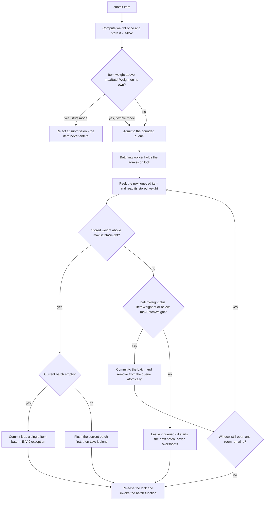

# WeightedAsyncAccumulator

**Responsibility.** [AsyncAccumulator](./async-accumulator.md) with a per-item
weight: batches close against a **maximum total weight** instead of a maximum
item count, and never overshoot it.

Use it when items have genuinely different costs — payload bytes, token counts,
row counts, credits — so that "100 items per batch" is the wrong bound.

- [Scope](#scope)
- [Weight computation](#weight-computation)
- [Admission and the no-overshoot rule](#admission-and-the-no-overshoot-rule)
- [Thread safety](#thread-safety)
- [Defaults](#defaults)
- [Advanced options](#advanced-options)
- [Lifecycle and cancellation](#lifecycle-and-cancellation)
- [Composition](#composition)
- [Invariants](#invariants)
- [Events and metrics](#events-and-metrics)
- [Test coverage](#test-coverage)
- [Open items](#open-items)

## Scope

| Owns | Inherits unchanged from `AsyncAccumulator` |
| --- | --- |
| The user weight function and when it runs | The true-batch-function contract ([D-040](../decisions.md#d-040-asyncaccumulator-invokes-one-true-batch-function-per-batch)) |
| Weight-budgeted batch admission | Outcome correlation and its contract violations ([D-042](../decisions.md#d-042-outcome-correlation-is-positional-by-default-keyed-is-advanced)) |
| The strict/flexible over-max policy | Per-item and batch timeout/cancellation outcomes ([D-187](../decisions.md#d-187-accumulator-item-and-instance-signals-have-distinct-effects)) |
| Atomicity of the weight check and admission | The batching-worker lifecycle ([D-046](../decisions.md#d-046-batching-runs-on-parallelworkers-with-no-fixed-cadence)) |
| | Queue bounding, overflow, cancellation |

Everything not listed in the left column behaves exactly as documented in
[async-accumulator.md](./async-accumulator.md). Read that document first.

## Weight computation

**Weight is computed once, at insertion, and stored with the item**
([D-052](../decisions.md#d-052-item-weight-is-computed-once-at-insertion)).

Assume the user's weight function may be heavy. The item is wrapped in a context
holding the item plus its precomputed weight — or recorded in a side map — and the
batching hot path only *reads* the stored weight. It never recomputes. This keeps
the admission lock tight and tolerates an expensive weight function.

> Illustrative pseudocode. No public API signature is committed yet.

```text
accumulator = weightedAsyncAccumulator({
  batch: async (items, ct) => await embed(items, ct),
  weight: item => countTokens(item),        # called once, at submit
  maxBatchWeight: 8000,
  overMaxPolicy: OverMax.Strict,            # or OverMax.Flexible
})
```

The weight function is user policy and must be pure: the library may call it on
any thread, and its result is cached for the item's lifetime
([design-principles.md § Functional conventions](../design-principles.md#functional-conventions)).

## Admission and the no-overshoot rule

**No overshoot, ever**
([D-050](../decisions.md#d-050-a-batch-never-overshoots-max-weight),
[INV-9](../architecture.md#invariants)). When reading an item from the queue, if
adding it would push the batch over `maxBatchWeight`, it is **not** added to the
current batch. It starts the next batch instead — carried over and run separately.
Batches flush just under the maximum, never above it.

**Single over-max item exception.** If one item's own weight exceeds the maximum
and the user has opted to allow it onto the queue, it runs as a **single-item
batch** (flexible mode). Otherwise it is **blocked** (strict mode)
([D-051](../decisions.md#d-051-a-single-over-max-item-runs-alone-in-flexible-mode-is-blocked-in-strict-mode)).
This is the only case in which a batch may exceed `maxBatchWeight`, and it does so
with exactly one item.



Note the asymmetry, and it is deliberate: **strict mode rejects an over-max item
at submission**, because admitting work that can never run would violate
[INV-1](../architecture.md#invariants) — a queued job must eventually be processed
or be announced. Flexible mode admits it and runs it alone.

## Thread safety

**This is the most concurrency-sensitive part of the library**, especially in C#.
The sequence

```text
peek → read stored weight → check the weight budget → commit to batch → remove from the channel
```

is a genuine hazard: between the check and the removal, another batching worker
must not claim the same item, and the committed batch weight must reflect exactly
what was removed
([D-053](../decisions.md#d-053-the-weighted-admission-sequence-must-be-atomic)).

Requirements for every binding:

1. The weight check and the admission **must be atomic** — for example a semaphore
   or mutex guarding the channel read so no interleaving is possible.
2. The lock is held across peek-and-commit, and **released before invoking the
   batch function**. The user's batch function never runs under the admission
   lock.
3. The weight function is **never called inside the lock** — that is the whole
   reason weight is precomputed at insertion
   ([D-052](../decisions.md#d-052-item-weight-is-computed-once-at-insertion)).
4. A carried-over item must remain claimable by the next batch and must not lose
   its queue position guarantees or its timeout bookkeeping.
5. This is subtle in every language and must be designed per binding, not copied.
   It is a required **technical test** area as well as a business one
   ([testing.md § Technical tests](../testing.md#technical-tests)).

## Defaults

| Option | Default | Notes |
| --- | --- | --- |
| `weight` function | **Required** | Without it, use [AsyncAccumulator](./async-accumulator.md) |
| `maxBatchWeight` | **Required** | The bound that replaces item count |
| `overMaxPolicy` | `Undecided` | Strict blocks; flexible runs the item alone. Which is the default is **not decided** — see [open items](#open-items) |
| `maxBatchSize` | `Undecided` | May coexist with the weight bound; whichever binds first closes the batch |
| Everything else | As [AsyncAccumulator](./async-accumulator.md#defaults) | Accumulation interval, `maxQueued`, overflow, timeout stages, clock |

## Advanced options

| Option | Shape | Effect |
| --- | --- | --- |
| `overMaxPolicy` | enum | Strict blocks an over-max item; flexible admits it as a lone batch |
| Combined size and weight bounds | numbers | Close the batch on whichever bound is hit first |
| Everything in [AsyncAccumulator § Advanced options](./async-accumulator.md#advanced-options) | | Inherited unchanged |

## Lifecycle and cancellation

Identical to [AsyncAccumulator](./async-accumulator.md#lifecycle-and-cancellation),
with two additions:

- A **carried-over** item is still a queued item: its queue-wait timeout keeps
  running and cancellation still removes it permanently
  ([INV-7](../architecture.md#invariants)).
- Drain flushes carried-over items as further batches rather than discarding them
  ([INV-1](../architecture.md#invariants)).

The optional controller injection and once-per-affected-batch compensation
contract are inherited unchanged
([D-180](../decisions.md#d-180-accumulators-accept-an-optional-controller),
[D-188](../decisions.md#d-188-accumulator-compensation-runs-once-per-affected-batch)).

## Composition

> Illustrative only.

```text
# Token-budgeted embedding calls, with at most 4 concurrent batch calls
limiter = rateController({ concurrency: 4 })
embedder = weightedAsyncAccumulator({
  batch: limiter.wrap(embed),
  weight: item => countTokens(item),
  maxBatchWeight: 8000,
})
```

## Invariants

- A batch never exceeds `maxBatchWeight`, except a single over-max item in
  flexible mode, which runs alone
  ([INV-9](../architecture.md#invariants)).
- Each item's weight is computed exactly once
  ([D-052](../decisions.md#d-052-item-weight-is-computed-once-at-insertion)).
- An item that does not fit is carried over, never dropped and never split
  ([INV-1](../architecture.md#invariants)).
- The weight check and the queue removal are atomic
  ([D-053](../decisions.md#d-053-the-weighted-admission-sequence-must-be-atomic)).
- In strict mode an over-max item never enters the queue, so no admitted item is
  unrunnable.
- Every `AsyncAccumulator` invariant still holds
  ([async-accumulator.md § Invariants](./async-accumulator.md#invariants)).

## Events and metrics

Everything `AsyncAccumulator` emits, plus weight-aware detail: the batch-exceeded
and max-batch events carry accumulated weight, and snapshots expose queued weight
alongside queued count. See [observability.md](../subsystems/observability.md).

## Test coverage

Case IDs `WAA-xxx` in
[testing.md § WeightedAsyncAccumulator](../testing.md#weightedasyncaccumulator-waa).
Every `AA-xxx` case must also pass under a constant weight function of 1 with
`maxBatchWeight` set to the equivalent `maxBatchSize` — that equivalence is itself
a test case.

## Open items

| Item | Status |
| --- | --- |
| Whether strict or flexible is the default `overMaxPolicy` | **Not decided.** Strict is safer against overshoot; flexible is friendlier because no work is refused. Surfaced during consolidation |
| Whether `maxBatchSize` and `maxBatchWeight` may be combined, and which takes precedence | Not decided. Surfaced during consolidation |
| Whether a weight of zero or a negative weight is valid, and what happens if the weight function throws | Not decided. Surfaced during consolidation |
| Whether carried-over items get priority in the next batch or re-compete normally | Not decided. Surfaced during consolidation |
| Everything open in [async-accumulator.md](./async-accumulator.md#open-items) | Inherited |
